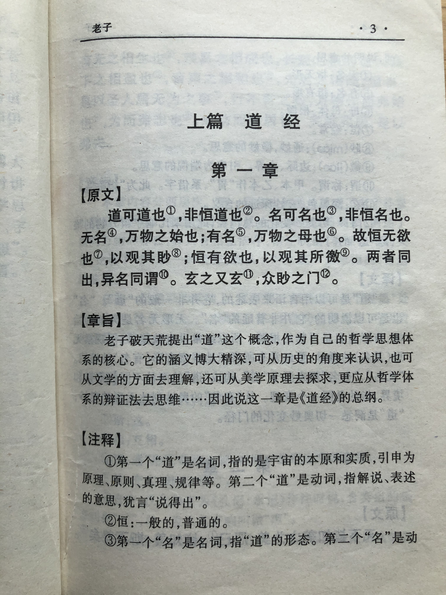

## 《道德经》第一章通行本原文：

    道可道，非常道；
    
    名可名，非常名。
    
    无，名天地之始，
    
    有，名万物之母。
    
    故常无欲，以观其妙；
    
    常有欲，以观其徼。
    
    此两者同出而异名，
    
    同谓之玄，玄之又玄，众妙之门。

## 译文
 
    道是可以去说明和去遵照的，但不是一般能说清楚的，也不是一成不变的道。
    
    名是道的形态，也是可描述的，但不是一般描述就能诠释的，它的形态也并非一成不变。
    
    无 ，即无名无形，是万物的起始。
    
    有，即有形存在，是万物的母体。
    
    只有始终保持无欲无求的状态，才能体察到道之无名无形的奥妙；
    
    只有保持持续的探究欲望，才能发掘道之有名有形的边界和特征。
    
    有和无，是两种不同的表述，它们都来自于道，是构成道的两种基本形态和不同的面。
    
    道玄妙高深，就像一扇大门，通过它才能洞悉世间万物的运行规律，了解宇宙的一切奥妙变化。   

## 逐句解释

### 道可道，非常道；名可名，非常名。

什么意思呢？道是可以说的或者去遵照的，但又不是一般的能阐释的道，不是一成不变的道。名乃道的形态，也是可以说明的，但也不是一般的描述就能够名状的，也不是一成不变的形态。

### 无，名万物之始。有，名万物之母。
（或无名，万物之始也。有名，万物之母也。这个标点在哪里都可以，古人没有标点）

这个我们借用宇宙大爆炸理论来说，权当真有这回事。道无名，道之无即无状态亦无形态，却是万物的起始，就像宇宙爆炸时的奇点，可以理解为体积无限小，质量无限大的黑洞，所有的物质都被压缩在里面，包括一切万物，原子核都能再压缩，这个东西小到啥也没有，即是无。道有名，道之有即道也有形态，虽然体积无限小，但的的确确是存在的，那个形态性状我们虽不知道，但随着奇点爆炸，混沌初开，宇宙迅速向外扩展，随即产生了万事万物，这是有可名状的。因此道是一切万物的母体和根源。

### 故常无欲，以观其妙；常有欲，以观其徼。

只有始终保持无欲无求的状态，才能体察到道之无名无形的奥妙；只有保持持续的探究欲望，才能发掘道之有名有形的边界和特征。因此既要无欲以求道，又要有欲以探究。这里的无可以理解为意识，而有可理解为物质。要以有欲去探究物质，以无欲去体悟意识。

### 此两者同出而异名。同谓之玄，玄之又玄，众妙之门。

有名无名，是两种不同的表述，它们都来自于道，是构成道的两种基本形态和不同的面。这里面非常玄妙高深，就像一扇大门，通过它才能洞悉世间万物运行规律，了解宇宙一切奥妙变化。

## 心得总结

道无所不包，通过道可以洞悉一切，就是这么玄妙。但道究竟是个什么东西呢？是既能说清楚也不能说清楚。这具体怎么理解呢？结合全书来看道本质是一种亘古不变的载体，在运行时又变化多端的客观规律；道是孕育万物生长的母亲，是一切事物的源泉，囊括了万事万物；道也是一种上善若水的修为和与世无争、无为而治的境界。但其实道远不止这些，一千个人有一千种看法。

作为一个近20年的互联网老兵和40岁的中年大叔来讲，虽经历尚浅，资质平庸，我还没有搞清楚道的运行规律和方式，但也见到了企业之起伏跌宕、技术之日新月异，以及人生之喜乐无常。我们身处的时代发展很快，社会变化万千，就像一辆追逐名利的高速列车，拥挤的空间上满载着自私和贪婪。在这列高速行驶的火车上，人生有多少个机会收获，又有多少个意外失去，还有多少个无情的伤害，以及多少个不经意的内卷，大家既享受到生活带来的乐趣，又被生活所嘲弄，搞得满身疲惫，人人喊累。这个年纪多少明白了世事之不易，人生之艰难。世道有常，天道无亲。人生多变皆无变，人生无常皆有常。究竟是无还是有？恐怕即是无又是有，所谓无中生有，有生于无。

## 附帛书版

