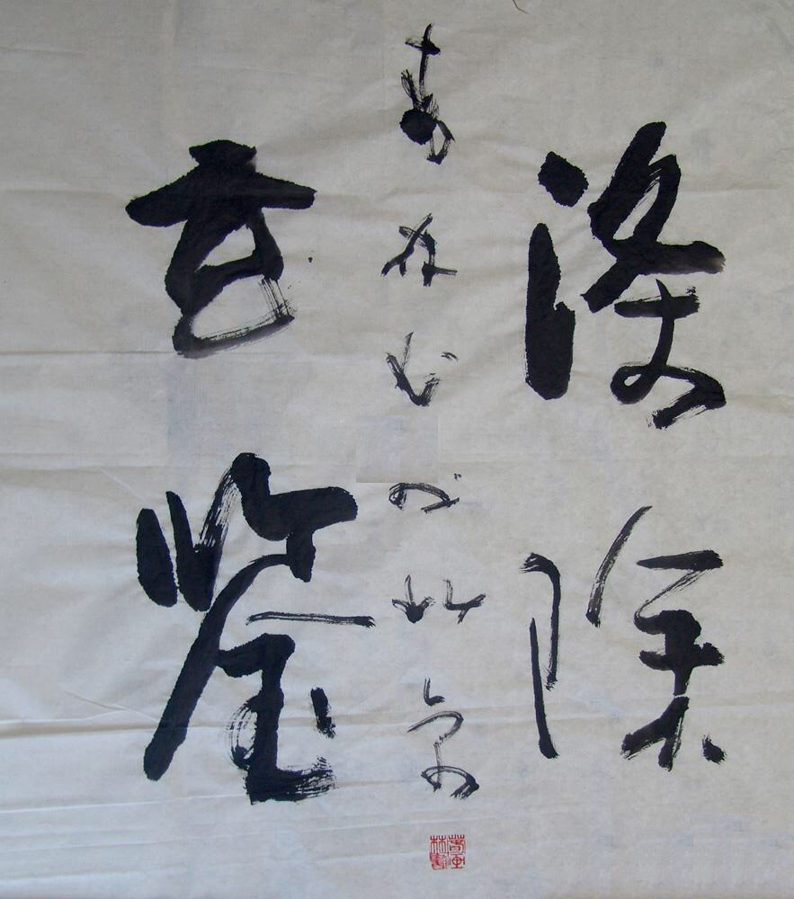
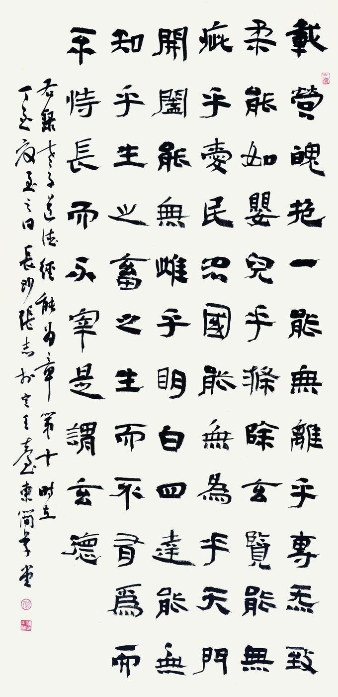
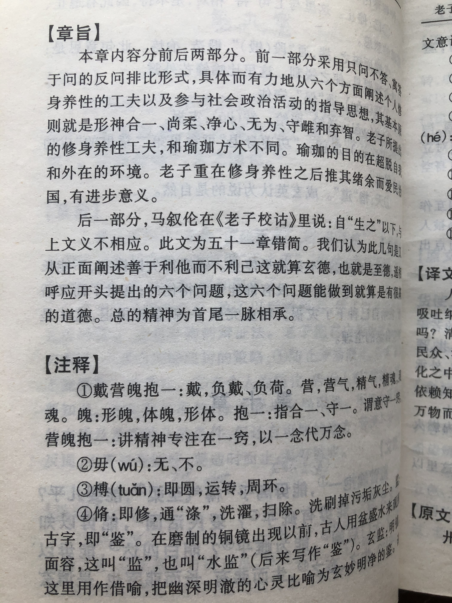

## 《道德经》第十章通行本原文：

    载营魄抱一，能无离乎？

    专气致柔，能如婴儿乎？

    涤除玄览，能无疵乎？

    爱民治国，能无为乎？

    天门开阖，能为雌乎？

    明白四达，能无知乎？

    生之畜之，生而不有，为而不恃，长而不宰，是谓玄德。

## 译文：
 
    灵魂（精神）和肉体（物质）合一，能永不分离吗？

    聚集精气，使得恬静柔和，能像出生的婴儿一般自如吗？

    清除杂念，使得心灵清澈，能如明镜一般没有污垢吗？

    爱护百姓，治理国家，能遵行无为而治的理念吗？

    五官开合，吐纳呼吸，行动言表，能静如处子吗？

    明晓天地，洞察四方，能不玩弄权术和心智吗？

    生长养育万物而不占为己有，有了贡献和功勋而不居功自傲，
    
    任凭万物自然生长而不去主宰和掌控，这就是最高深的“德”。
    

## 逐句解释：

### 载营魄抱一，能无离乎？
载（有记戴），有的理解为语气词，有的表负载，都可以，都不影响理解。关键是营魄，即魂魄，聚集在身体上的精气。魂是能独立躯壳而存在的魂灵，属阴气，这里代表精神，魄则依赖本体而存在的某种精力，属阳气，这里代表形体。这里是说要使两者合二为一，和谐平衡，达到最佳状态。

### 专气致柔，能如婴儿乎？
专也有写槫，有说专一、集聚，也有说运转，都无大碍。这里的意思是，聚集精气以使平静柔和，就像新生儿一样安详。这是说要达到一种恬淡和自然的状态。

### 涤除玄览，能无疵乎？
玄览也有写玄鉴，意为镜子。涤除就是清洗去除。
即清除心中杂乱不堪的东西，使得心如明镜，没有瑕疵。这里是说明心见性，保持内心澄澈。

### 爱民治国，能无为乎？
统治者要爱护百姓，治理国家能否做到顺其自然，无为而治。什么是无为而治呢？多言数穷，不若守于中。少人为干预，遵照事物本来的样子去发展。

### 天门开阖，能为雌乎？
天门即五官，耳鼻口眼舌，能够自然开合，保持一种柔和平静。雌是柔静的体现。这里是说要静如处子，保持淡定。

### 明白四达，能无知乎？
理解天下万物，洞察四方人情，少点智谋和伪诈。这是告诉我们应该坦诚以待，实事求是去了解天下事物。

### 生之畜之，生而不有，为而不恃，长而不宰，是谓玄德。
生育养育，也不会占据为私有；做出了成绩贡献也不恃才傲物、自以为是；万物生长顺其自然，少去干预主宰。这里是说要无我利他，以无为胜有为，这才是好的德行。

## 心得总结：
本章老子是告诫众人：
前面讲要神形合一、专一致柔、清除杂念、净心守静、无为而治、爱民弃智，做到这六项就算入道有德了，后面提到如果能无我利他、道法自然则就是至高的德了。

1、首先要保持内心的和谐，聚精会神，如婴儿和雌性小动物般宁静。
2、再清除掉内心的杂念，保持心中的淡泊。少点智谋去对付老百姓，多一份真诚与关爱。
3、然后要无私利他，不要去计较个人得失，少点人为控制，一切顺其自然。

本章老子依然在论证清静无为和无为而治的思想理念。总体上来讲，人尤其是领导者应该保持身心和谐，效法天地，遵循客观规律，让万物自然生长。这就是最好的“德”，体现的依然是一种朴素的无为而治的思想。

现如今看老子的话很有意义。如今人们总喜欢干预自然，期望违反客观规律来迅速致富和获得高额回报，甚至不惜一切手段。这时候人就变得狂躁、贪婪、扭曲，内心无法宁静，身心也不再柔顺和谐。而这样的结果是，既达不成目标，还搞的身心疲惫，乌烟瘴气。

如今社会，我们真的很需要读读《老子》，在浮躁中找到一份宁静，在贪婪中找到一份和善，我们平复心态，遵循客观自然，最后才能真正得到我们想要的发展和幸福。

有些人把老子这章看成了修道打坐，练气养神的方法，这个我全然看不出来。道教与《道德经》本来就是两回事，道教的炼丹修道，避世隐居，长生不老等完全是曲解了老子的学说，或者只是故意借用而已。这也是无奈吧。其实《道德经》只是一本哲学类经书，很多内容并没有逻辑推导，因此理解起来各种各样，五花八门。这样也好，不是么？你心中是怎样的看法，看到的便是怎样的。所谓相由心生，读书学习也是如此。

## 附帛书版：

[返回目录](../) &nbsp; [上一章](./9.md)&nbsp; [下一章](./11.md)

