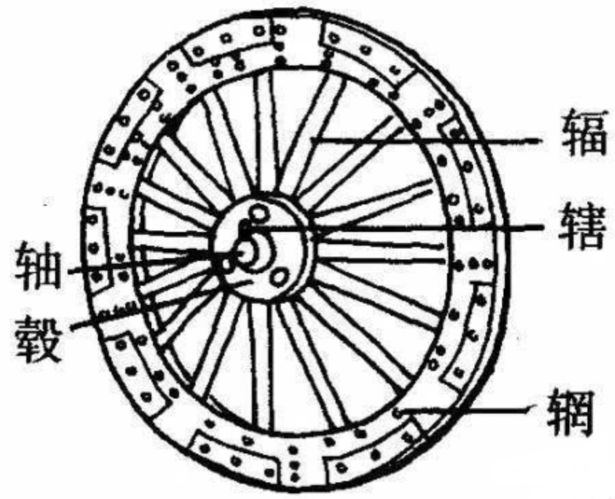
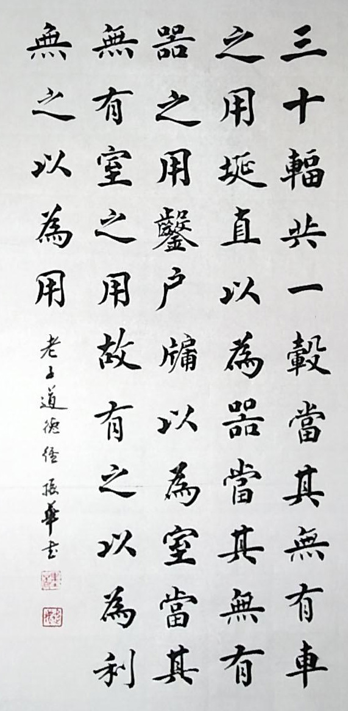
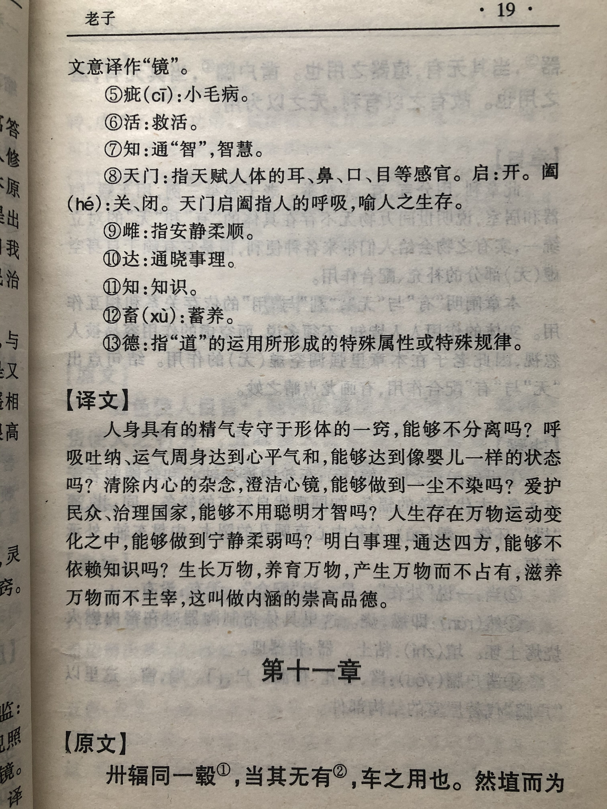
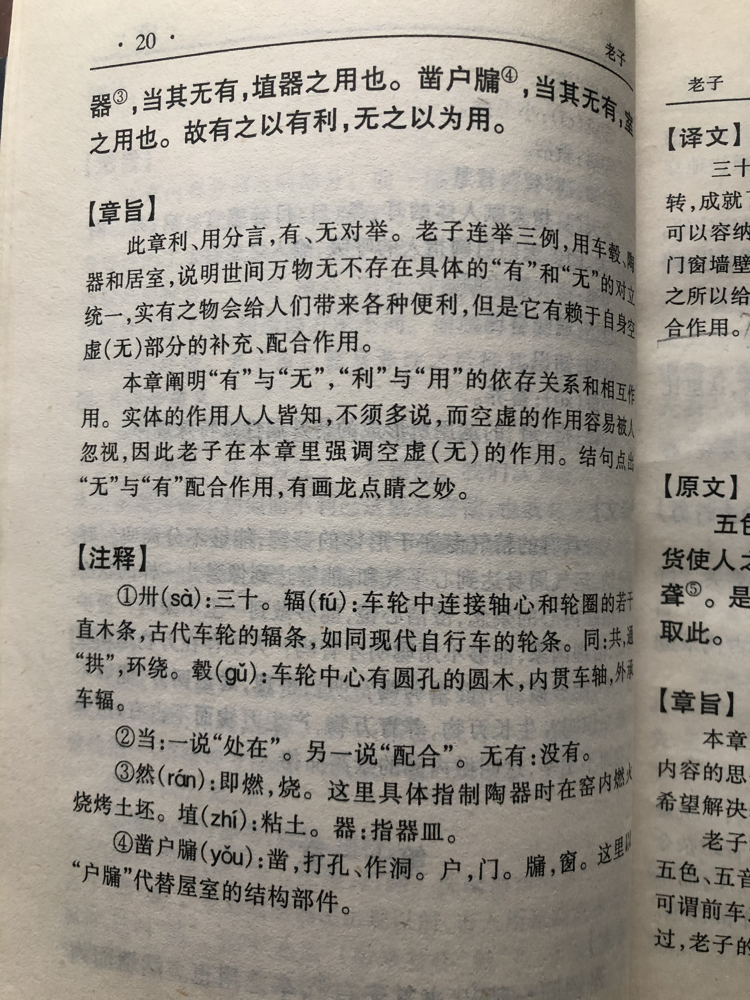

## 《道德经》第十一章通行本原文：

    三十辐共一毂，当其无，有车之用。

    埏埴以为器，当其无，有器之用。

    凿户牖以为室，当其无，有室之用。

    故有之以为利，无之以为用。

## 译文：
 
    三十根车辐横穿轮毂，中间留有空处，车轮才得以发挥转动的作用。

    烧制陶土打造器皿，中间留出空处，器皿才能发挥盛放的作用。

    开凿门窗建造房屋，有了门窗的空处，房屋才能发挥居住的作用。
    
    所以，“有”使得万物产生效用，而“无”使得“有”发挥作用。

## 逐句解释：

### 三十辐共一毂(gǔ)，当其无，有车之用。
三十也就是卅，古时候车轮上的车辐由三十根横条组成，横条之间有空隙，中间有圆孔安装车轴，因为有了这些空处，车轮才能转动前行。

### 埏埴(shān zhí)以为器，当其无，有器之用。
埏，不同版本文字有差异，有做燃烧或搅拌的意思，怎么理解都不影响。埴是黏土的意思。就是烧制或打造陶土为器皿，中间也要留有空白，这样才能盛装食物和水。

### 凿户牖(yǒu)以为室，当其无，有室之用。
开凿建造房屋，都要留下门窗的空洞，这样人才能出入，空气才能流通，阳光才能照射进来。

### 故有之以为利，无之以为用。
因此，实体的“有”发挥了便利作用，人们可以使用它，而这个“有”却依赖于“无”，有了“无”才能“有”。所谓天下万物生于有，有生于无也是这个意思。

## 心得总结：
本章老子不再讲无我利他，无为而治之类的思想，而是论证“有”和“无”的关系。前面老子已经充分说明“道”的来源，“道”的内涵，无为的意思等，这章开始，老子指出，“有”是发挥实际效用的，而看不见的“无”才起着根本的决定性作用。这几个车辐、器皿、房屋例子，都旨在说明无的根本性。老子的思想很质朴，他看到了物体之所以发生效用背后都来自于“无”，最后总结出“有之以为利，无之以为用”的观点。

两千多年前的老子通过实际的生活观察，洞悉了“有无”的关系，发现了朴素的哲学道理。可以说老子非常深邃，了不起。我们普通人都看得见“有”，而忽视了“无”，更无从知晓“有”和“无”的关系，这是因为我们只看到事物的表面，最多能看到里面，而看不到事物的底部和背面。

当然我们也不能神化老子。有些文人墨客或者有些修道求仙之人，容易把老子的哲学思想看成为修道成仙的玄学。其实老子并没有那么厉害，他也不是神仙，他没法告诉人们如何得道成仙，老子以出世的心态做着入世的事情，他不是创建宗教和神学，他只是告诫君王等管理者最最自然朴素的道理。老子是古典朴素的唯物主义代表，他的思想非常纯粹，很多理论也都来源于实际的观察，通过他的观察再把一切事物的本质列了出来。他从实际观察中感悟到天地的玄妙，洞悉到事物的运行规律，然后把这个规律记录了下来，这便成了《道德经》。

当然老子的观点是否都正确呢？其实不然，不同时代有不同的诠释和理解。本质上老子的思想充满了智慧和辩证思维，还具有客观唯物特点，但毕竟没有逻辑推导和理论分析，所以老子只是下了定义。比如有生于无，为何不是无生于有呢？或者说有为何不来自于有呢？无是如何生出有来的呢？论证的过程是怎样的？我们不能穷究一些问题，往死里较劲。如果那样，理解哲学、感悟人生就会陷入困顿，始终不得其解，要么就自以为得道成仙了，变得不可理喻，走向了歧途。我还是倾向于把老子的学说当做学术来研究，了解其中的道理，根据当前时代的要求来诠释老子的思想，从而也获得人生的感悟，提升自己的修养。

总之《老子》既有朴素唯物主义自然哲学观，又有意识决定物质的唯心主义观点，但绝不是打坐修道，炼丹成仙类的宗教神学书籍。“道”突破了唯物与唯心主义之争，它不是二元论，超越了西方哲学非此即彼的二元观点。如果你持有两个极端想法，一是认为老子消极无为，胡编乱造，那最好别读《老子》；二是如果认为老子的话是金科玉律，洞悉了生死的奥秘，可以得道成仙，那么你也别读《老子》。读《老子》不能走极端，而是不偏不倚，大道至简，参悟其中蕴含的智慧，实现人生的价值。

## 附帛书版：

[返回目录](../) &nbsp; [上一章](./10.md)&nbsp; [下一章](./12.md)

