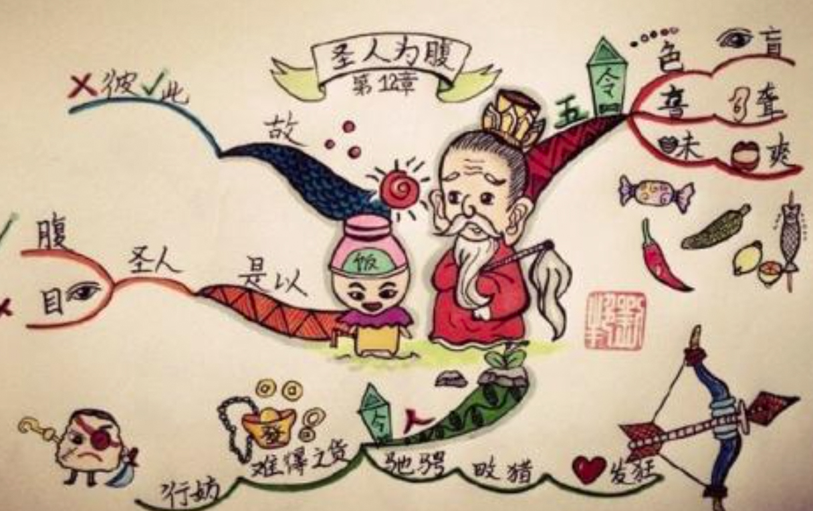
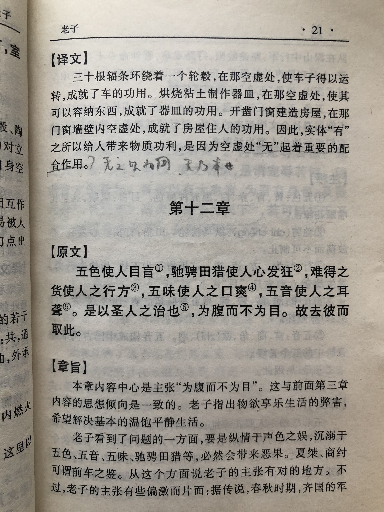
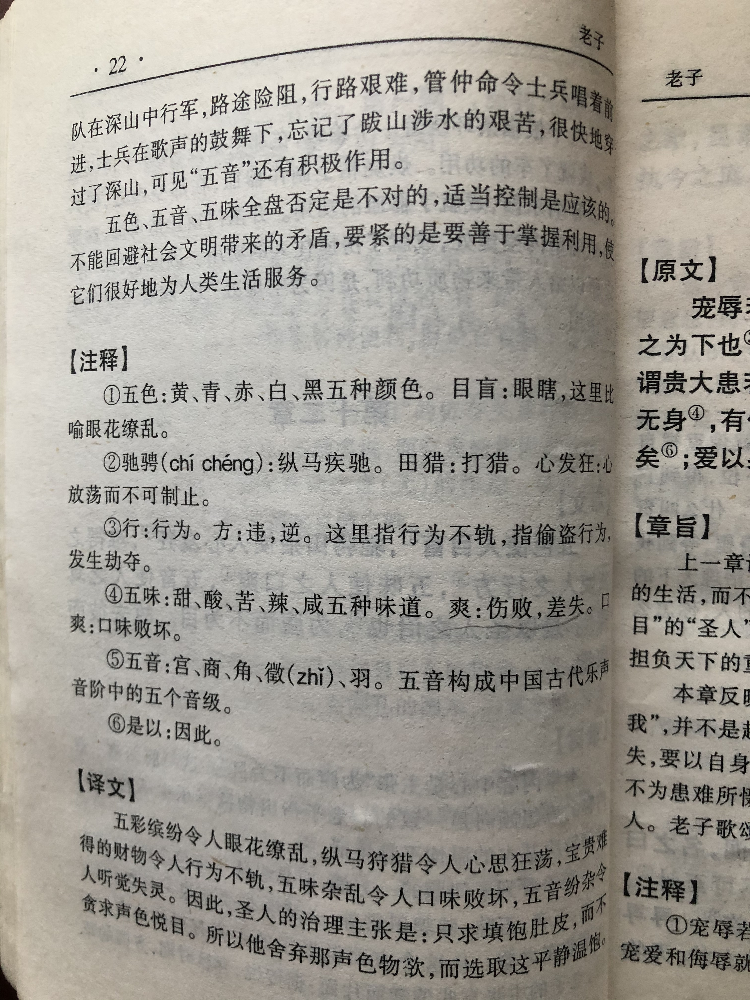

## 《道德经》第十二章通行本原文：

    五色令人目盲，五音令人耳聋，五味令人口爽；
    驰骋畋猎，令人心发狂；
    难得之货，令人行妨；
    是以圣人为腹不为目，故去彼取此。

## 译文：
 
    色彩缤纷，使人眼花缭乱；音调嘈杂，使人听觉失灵；食物丰盛，使人舌不知味；
    纵情狩猎，使人激荡发狂；
    珍贵难得的货物，使人行为不轨。
    因此，圣人但求吃饱肚子而不追逐声色犬马，摒弃物质享受而保持内心的安宁。

## 逐句解释：

### 五色令人目盲，五音令人耳聋，五味令人口爽；
五色：青、黄、赤、白、黑。五音：宫、商、角、徵、羽。五味：酸、苦、甘、辛（辣）、咸。这些东西都表示物质享受，令人贪图，但凡事过犹不及，一旦沉溺其中就会迷失自我，最后丧失了正常的分辨能力。

### 驰骋畋猎，令人心发狂；
驰骋，这里意思是纵情放荡。畋，音tian，打猎的意思。纵情猎杀，会激起人性的杀戮，让人癫狂。

### 难得之货，令人行妨；
难得之货，指奇珍异宝之类，这会激发人心贪婪。“行”表示行为，“妨”表示妨害。意即人们会因为争夺珍宝而做出伤害的事情来。

### 是以圣人为腹不为目，故去彼取此。
所以好的统治者治理天下是为了老百姓能吃饱穿暖与过得安宁，而不是为了让大家纵情声色，过度享受物质。“彼”指“为目”的生活；“此”指“为腹”的生活。因此有道明君会摒弃不良的欲望，保持简朴的生活与内心的宁静。

## 心得总结：
本章老子辩证的分析了人的欲望应当适度，过犹不及，尤其是物质享受。无论美女，还是美食，抑或奇珍异宝，看多了也就那样，最后都会乏味。而嗜杀成性，最后会导致失去人性，丧心病狂。老子在告诫领导者，不要纵情声色犬马，而是回归宁静与质朴的生活。老子的排比娓娓道来，非常生动，可谓鞭辟入里，入木三分。

老子看问题非常清晰深邃，且充满着辩证思维。我们总以为东西越多越好，吃喝玩乐越爽越好，但其实往往过犹不及，纵欲过度最后适得其反。老子在提醒我们应该保持清醒，人应该过自然状态的生活，而不是铺张浪费、穷奢极欲。历朝灭亡，几乎都亡于统治阶级的奢靡之风，老百姓苦不堪言，最后揭竿而起。

作为人类来讲，粗茶淡饭，粗布麻衣，身体健康，简单快乐，不就是最大的幸福么？这对于领导者还是普通百姓来讲都是一样的。所谓知足常乐，日子稀松平常，生活简单朴素，但这才是最美好的状态。保持内心宁静、平和、安详，这才是我们应当遵循的生活状态。

不是不去创新、创造，也不是不去享受美好的生活，更不是拒绝科技进步，而是一方面要不断创新发展、改造自然；另外一方面要保持本真，让心态回归自然。这两者并不矛盾。只有保持对自然的敬畏，保持质朴的心态，才能更好的改造自然、利用自然和发展自然，最后与自然和谐相处。

那些贪图享受的领导者要注意了，不要纵情声色，生活奢靡，只有回归朴素和简单，才是我们应该的样子。此所谓不忘初心也！

那些先富起来的人要注意了，不要因为有钱了就任性，贪图享受，纵欲过度，最后人性扭曲，失去了生活本来的意义。

## 附帛书版：

[返回目录](../) &nbsp; [上一章](./11.md)&nbsp; [下一章](./13.md)

