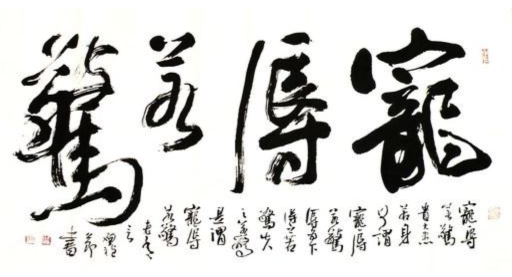

## 《道德经》第十三章通行本原文：

    宠辱若惊，贵大患若身。

    何谓宠辱若惊？宠为下得之若惊，失之若惊，是谓宠辱若惊。

    何谓贵大患若身？吾所以有大患者，为吾有身，及吾无身，吾有何患？

    故贵以身为天下，若可寄天下；爱以身为天下，若可托天下。

## 译文：
 
    得到恩宠或遭受侮辱，都要为之担惊受怕。重视大患大难，就好像重视自己的身体一样。

    什么叫作“宠辱若惊”呢？得宠是卑下的，得到它会感到惊喜不安，失去它则会感到惊恐不安。这就叫宠辱若惊。

    什么叫作“贵大患若身”？人之所以会有祸患，是因为有这个身躯；倘若没有了躯体，人还有什么祸患呢？

    所以，把天下看得和自己的生命一样宝贵的人，才可以把天下的重担交付于他；
    
    爱天下和爱自己的身体一样的人，才可以把天下的责任托付于他。

## 逐句解释：

### 宠辱若惊，贵大患若身。
这里宠可作恩宠、荣宠讲，代表上面赐予的荣耀和信任，辱则作侮辱或耻辱讲，是上面施加的惩罚和责备。宠辱总是相连，有宠必有辱，因此得到宠爱和侮辱均会感到心惊。宠爱是上对下的赏赐，缘于一种信任，受宠者自然感到惊喜，但也会带来不安，因为不知道什么时候这份恩宠忽然就失去了，也不知道自己能否对得起这种托付。受辱往往因为酿成了祸患，自然会惊吓不已，不知道啥时候就大祸临头了。贵大患若身，就是把大患大难看作是身家性命一般，这样我们才会真的全力以赴，视死如归。

### 何谓宠辱若惊？宠为下得之若惊，失之若惊，是谓宠辱若惊。
究竟什么才是宠物若惊？恩宠是以上对下，得之欣喜，失去心惊。恩宠可以随意赏赐，也可以随时收回，因此受宠者惊喜之余内心其实惴惴不安，胆战心惊。人们常说的受宠若惊、宠辱不惊又怎么理解呢？其实这并不矛盾，只是不同的境界而已。受宠若惊即得到恩宠而充满惊喜，这是普通人常见的心情表达；宠辱不惊表达的是一种名士气概，遇事不悲不喜，闻惊雷而面如平湖，有种超凡脱俗之概；宠辱若惊则是管理者的智慧，知道宠辱相连，荣辱与共，因此对待恩宠与侮辱一样胆战心惊，如履薄冰。

### 吾所以有大患者，为吾有身，及吾无身，吾有何患？
人之所以有大的病痛灾祸，是因为有了人身，如果没有身体了，那哪里还有病痛灾祸和荣辱呢？身体是大患的来源。庄子说“此身非汝有”，佛教中称为“臭皮囊”，如果没有这个身体，人该多么开心，何其自由。

### 故贵以身为天下，若可寄天下；爱以身为天下，若可托天下。
所以能够以身示范，把天下安宁与自己生命看得一样宝贵的人，也就是天下为公，舍身为民的人，才适合寄托天下。珍爱自身而忽略天下黎民的人不能把天下寄托给他。这是很朴素自然的道理，人最珍贵的还是自己的身体，如果你能够把天下当做自己的身体来对待，那就一定会竭尽全力，奉献所有。

## 心得总结：
本章理解起来有点不容易，尤其是前面的宠辱若惊。这句话与宠辱不惊看似有点矛盾，都说君子要保持从容淡定，怎么会心惊不安呢？其实如果深入理解，就会发现宠辱不惊表达的是气概和心胸，指的是淡泊名利，这是一种出世的潇洒。宠辱若惊则是责任和担当。上面委以重任，赐予恩宠，受宠者一定要如履薄冰，小心翼翼，始终保持谨慎、克制、心惊，这是一种以出世心态做入世之事。上面给与的侮辱(或耻辱)也是一样，这代表鞭策，受辱者当心怀忐忑，战战兢兢，改过自新，奋发图强。

而一个人要想堪当大任，承当重担，必先有置生死度外的气魄。对于统治者而言，应该把天下苍生看做比自己的生命还珍贵，只有这样才能受到老百姓的爱戴和拥护。所谓以天下为己任就是这个道理。从来英雄豪情万丈，置个人生死于度外。也只有这样的人，才值得托付。贪图享乐，贪慕虚名，精致的利己主义者，统统不值得信任。

老子真的很伟大，一针见血地指出来只有敢于拿命来担当的，才值得托付天下，否则全是空谈。老子也很深邃，我们说受宠若惊，或者说宠辱不惊，但他告诉我们其实受宠和受辱一样，同样要胆战心惊。只有敢于拿性命担当，心怀忐忑，亦步亦趋的人，才是值得托付天下的人。

## 附帛书版：

[返回目录](../) &nbsp; [上一章](./12.md)&nbsp; [下一章](./14.md)

