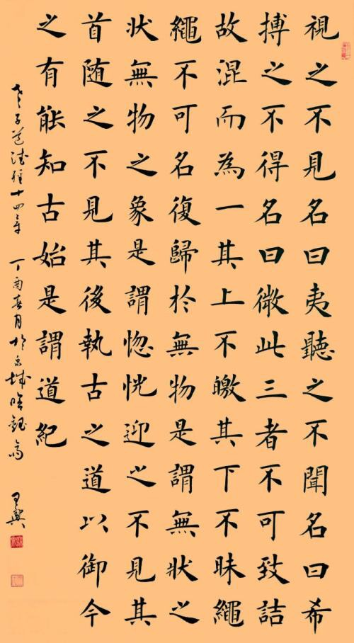
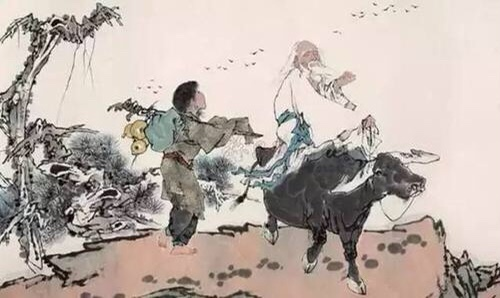
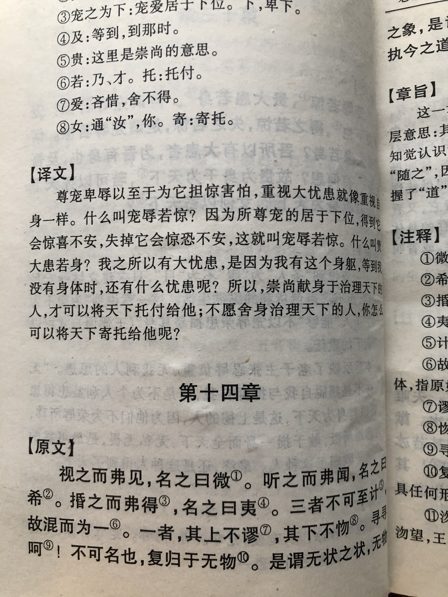
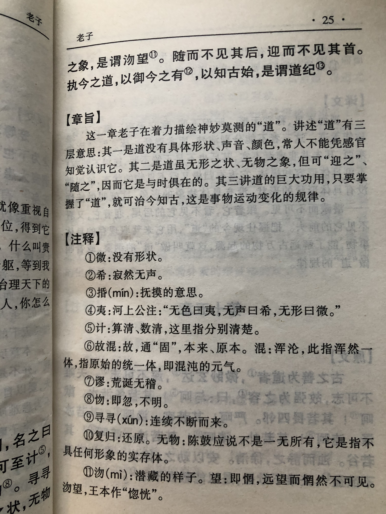

## 《道德经》第十四章通行本原文：

    视而不见，名曰夷；听之不闻，名曰希；

    搏之不得，名曰微。此三者不可致诘，故混而为一。

    其上不徼，其下不昧，绳绳兮不可名，复归于无物。

    是谓无状之状，无物之象，是谓惚恍。

    迎之不见其首，随之不见其后。

    执古之道，以御今之有。能知古始，是谓道纪。

## 译文：
 
    看不见，叫做“夷”；听不到，叫做“希”；摸不着，叫做“微”。

    这三者形态无从细究，它们原本就混为一体。

    它的上面并非光亮；它的下面也不阴暗，它延绵不绝无法名状，最后仍回到无物的虚空状态。

    这就是无形的形状和无物的形象，叫做“惚恍”。

    迎着它，看不见它的头，跟着它，也看不见它的尾。
    
    根据早已存在的“道”，来考察现今的具体事物，我们就能了解宇宙的起始，这就叫作道的规律。

## 逐句解释：

### 视而不见，名曰夷；听之不闻，名曰希；搏之不得，名曰微。
夷，灭也，即无形。希，静也，即无声。搏，触摸。也有记作“㨉”;㨉：抚、摹。即“道”，看不见叫做夷，听不到叫做希，摸不着叫做微。这就是“道”的形状和形象。

### 此三者不可致诘（jié），故混而为一。
致，推。诘，问。夷、希、搏这三样不能细究推理，它们本来就浑然一体。“道”这个东西说不明白，无法解释透彻。

### 其上不徼（jiǎo），其下不昧（mèi），绳（mǐn）绳兮不可名，复归于无物。
徼，明也。昧：暗也。它上面并不明亮，下面也不黑暗。绳绳者即绵绵不息。它延绵不绝无法描述。它的运动和存在最后会归于空无。这就是“道”的状态。

### 是谓无状之状，无物之象，是谓惚恍。
所谓没有形体的形状，没有物体的形象，就是惚恍。惚恍：若存若亡、似有似无。“道”这个东西就是恍恍惚惚，好像有，好像没有。

### 迎之不见其首，随之不见其后。
观察恍惚的时候，从头看不见首，从后看不见尾。总之就是搞不清楚，似有似无。

### 执古之道，以御今之有。能知古始，是谓道纪。
秉持自古就存在的“道”，来考察理解现今存在的事物。以此能知道古今的起源，也就是了解事物运动变化的规律。

## 心得总结：

这章老子不再谈无为而治以及人道之类，而是回到了什么是“道”这件事情上，即天道。老子试图告诉我们究竟什么是“道”，有什么意义。

“道”不可被感知，看不见，摸不着，虚无缥缈，却又真实存在，它支配着万物的运转，是“无状之状，无物之象”。只有掌握了其变化运动的规律，才能了解“道”，了解“道”所支配的世间万物。

掌握“道”的运行规律是驾驭和管理万事万物的关键，要去追求最本质的规律，只有这样才能接近”道“。这些规律是自古就存在，且亘古不变。万事万物都在遵循这些根本规律，即便事物在不断运动变化，但“道”不变，所以要追根溯源，认识世界的本质。

这是一篇略带玄乎的哲学篇章，即事物有着不变的规律，也有着不断运动的规律。比如大地、空气、阳光、水土，这些自然环境基础属性是不变的，人需要吃穿住行的需求也是不变的。但基础属性的应用和提取随着科学技术进步在发展了，运动着；时代的变迁，人对于基本需求也在不断发生着运动和变化。所谓波浪式前进，螺旋式上升，也是这个道理。总体上，根本上的东西是不变的，但具体到某个细节，某个具体的事物，时时刻刻都在发生着变化。

老子依然没有论证这些逻辑关系，他只是下了定义。“道”这个东西，无法描述。它看不见，听不到，摸不着，恍恍惚惚，不见首尾，从根本上支配者万事万物，认识和是遵循它，便能知古今起源和事物的本质了。

道可道，非常道。那么说了这么多，究竟“道”是什么呢？

## 附帛书版：

[返回目录](../) &nbsp; [上一章](./13.md)&nbsp; [下一章](./15.md)

