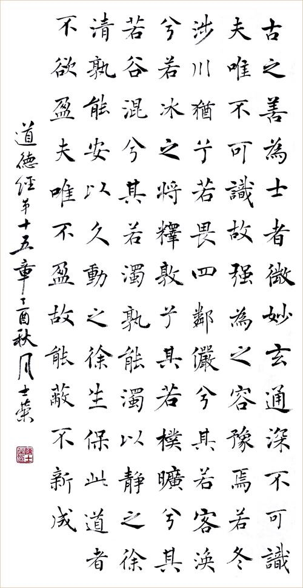

## 《道德经》第十五章通行本原文：

    古之善为士者，微妙玄通，深不可识。

    夫唯不可识，故强为之容。

    豫兮，若冬涉川；犹兮，若畏四邻；

    俨兮，其若客；涣兮，若冰之将释；

    敦兮，其若朴；旷兮，其若谷；浑兮，其若浊。

    孰能浊以止，静之徐清？孰能安以久，动之徐生？

    保此道者不欲盈，夫唯不盈，故能敝而新成。

## 译文：
 
    古时善于行“道”的人，见解微妙而深奥，深奥到无法深入了解，只能勉强用比喻来描述。
        
    他的小心谨慎啊，就像严冬涉水过河；他的警觉戒备啊，好像随时提防强敌入侵；
        
    他的庄重严肃啊，就像去别人家里做客；他的身心释放啊，就好像冰雪即将消融；
        
    他的敦厚质朴啊，就像没有雕琢过的璞玉；他的旷远豁达啊，就像空旷的山谷一样；他的浑厚宽容啊，就像江河一样浑浊。
        
    谁能在浑浊中安静下来，使得渐渐澄清？谁能在安定中变动起来，使得出现生机？
        
    遵循保持上述“道”的旨要的人，就不会自我盈满。正因为他从不自满，所以能够去故更新，不断变化。

## 逐句解释：

### 古之善为士者，微妙玄通，深不可识。
士是懂得“道”的人。自古善于了解“道”的运行规律的人，见解微妙而玄通，高深莫测。

### 夫唯不可识，故强(qiǎng)为之容。
因为无法深入了解认识，只能勉强描述。容，作描述形容讲。

### 豫兮，若冬涉川；犹兮，若畏四邻；
豫，兽名，性多疑，每有行动，踌躇不前。这里用以形容善道之人行动时谨慎小心，三思后行，就像冬天涉水过河一般。犹：兽名，其特点与豫相似。形容谨慎戒备如临强敌，一刻不敢松懈。

### 俨兮，其若客；涣兮，若冰之将释；
俨，庄重恭敬。庄重的就像去别人家做客。涣，是消散的意思。指有道之人身心释放时不敢放纵，而犹如冰雪渐渐消融。

### 敦兮，其若朴；旷兮，其若谷；浑兮，其若浊。
敦，敦厚。很朴实，接近自然。旷，空旷、开阔。心胸宽广，为人豁达，犹如山谷。

有的版本还有“澹兮，其若海；飂兮，若无止”这句。
澹（dan），恬静。安然恬静得像大海一样静谧。飂（liu），飘。
意为清的与浊的混杂一体，灵动飘逸永不停歇，这才是浑厚的体现。

### 孰能浊以止，静之徐清？孰能安以久，动之徐生？
谁能使浑浊静止下来，慢慢得以澄清？谁能使静止变动起来，慢慢显示出生机？

### 保此道者不欲盈，夫唯不盈，故能敝而新成。
能遵守此道的人，不会自我觉得盈满了。只有保持不盈满，才能去旧迎新，不断获得生机。
帛书本里写作“蔽而不成”，意思保持一种有残缺的不完美，大成若缺。
这个意思似乎更加高深，也更符合老子的朴素无为思想，但与通行本其实本质无差别，两者皆可。

## 心得总结：
上一章老子描述了“道”的状态是无形、无色、无味，本章老子总结的是懂得“道”之人的特点。得道之人非常深奥玄妙，深不可测。他会谨慎小心，庄重恭敬，敦厚朴实，心胸宽广，清浊合一，灵动飘逸。他既能在浑浊中安静下来渐渐澄清，也可以在安宁中不断变化获得新机。
这样的人，还是能不自满的人。月盈则亏，日中则昃。人不能太满，太满了就装不下新东西了。

本章的核心思想在于结尾：夫唯不盈，故能蔽而新成。也就是为人处事，只有保持不盈满，才能不断发展、吐故纳新。蔽而新成是一种自然而成，辞旧迎新，而不是刻意为之。

这章总体是告诫我们，尤其是统治者应当怎样为人。应该谨慎、庄重、朴素、豁达，还能和光同尘，清中有浊，浊中有清，且不能自满。
这样的人，能做到真的不容易啊！

## 附帛书版：

[返回目录](../) &nbsp; [上一章](./14.md)&nbsp; [下一章](./16.md)

