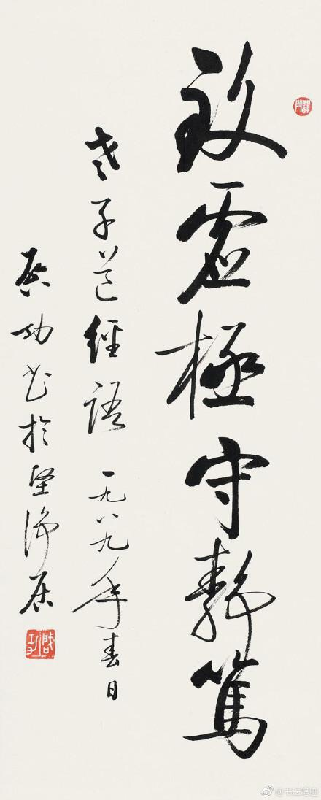
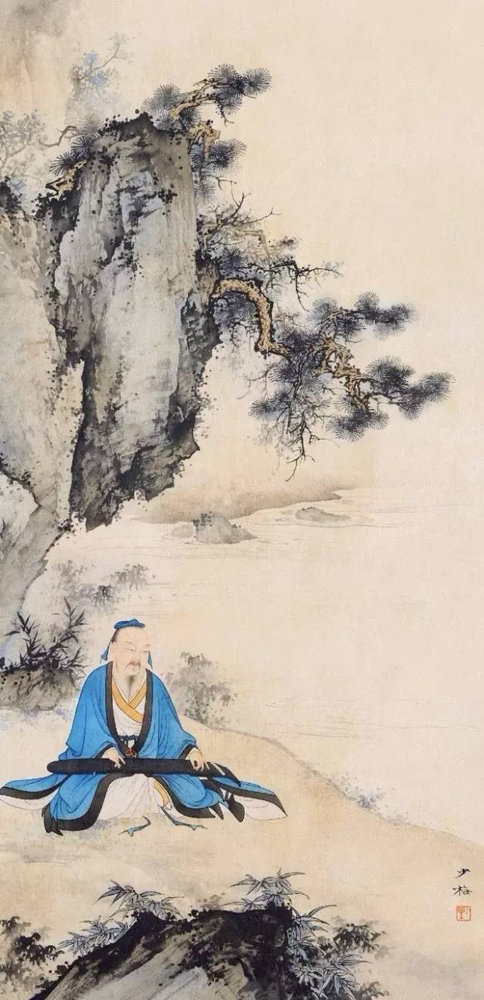
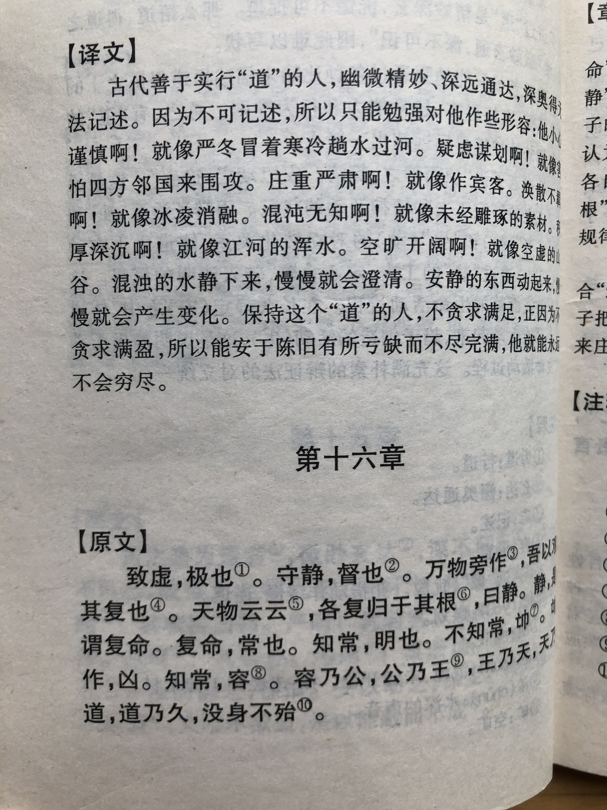
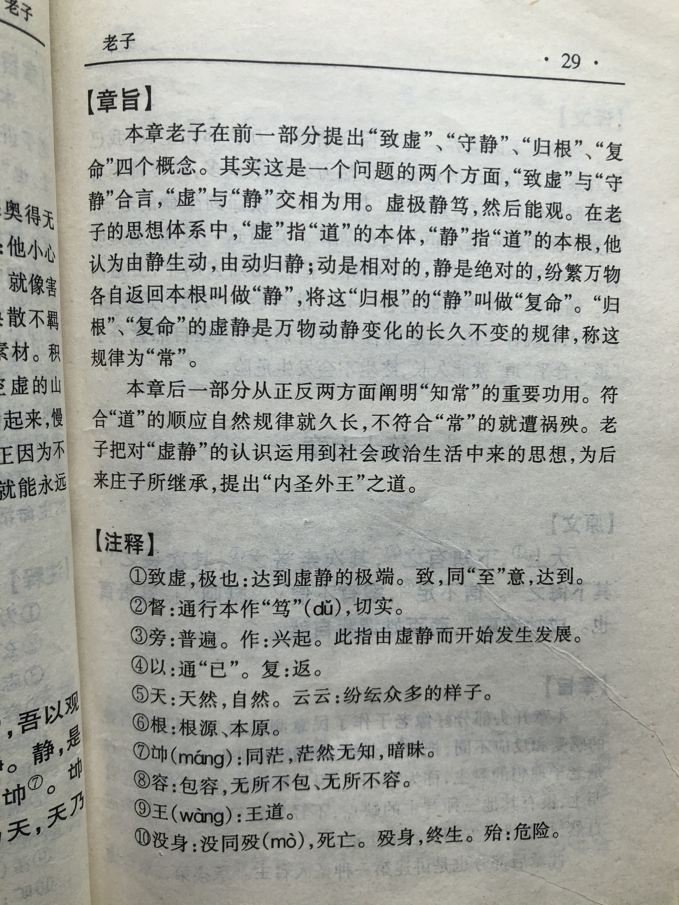

## 《道德经》第十六章通行本原文：

    致虚极，守静笃，万物并作，吾以观复。
    
    夫物芸芸，各复归其根。归根曰静，是谓复命。
    
    复命曰常，知常曰明，不知常，妄作，凶。
    
    知常容，容乃公，公乃王，王乃天，天乃道，道乃久，没身不殆。

## 译文：
 
    保持心灵的虚空到极致，守住内心的清静到极致。
    
    万物蓬勃生长，我从中观察循环往复的道理。
    
    天下万物虽然生长茂盛，但最终都将回归到本根。
    
    返回本根就叫“静”，“静”就是复归本性。
    
    复归本性是万物运动变化的规律，认识这条规律叫作“明”。
    
    不了解这个规律，轻举妄动就会有凶险。
    
    了解这个规律的人，就能做到宽容，做到了宽容才能公正，公正才能周全，
    
    周全才符合自然，符合自然才能符合于“道”，符合“道”就能长久，可以终身不殆。

## 逐句解释：
### 致虚极，守静笃（dǔ）

虚极是个什么概念呢？应该是彻底的虚空，抛掉思想杂念，尤其是个人欲望，保持内心澄澈，无我利他。注意这里与打坐静修并非一个意思。这里是说内心能保持清净，而打坐只是仪式上的清静。老子的更高智慧在于保持入世的清静，而非出世的清静。

### 万物并作，吾以观复

万物不断生长，我从中观察循环往复的规律。

### 夫物芸芸，各复归其根

万物生长繁茂，最后仍旧复归其本根，即最初的状态。种子会发芽，小芽会长成树木 ，树木会结果，果子再变成种子，如此循环往复，不断回到最初。

### 归根曰静，静曰复命

回到本根叫做“静”，“静”就是复归其本性、本真。

### 复命曰常，知常曰明

复归本性是一种规律，知道这种规律叫做“明”。明亮的明，明了的明，明心见性的明。

### 不知常，妄作凶

不知道这个规律，就任意妄为的会带来危险。不了解“道”之规律，千万别“作”。

### 知常容，容乃公，公乃全，全乃天，天乃道，乃久，没（mò）身不殆

知道了这个规律就会变成包容、宽容，包容、宽容就会做到公平、公正，公平、公正才能做到周全，做到周全才符合客观自然，客观自然就是“道”，符合“道”就会长久，就不会陷入危险境地。

## 心得总结：

本章老子指出“道”乃是返回本根，即追求极致的虚空和清静。也就是致虚极，守静笃。上两章老子分别描述了什么是“道”以及修道之人的状态，这章就来说明“道”的核心内容。

老子认为得道之人一定是保持内心的虚空和清静的，这种虚空和清静是去除内心的浮躁和欲望，让自己静下心来，减少个人私欲，回归到一种自然状态的本真中来。所以“清静”是老子的核心思想之一，所谓清静无为。但老子的清静并非形式上的清静，而是内心的清静，是一种以出世心态做入世事情的豁达和宽广。

很多人认为老子是让大家消极无为，去练习打坐清修，两耳不闻窗外事，作世外之人。其实这是一种误解。老子只是让大家保持一种清静的状态，在浮躁的社会中，笃守内心的宁静。同时仔细观察事物的运行规律，然后再按照这种规律去办事，不要违背规律去制造祸患。老子是积极的，他告诉大家不要轻举妄动，而不是不动，是要在认清“道”的规律后肩负起责任，敢于担当，治理天下，大展宏图。

前面几章老子分别提到修道的人应该“宠辱若惊，贵大患若身”、“夫唯不盈，故能蔽而新成”，这章老子是告诉大家“致虚极，守静笃”。这几个告诫是一脉相承的，中心思想是守静、谨慎、担当。是在告诫统治者或管理者要守住内心的宁静，能伸能屈，保持谦卑，依循自然，不断革新。这对我们普通人来讲，也就是老老实实做人，踏踏实实地做事。

最后，再强调一遍！老子的思想一点也不消极。看到消极的是因为没看懂或者自己本身消极。我看到的恰恰是一种充满大智慧的担当和责任，是对美好生活的渴望，和不断进取，敢于奉献的精神。

## 附帛书版：

[返回目录](../README.md) &nbsp; [上一章](./15.md)&nbsp; [下一章](./17.md)

