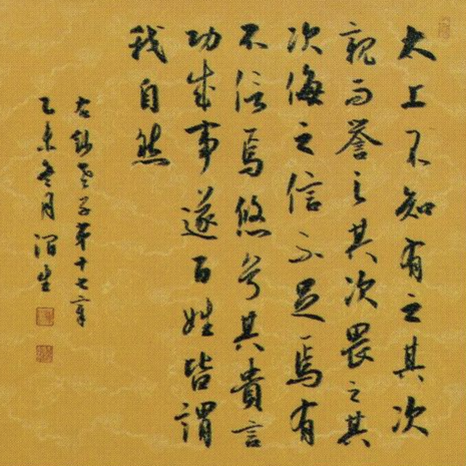
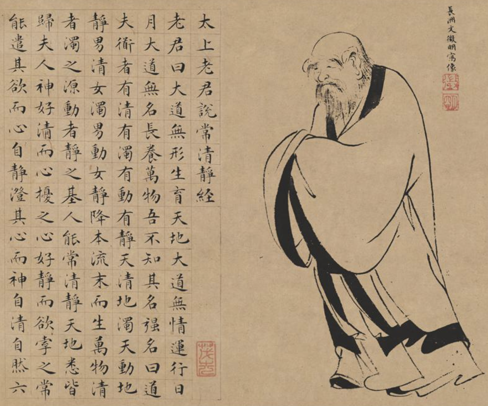
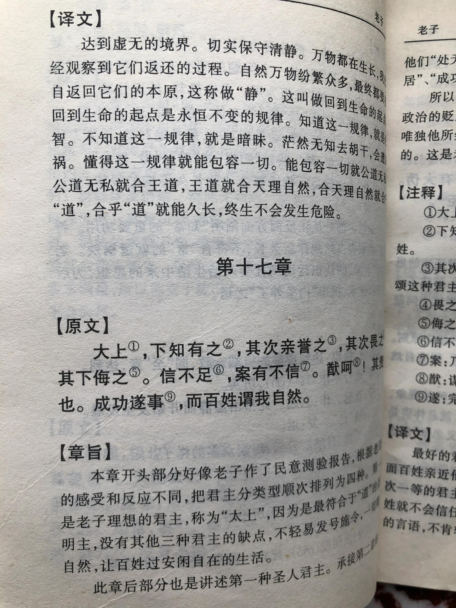
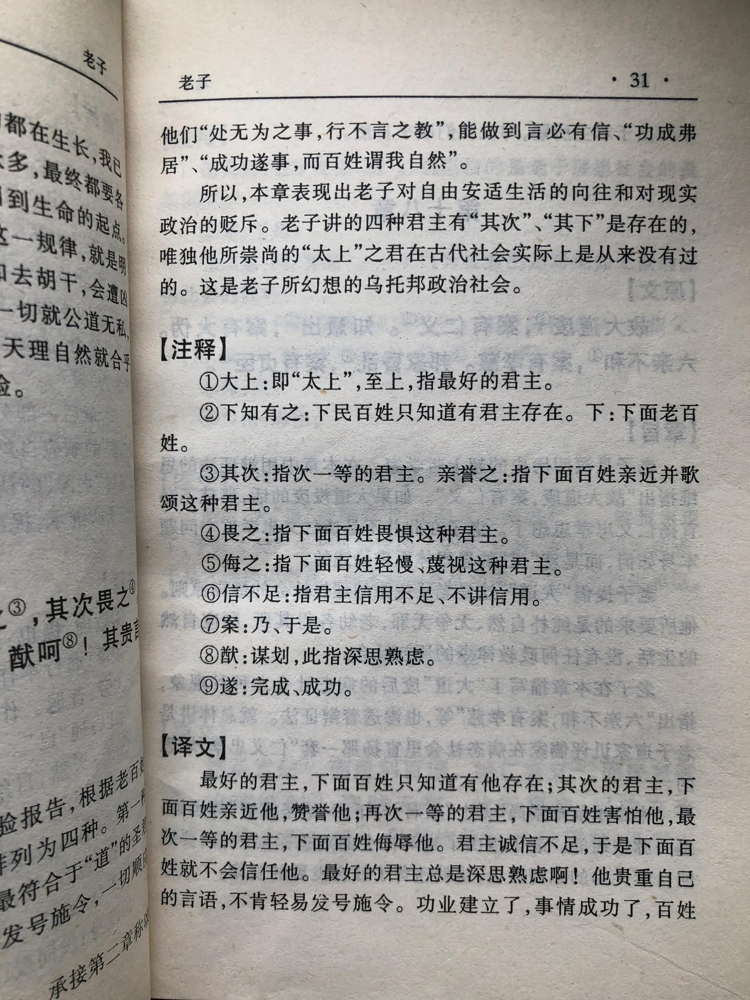

## 《道德经》第十七章通行本原文：

    太上，不知有之；
    
    其次，亲而誉之；
    
    其次，畏之；其次，侮之。
    
    信不足焉，有不信焉。
    
    悠兮，其贵言。功成事遂，百姓皆谓我自然。

## 译文：
 
    最好的统治者，百姓并不知他的存在；
    
    其次的统治者，百姓亲近而赞誉他；
    
    再次的统治者，百姓畏惧他；
    
    更次的统治者，人民轻蔑他。
    
    统治者的诚信不足，百姓才不相信他。
    
    最好的统治者悠闲自在，他很少发号施令。
    
    当事情做成功了时，老百姓会觉得这就是本来的样子。

## 逐句解释：

### 太上，不知有之；其次，亲而誉之；其次，畏之；其次，侮之。
太上就是最好，这里指统治者或领导者。当统治者默默治理天下的时候，人们甚至不知道他的存在，这就是无为而治的境界，实际上做了很多事情，做的很自然，看起来好像什么也没有做一样，老百姓甚至都不知道。次一点的是统治者，是做了很多事情，那是老百姓想要的，因此会受到亲近和拥戴。再次一点的统治者，就是他做了很多事，但通过威权和强制干预的方式做事，结果也不是百姓想要的，百姓因此感到畏惧。最次的是，统治者残暴无道，欺凌百姓，与百姓争夺利益，这样的统治者，人人都会蔑视和侮辱他。

### 信不足焉，有不信焉。
信就是诚信，统治者信任不足，就会导致百姓失去信任，最后失去信心。

### 悠兮，其贵言。功成事遂，百姓皆谓我自然。
好的统治者，按照“道”的规律治理，顺其自然，悠闲自在，他的号令很珍贵，不会频繁发号施令。当事情做成以后也不居功，而是退居幕后，让百姓得利，老百姓甚至以为一切原本就是这样子的。这就是以天下为己任，后天下之乐而乐。

## 心得总结：
本章老子又回到了无为而治的话题。前面几章老子分别谈到了“什么是道”，“什么是有道之人”，“以及修道的方式”等。这章又回到了统治者如何治理天下的话题。本章的中心思想依然是道法自然，无为而治。

老子认为君王分四个等级。第一等是效法天地的得道之君，第二等是爱护民众的有德之君，第三等是强制干预的威严之君，第四等残暴无道的失德之君。最好的君王应该是遵循道法自然，无我利他，润物无声，做成之后老百姓甚至都感知不到。当然这种最高境界如果你达不到，那就退而求其次，做个让百姓爱戴拥护的统治者，而不是做让老百姓感到畏惧的领导者，更不要做让老百姓憎恶、轻蔑的人。

封建历史上有数百位君王，各种统治官员也有数千上万。但真正能让老百姓爱戴，让老百姓记得的也没多少，而那些实行无为而治，天下为公，与民休息的统治者少之又少。所以治理天下不是件容易的事情，而能做到无为而治，道法自然更不容易。

老子期待的理想君王究竟存不存在呢？这其实是个难题。人性都有自私贪婪的一面，做事或多或少也都为了个人的名或利。统治者也不例外，统治者都想流芳千古 、名书竹帛，受到人们永世的爱戴。老子提倡的最高境界，在现实中比较难以达成。但这个目标，值得提倡，值得统治阶级以及每一个管理者去学习。秉持最高的理想，达成二等结果也是可以的，就怕秉持三等的理想，达成四等的结果。

## 附帛书版：

[返回目录](../README.md) &nbsp; [上一章](./16.md)&nbsp; [下一章](./18.md)

