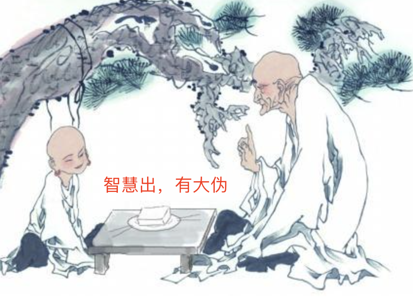
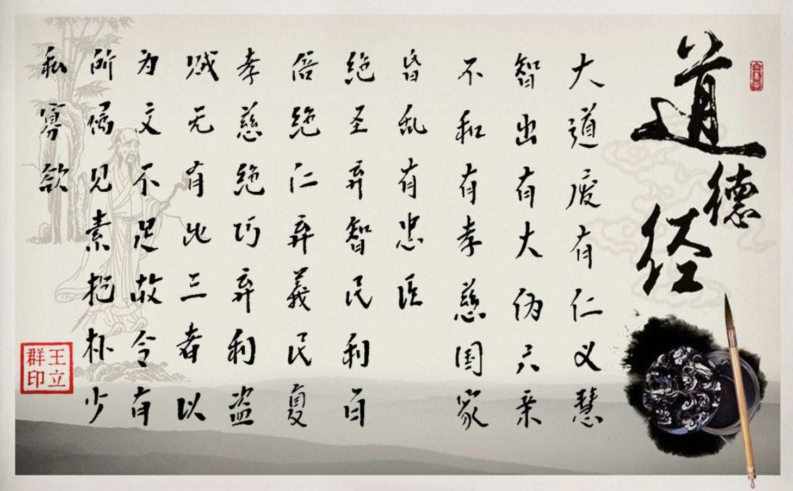
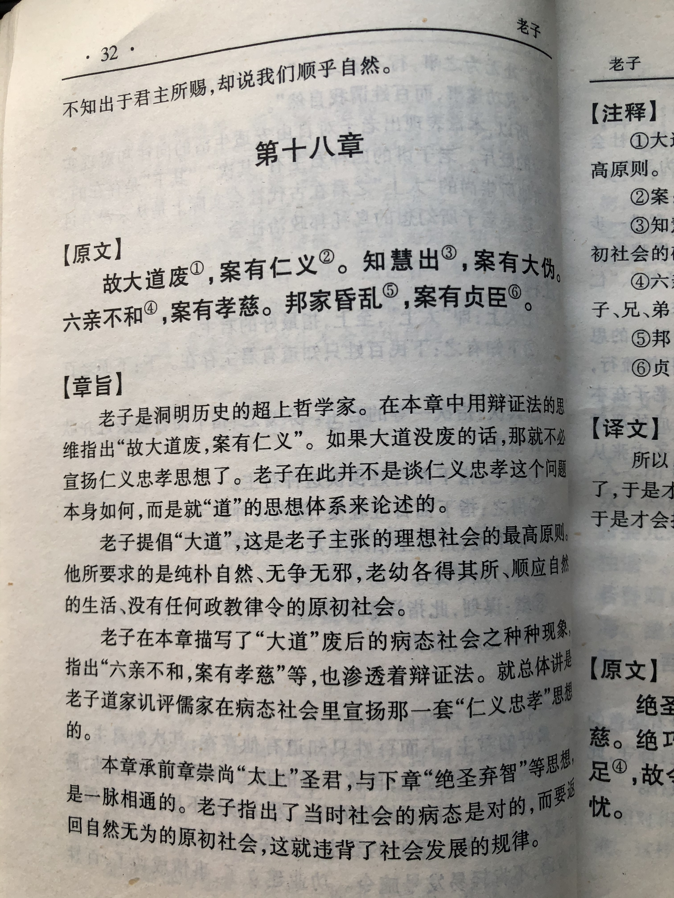
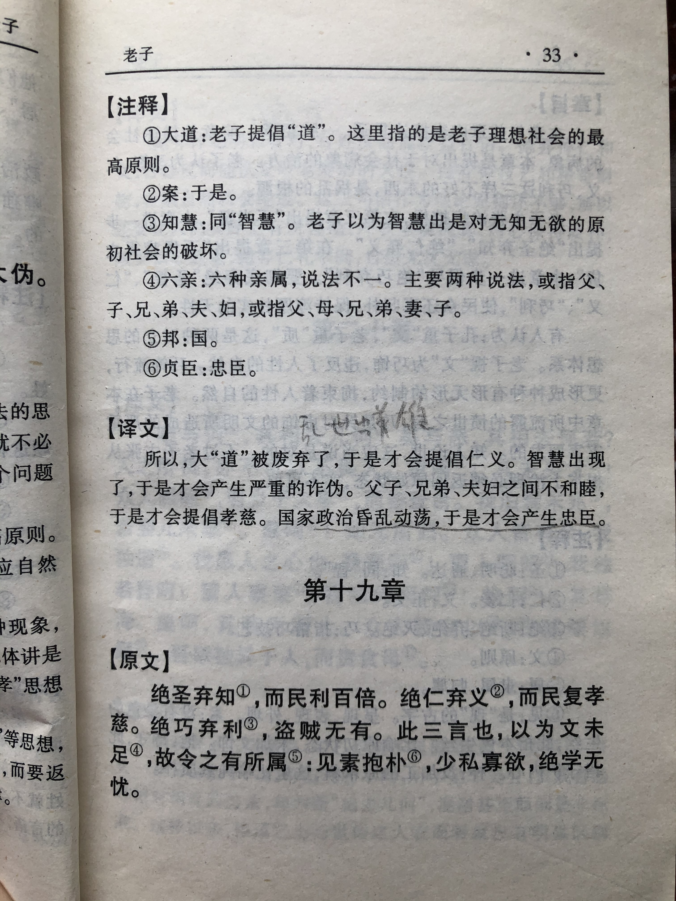

## 《道德经》第十八章通行本原文：

    大道废，有仁义；
    
    智慧出，有大伪；
    
    六亲不和，有孝慈；
    
    国家昏乱，有忠臣。

## 译文：
 
    大道被废弃了，才提倡仁义。
    
    智慧巧诈出现了，就会产生大伪。
    
    父子、兄弟、夫妻不和睦的时候，才会提倡孝慈；
    
    国家混乱的时候，才会出现忠臣。

## 逐句解释：

### 大道废，有仁义；
大道，即光明正大的道，包括自然法则和社会秩序等。当秩序紊乱、礼乐崩塌的时候才会提倡仁义，否则社会上秩序良好、君王有道、人人有德，那何需仁义一说呢？

### 智慧出，有大伪；
智慧，这里指智巧，巧妙。当人们穷尽智力，不断展现聪明才能时，大奸大伪也就出现了。人们拥有聪明才智是好事，但是如果内心不笃定，戴着伪善的面具做起恶来，那破坏力也很强。

### 六亲不和，有孝慈；
六亲，父子、兄弟、夫妻，指家庭。当家庭不和，各怀私心时，才需要特别强调慈爱孝悌，否则依循自然，克制私欲就足以凝聚大家，根本不用强调人伦礼制那一套。

### 国家昏乱，有忠臣。
国家朝政混乱，君主暗弱，奸臣当道，这时候就很需要正直忠诚的臣子来匡扶天下，主持正义。如果四海清平，君王将相皆有道，又何必出来忠臣？

## 心得总结：
老子这章其实是对儒家的仁义礼智的反对。在老子看来，世人推崇的仁义，恰恰是因为大道荒废了;那些巧诈、奸伪的出现，恰恰是因为世人挖空心思运用智慧的结果。孝慈、忠臣的出现也是这样。

儒家强调的那一套都是建立在礼乐崩坏之后，而如果保持天道，哪里需要那一套约束人的制度呢？凡事皆有两面性，仁义礼智也不例外。当人人都认识和遵循“道”，保持本真，那根本就不需要额外的约束。

可见老子是站在更高的层次去看问题的，他认为君王昏庸无道，百姓贪婪自私，社会秩序混乱，这时候才需要通过道德教化来维持秩序；之所以提倡孝慈，是因为家庭缺失了和睦。这是有道理的，类似中医里面的治未病，而不是治已病。如果一个人很健康，又何必要吃药打针呢？老子是从根本上来解决问题的，从根源上找到症结，然后给出对应良方。

但仍存在的问题是，根源的问题能否得到有效解决？这是个千古难题，就像人能否去除烦恼和矛盾一样。无论是治理天下还是企业，抑或是家庭，要想彻底根治、解决矛盾是不可能的。只要人还需要生存，那么就有欲望；只要有欲望那么就有矛盾；只要资源是稀缺的，那么就会有竞争；只要是有竞争，那么就会存在分歧。

也有人提出现代社会的民主法治才是保持社会秩序和解决根本矛盾的方法，但其实也不然，法制通常是滞后的，这也是一种治已病，且如何保证法治执行过程准确到位也是个难题。

佛教以出世的方式告诫人们摆脱欲望，超脱自我，到达快乐的彼岸，这是另外一种态度。老子和孔子都不是这样的，老子不像孔子着重于解决当前实际的矛盾，老子希望解决长久的根源矛盾。老子的道法自然、无为而治的方案能否解决这个长期矛盾呢？我看是解决不了，儒释道三家以及世界上其他宗教和哲学思想都不能彻底解决。但解决不了不等于不去解决，就好像知道地球总会灭亡，人类终将消失，但我们依然会竭尽全力发展科技和文化，不断探索未知世界和提升自我认知，以让生活更加美好幸福。

儒家、道家、佛教它们要解决的问题并不完全相同，它们在不同层次和时机有着不同的作用。我们不去否认任何一家的作用，也不去吹捧任何一家的功效。这里老子对于儒家提倡的仁义礼智信的否定是正确的，但儒家奉行的仁义礼智信也是正确的。

## 附帛书版：

[返回目录](../README.md) &nbsp; [上一章](./17.md)&nbsp; [下一章](./17.md)

