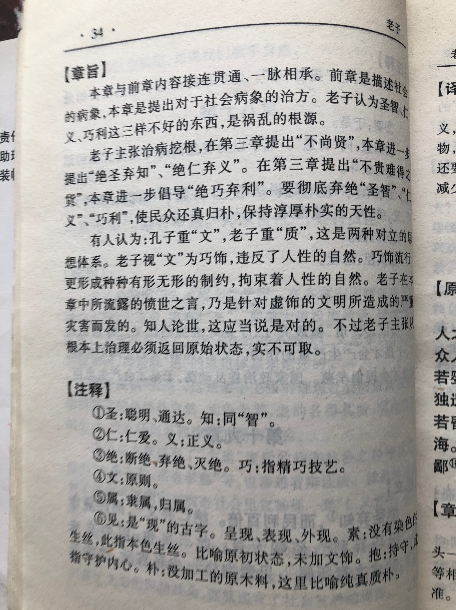

## 《道德经》第十九章通行本原文：

    绝圣弃智，民利百倍；
    
    绝仁弃义，民复孝慈；
    
    绝巧弃利，盗贼无有。
    
    此三者以为文不足，故令有所属。
    
    见素抱朴，少私寡欲；绝学无忧。

## 译文：
 
    抛弃掉聪慧和智巧，对百姓有百利无一害；
    
    杜绝仁慈和道义，百姓就会回归孝慈的本性；
    
    抛弃巧诈和利益，就不会有盗贼产生。
    
    “圣智、仁义、巧利”这三者还不足成文立规，但要让人们的思想认识有所归属。
    
    那就是保持纯洁质朴的本性，减少私欲杂念，不去学那些“圣智礼法”的浮文，这样就没有什么忧患了。

## 逐句解释：

### 绝圣弃智，民利百倍；
圣，这里指圣贤所拥有的才智和聪慧。智，智巧、智慧。意思就是，统治者应该放弃掉披着圣人外衣的修养和智慧，返璞归真，这对于人们是极大的好事。

### 绝仁弃义，民复孝慈；
放弃掉披着圣人外衣的“仁义”，民众会恢复孝慈，和睦相处。

### 绝巧弃利，盗贼无有。
巧，巧诈，技巧。利，就是利益、获利。放弃掉以巧诈与利益之争，盗贼也就没有了。因为人人朴实，民不为盗。

### 此三者以为文不足，故令有所属。
上述“智仁、孝慈、巧利”这三者不足以成文立规，还是要有其他的方式来让大家遵循。

### 见素抱朴，少私寡欲；绝学无忧。
素，是没有染色的丝。朴，没有雕琢的木头。这里指人应该保持朴素自然的本性，减少个人私欲杂念，不去学那些智巧、装饰、蛊惑人心之类的学问，这样就不会有什么忧患和烦恼。

## 心得总结：
本章是延续上一章的内容。上一章讲到“大道废，有仁义；智慧出，有大伪；六亲不和，有孝慈；国家昏乱，有忠臣。”，已经告诉大家不要去搞那些聪明才智、假仁假义。

这一章也一样，老子提出“绝圣弃智”、“绝仁弃义”、“绝巧弃利”的治世思想。认为“仁义、“圣智”、“巧利”等不足以作为治理天下的法则。

老子依然在抨击那些推崇圣贤才智的学说，认为那些只是一种巧饰，与自然是违背的。他让大家不要去追逐什么聪明才智和虚名浮利，而是回归朴素，减少私欲，少学那些冠冕堂皇的“仁义礼智”之类的学说。老子是从根本上来看问题的。

我们不能说孔子见地不如老子，也不能说老子的抨击没有根据。这个世界很华丽，但也很浮躁，人们追名逐利，不择手段。这样下去，人性被刺激得越发贪婪，表面和气，讲究仁义，而背地里相互倾轧和处处内卷，人人都活得累。

领导者治理天下强调美德是好的，鼓励大家提升修养，鼓励相互竞争也是好的，但凡事过犹不及。人类虽一直在不停向更高级文明发展，但这并不需要我们聪明智巧和争当圣贤，反而需要我们应该略显笨拙，去除私欲，回归朴素。

这几句话初听起来，老子是反智的，让百姓少欲望，不进步，无竞争，回归朴素。其实如果把这些章节连在一起看，就会发现老子本意是抨击那些整天仁义道德，满口等级有序的“圣贤君子”，老子不喜欢人为的刻意干涉，觉得那样反而使人虚伪。老子喜欢的是顺其自然，返璞归真。总之，老子并不反智，也不消极。相反，老子是大智慧和真积极。如果读懂了老子，那么人生就豁然开朗了。

## 附帛书版：

[返回目录](../README.md) &nbsp; [上一章](./18.md)&nbsp; [下一章](./20.md)

