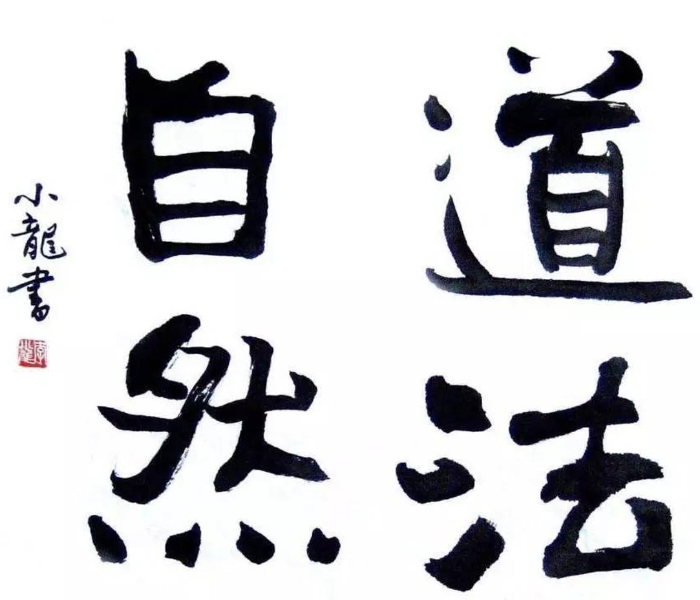
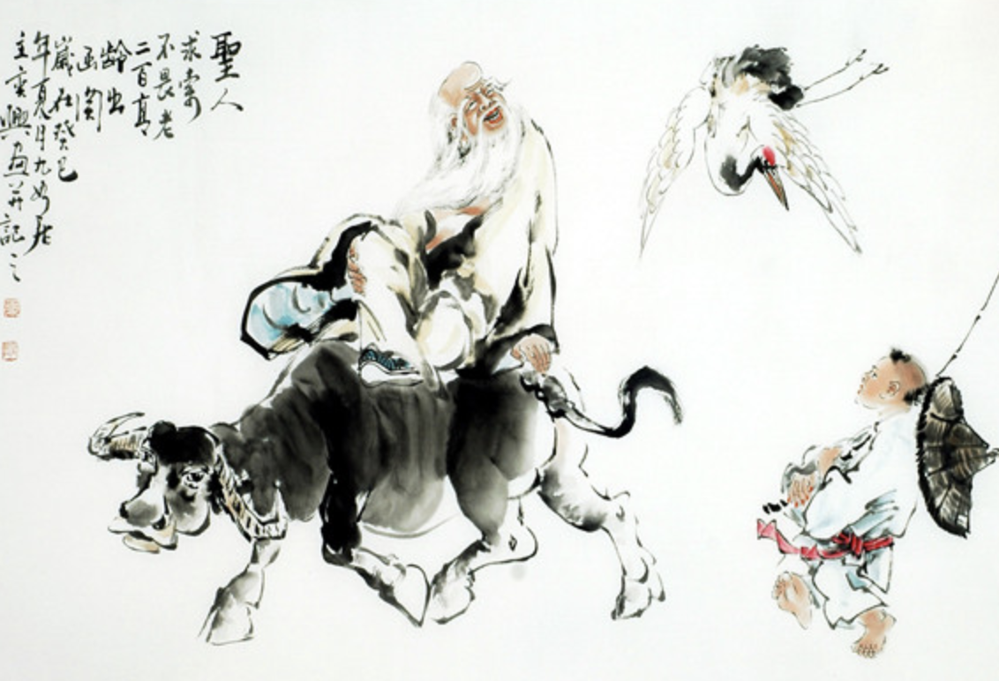
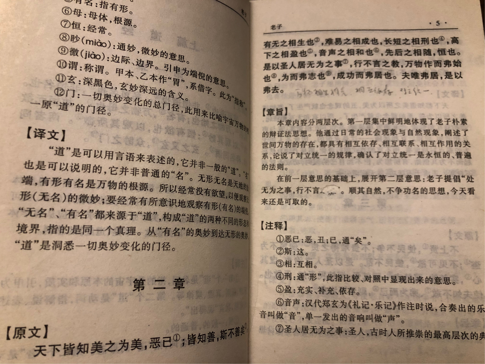
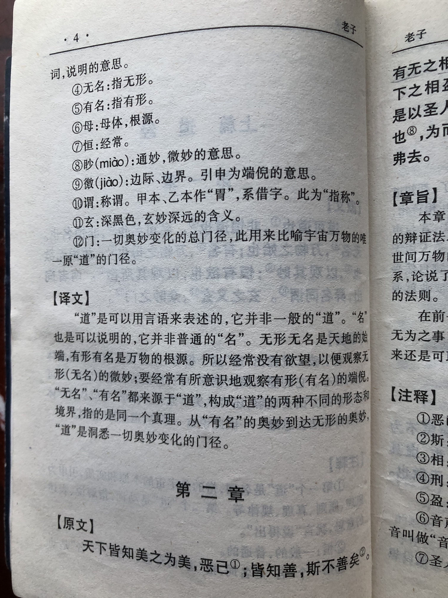
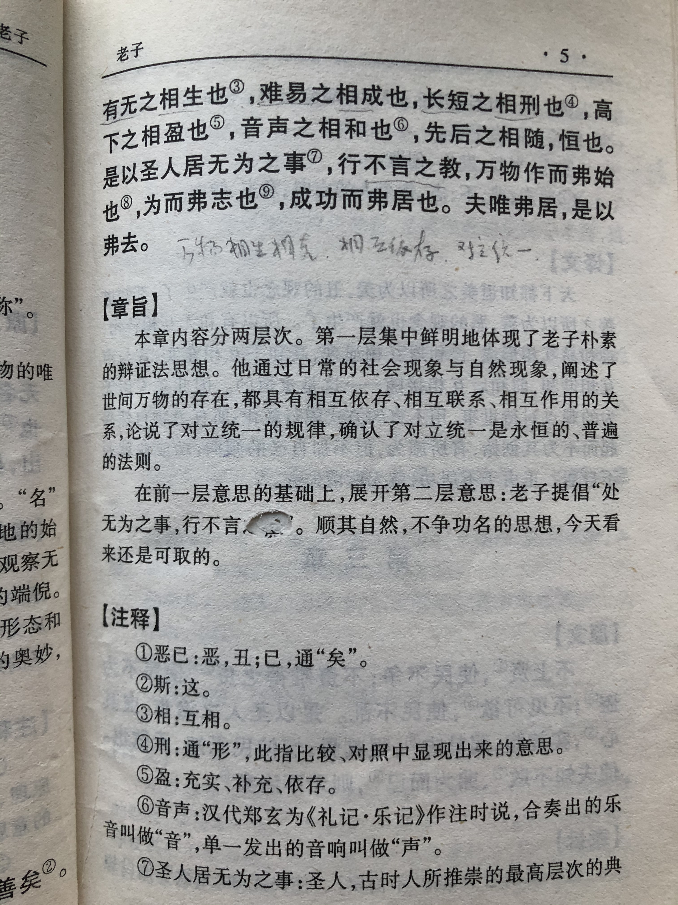

## 《道德经》第二章通行本原文：

    天下皆知美之为美，斯恶已；
    
    皆知善之为善，斯不善已。
    
    故有无相生，难易相成，
    
    长短相较，高下相倾，
    
    音声相和，前后相随。
    
    是以圣人处无为之事，行不言之教。
    
    万物作焉而不辞，生而不有，为而不恃，功成而弗居。
    
    夫唯弗居，是以不去。

## 译文：
 
    天下人都知道美之为美，那是有丑的存在。
    
    都知道善之为善，那是因为有恶的存在。
    
    所以有和无互相转化，难和易互相形成；
    
    长和短互相显现，高和下互相充实；
    
    音与声互相协同，前和后互相紧随——这是永恒的规律。
    
    因此圣人用无为的方式来行事，用不言的方式来教化。
    
    听任万物自然兴起而不刻意去改变，有所作为但不加强加个人意志，取得成就而不自居。
    
    正因为不居功，反而不会失去。   

## 逐句解释：

### 天下皆知美之为美，斯恶已。皆知善之为善，斯不善已。
天下人之所以称美为美，是因为有了丑的概念。或者说产生了美的概念，那就也产生了丑的概念。当知道善这个概念的时候，恶的概念也就产生了。

### 故有无相生，难易相成，长短相较，高下相倾，音声相和，前后相随。
有和无，或者说物质和意识是相互形成，相互依存的。就像难和易相互形成，长和短相互显现，高和下相互充实，音和声相互调和，前和后相互倚靠一样，这是亘古不变的道理。

### 是以圣人处无为之事，行不言之教。
因此圣人以无为的态度来担当和行事，用不言的方式来教化。

### 万物作焉而不辞，生而不有，为而不恃，功成而弗居。
让万物自然兴起，而不要刻意去让其生长。圣人有所作为但不会按个人偏好去任意干涉，功成名就后也不会居功自傲。

### 夫唯弗居，是以不去。
正因为不居功，反而不会失去。

## 心得总结：
这一篇包含有很多的辩证思维，通过层层推进，不断举例强化，告诉大家事物对立面是相互统一、相辅相成的。没有哪个更好，也没有哪个更坏。美丑善恶、长短高下皆是如此。我们不应该厚此薄彼，而应该无差别对待一些概念和事物。对于世间万物我们应该保持敬畏，有所为但不要按个人意志去破坏客观事物的本来面目。当我们持有“无为”的这种心态时，我们反而能把事情做好。所谓顺木之本，以致其性也就是这个道理。

总之，我们应该客观看待问题，遵循自然法则，助力和顺应事物按本来的逻辑发展，而不要揉杂个人的偏好去揠苗助长。的确是这样的，太多的例子。无论教育孩子，还是企业发展，抑或国家复兴。由小到大，无论哪一件事情，我们都要遵循客观规律。在这一前提下，尽力而为，发奋图强，就一定可以做出成绩来。而如果罔顾事实，背离发展规律，那样就会适得其反，离目标越来越远。而一旦做出了成绩来，有了收获，我们也不至于夸大自己的作用，那不过是顺应了时代，依循了规律，做了正确的选择，更多的是时代成就了我们，而非我们成就了时代。

纵观古往今来，居功自傲者多，争权夺利者多，而这些行为一般都没有好下场。相反那些不居功、不夸耀的人啥也没有失去，反得到好的结果。这对于我们现代人来说，应该铭记这一点，要有所为，但不要居功自傲。

## 附帛书版：

