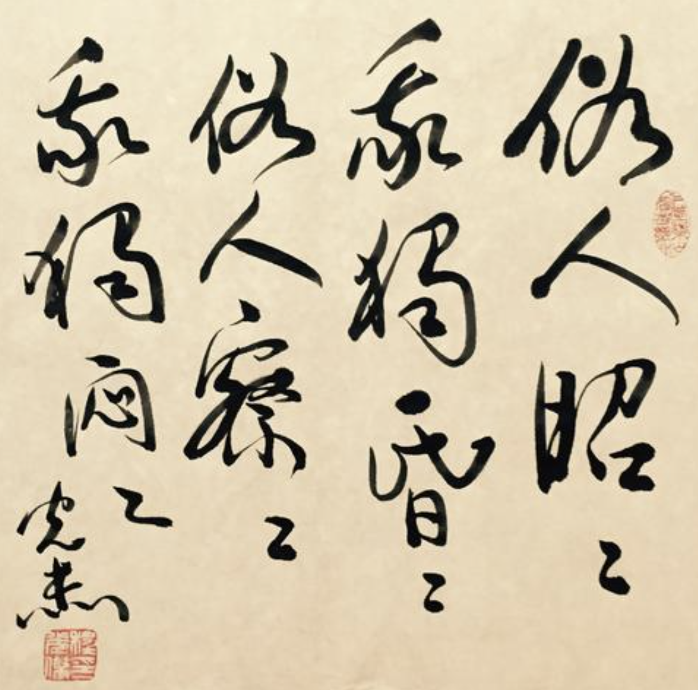
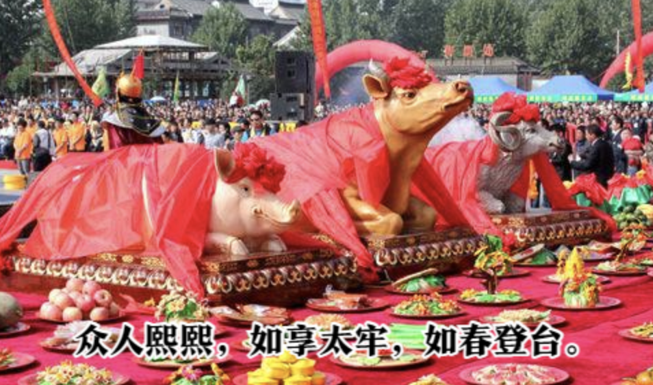
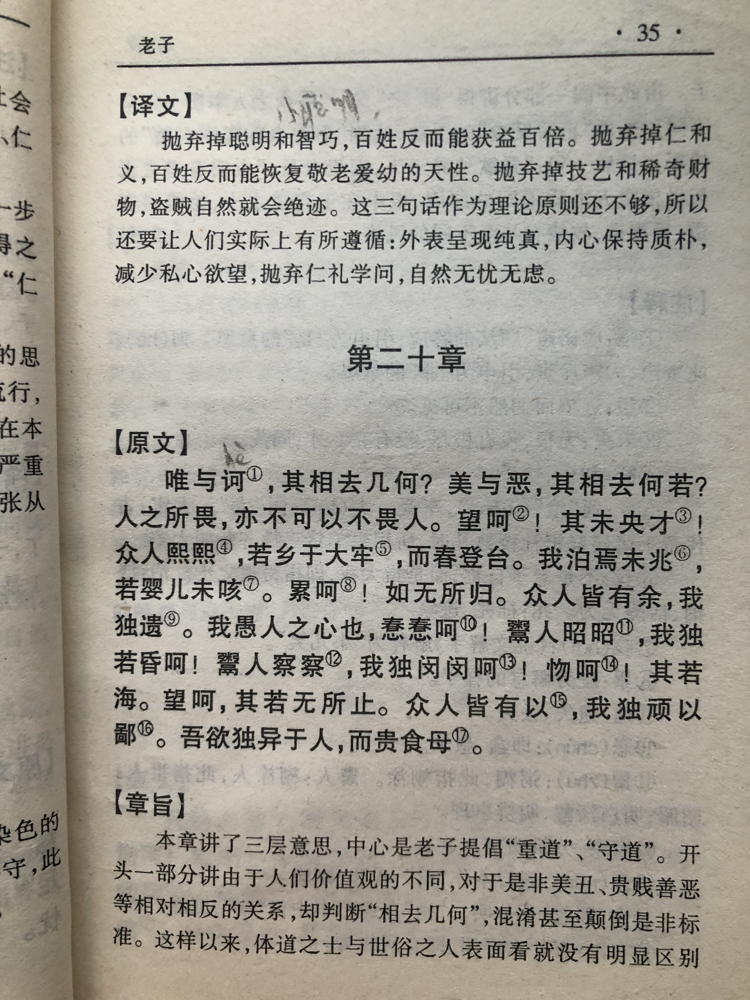
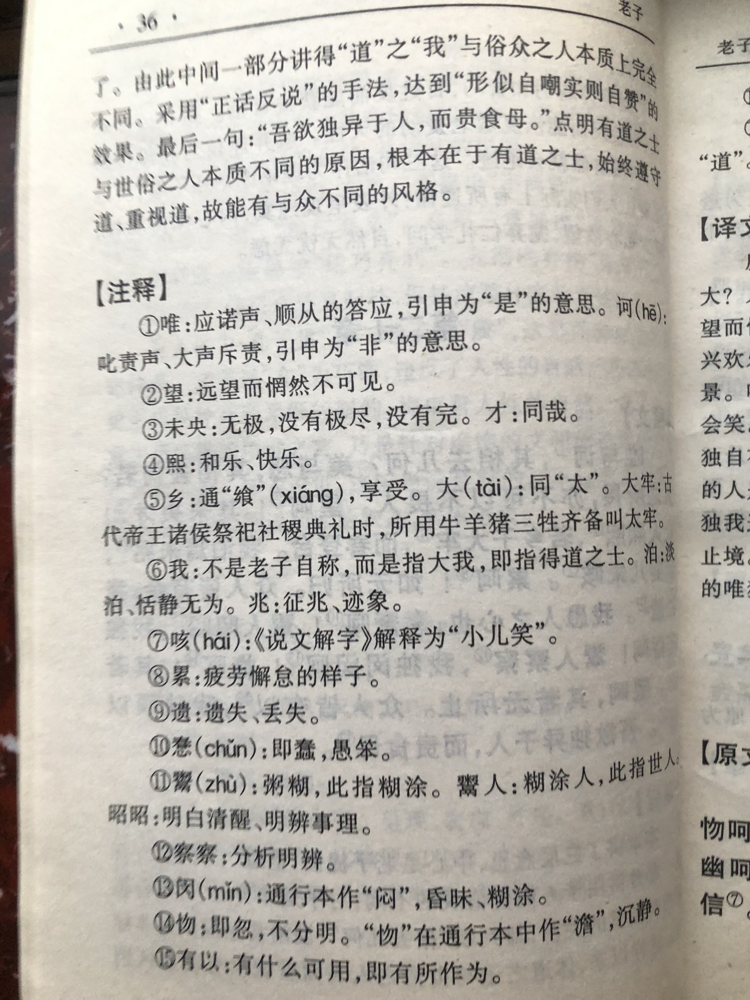

## 《道德经》第二十章通行本原文：

    唯之与阿，相去几何？
    
    善之与恶，相去若何？
    
    人之所畏，不可不畏（人）。
    
    荒兮，其未央哉！
    
    众人熙熙，如享太牢，如春登台。
    
    我独泊兮，其未兆；
    
    沌沌兮，如婴儿之未孩；
    
    儽儽兮，若无所归。
    
    众人皆有余，而我独若遗。
    
    我愚人之心也哉！
    
    俗人昭昭，我独昏昏。
    
    俗人察察，我独闷闷。
    
    澹兮其若海，飂兮若无止。
    
    众人皆有以，而我独顽且鄙。
    
    我独异于人，而贵食母。

## 译文：
 
    唯诺和呵斥，相距有多远？
    
    美好与丑恶，又相差多少？
    
    人所畏惧的对象，也不可不畏惧人。
    
    其中道理宽广深远，好像没有尽头。
    
    众人光彩照人，如同享受祭祀供奉，也如同春天里登高眺远。
    
    而我却独自淡泊宁静，无动于衷。
    
    我混混沌沌啊，如同婴儿还不会笑。
    
    我疲倦散漫啊，好像浪子没有依归。
    
    众人皆有所盈余，而我独自有所遗失。
    
    我真是一颗愚人的心啊！
    
    世人都明明白白，唯独我昏昏暗暗；
    
    众人都精明洞察，唯独我不声不响。
    
    我宁静时像大海一样静谧；运动飘忽时没有止境。
    
    世人都很有作为，而我却愚昧粗鄙。
    
    我唯独与人不同的，就是推崇孕育万物的母体-“道”。

## 逐句解释：

### 唯之与阿，相去几何？
唯唯诺诺与呵斥指责，相去很远吗？可能咫尺之间。

### 善之与恶，相去若何？
善恶对比，相差又有多少？只在一念之间。

### 人之所畏，不可不畏（人）。
让人们所畏惧的统治者，也不得不畏惧人们。苛政猛于虎，人人畏之，然而民众一旦起来反抗，就会令统治者瑟瑟发抖。帛书版后面有一个人字，通行本缺失了后面的人讲不太通。

### 荒兮，其未央哉！
荒，帛书写作望，表示宽广。央，尽头。这里面的道理宽广无比，没有止境。比喻“道”一望无际，无穷无尽。

### 众人熙熙，如享太牢，如春登台。
熙熙，光彩照人，兴高采烈。享，或乡，飨也。太牢，诸侯祭祀，猪牛羊齐备为太牢。春登台，春天登台也是一种盛大仪式，感应天地，祈求风调雨顺。这里的意思是众人也就是那些世俗的领导者总喜欢光彩照人、受人瞩目，如供奉祭祀，如登台大典。

### 我独泊兮，其未兆；
泊，淡泊。兆，征兆。唯独我（泛指有道的管理者）淡泊名利，不动声色，不随波逐流。

### 沌（dǜn）沌兮，如婴儿之未孩；
孩，咳，小儿笑。得道的人混混沌沌的，像婴儿还不会笑。即质朴纯真的像刚出生时的婴儿一样，白璧无瑕。

### 儽儽（lěi）兮，若无所归。
儽，帛书为累，疲倦。意味得道之人疲倦散漫，没有羁绊，无所依归，不为世俗所牵挂。

### 众人皆有余，而我独若遗。
众人（世俗领导者）都有所盈余，渴望名利双收。而我却好像有所遗失，不断给予付出。

### 我愚人之心也哉！
我（有道领导人）就是一个愚笨之人的心态。没有聪明智巧，没有争权夺利，只有纯真质朴。

### 俗人昭昭，我独昏昏。
俗人，未悟道的领导者。他们都明明白白，彰显光辉，而得道的统治者却昏昏沉沉，略显糊涂。

### 俗人察察，我独闷闷。
未得道的领导者精明强干，善于纠察，而得道的统治者不声不响，润物无声。未得道的精于算计、争夺名利，得道的不记得失、无我利他。

### 澹（dàn）兮其若海，飂(liù)兮若无止。
澹，宁静。飂，飘忽。得道的领导者宁静时如大海般静谧，行动飘忽像风一样永无止境。

### 众人皆有以，而我独顽且鄙。
一般世俗领导者皆想有作为，希望拥有和得到，而得道的领导人却保持朴素和粗鄙。

### 我独异于人，而贵食母。
有道的领导者与世俗的领导者不同点在于，推崇万事万物的母体-“道”。

## 心得总结：

老子这章是继续就入道和世俗进行比较，文中的我与众人形成了强烈的反差。“我”是一种表述方式，指统治者，而“众人”就是世俗的统治者。“众人”皆醉“我”独醒，老子是告诉统治者治理天下，应该保持朴素自然，笃守默默奉献精神，而不应该光彩照人，大肆渲染自己的丰功伟绩。

这一章仍然是之前章节的延续，也就是提倡朴素的治国理念与笃静守拙的处世哲学。老子的这个朴素思想究竟对不对，是具有积极意义还是消极意义呢？

这要看你怎么来看。你如果进不到那个门，怎么说都是多余，觉得老子胡说八道，但如果入了门，略有开悟，那就会感觉是大智慧。

我呢？觉得老子逻辑体系有待完善，论证过程并不充分，某些观点的可执行性有待商榷。但老子的总体思想，以及老子的品德和服务精神，我是极为赞赏的。

首先，老子提出的是万事万物背后都有规律可循，我们应该去遵循和适应，而不是破坏。
其次，我们应该减少贪欲，回归朴素自然的生活，笃守内心的安静。尤其是管理者，甘居人后，不要争权夺利。
然后，得有奉献精神，虽千万人吾往矣。默默奉献，无我利他。虽无依归，也要给予。像大海壮阔，像风迅疾，像水柔静。

只要你按照“道”的规律付出了，努力了，就一定会有回报。这是内心必须的信念！

## 附帛书版：

[返回目录](../README.md) &nbsp; [上一章](./19.md)&nbsp; [下一章](./21.md)

