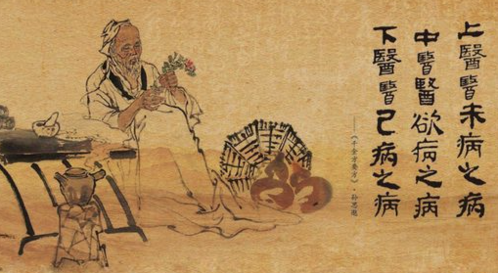
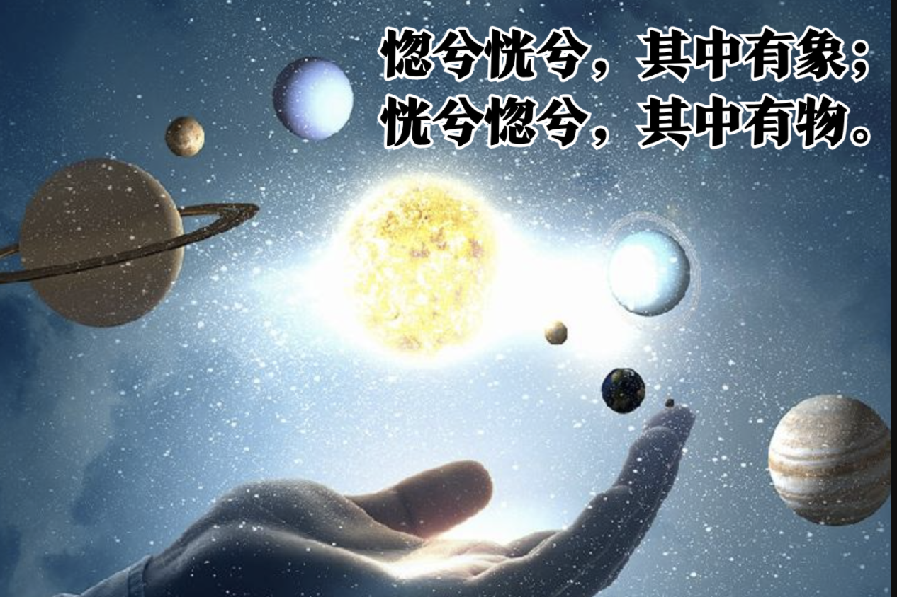
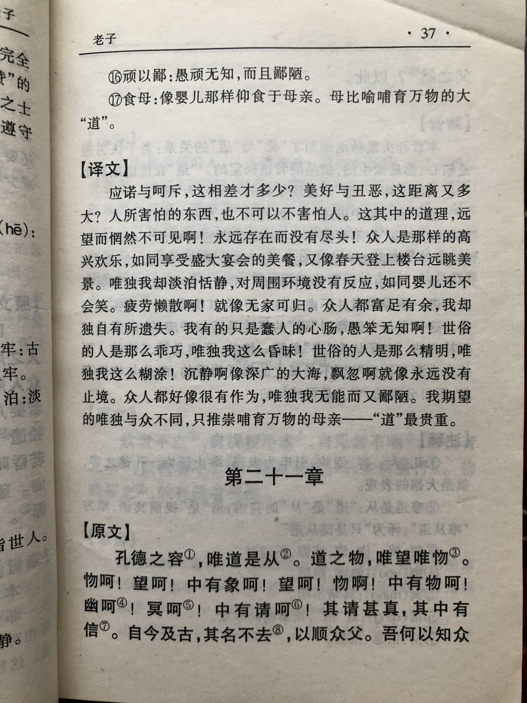
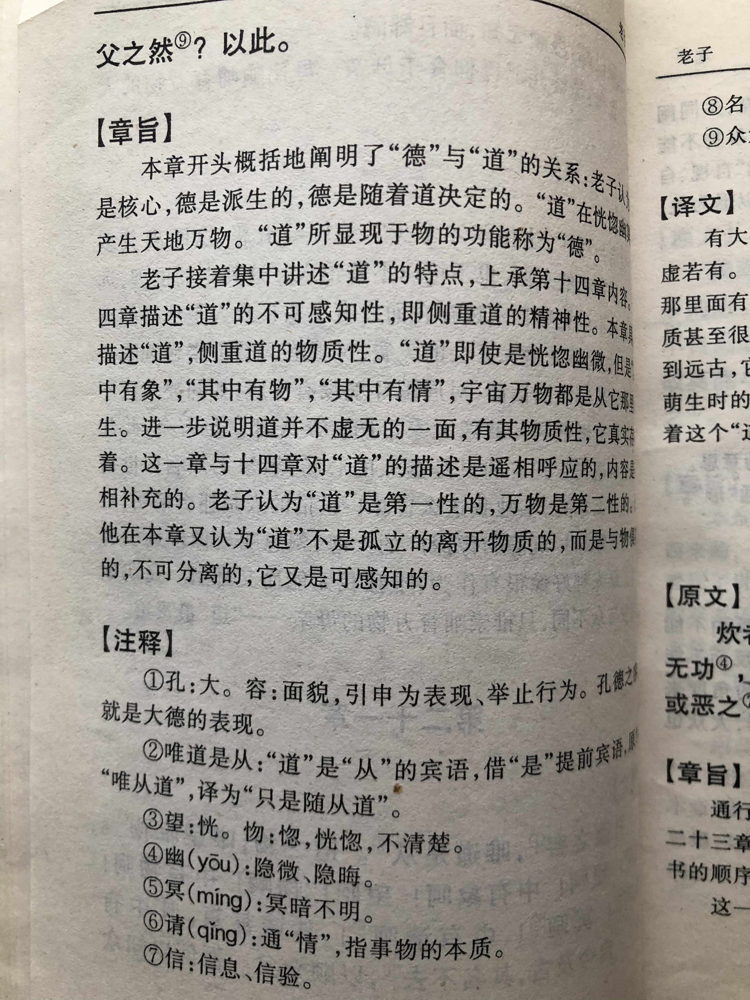

## 《道德经》第二十一章通行本原文：

    孔德之容，惟道是从。
    
    道之为物，惟恍惟惚。
    
    惚兮恍兮，其中有象；
    
    恍兮惚兮，其中有物。
    
    窈兮冥兮，其中有精；
    
    其精甚真，其中有信。
    
    自今及古，其名不去，以阅众甫。
    
    吾何以知众甫之状哉？以此。

## 译文：
 
    大德的形态，是由“道”所决定的。
    
    “道”这个东西，恍恍惚惚，似有还无。
    
    它是那样的不可捉摸啊，其中却有形态。
    
    它是那样的恍恍惚惚啊，其中却有实物。
    
    它是那样的深远暗昧啊，其中却有精质，这精质是真实存在的，是可以信验的。
    
    自今及古，”道“之名从未去除。通过它，才观察到万事万物的初始。
    
    我怎么了解万事万物起始状况的呢？都是从认识“道”开始的。

## 逐句解释：

### 孔德之容，惟道是从。
孔：甚，大。德：“道”形式上彰显为“德”。容：运作、形态。
大德的形态，是由“道”来决定。“道”是“德”的载体和本质，“德”是道的形式和表现。

### 道之为物，惟恍惟惚。
恍，惚，似有若无，难以捉摸，仿佛之意。
“道”这个东西，似有似无，恍恍惚惚。道可道，非常道。“道”不是可以说清楚的一般的道。
道是存在的，虽然看不到、听不见、摸不到，但它的的确确存在着，并影响着万事万物的生长与运行。

### 惚兮恍兮，其中有象；恍兮惚兮，其中有物。
象：形象、具象。“道”恍恍惚惚的，其中是有形态的；“道”混混沌沌的，其中是有实体的。

### 窈兮冥兮，其中有精，其精甚真，其中有信。
窈，深且远，微不可见；冥，暗昧，深不可测。精：最微小的物质，原子物质。
“道”深不可测、微不可见。“道”的原子物质非常真实，这些是可信验的。

### 自今及古，其名不去，以阅众甫。
众甫：甫与父通，引伸为始。
由今及古，”道“之名和规律一直都在，人们通过它来观察万事万物的起始。

### 吾何以知众甫之状哉？以此。
以此：此指道。我，这里指修道之人，或得道的统治者。
我怎么来了解万事万物的起源呢？就是通过认识“道”开始的。

## 心得总结：
本章又回到了对于“道”的特征描写，承接着第十四章的内容。同时本章还指出了“道”与“德”的关系，“道”是“德”的载体，“德”是“道”的表现。“道”决定着“德”，万事万物通过“德”这个形式来体现“道”的规律。

“道”依然惟恍惟惚，是无状之状，无物之象。大道形态是在恍恍惚惚之间渐行渐远，幽暗深邃，其中有象，象中有物，物中有精，精中有信。总之“道”是真实存在，而又无法琢磨。

这章还提出了“道”内在是由“精”这种最细微的物质构成的。“精”很细小，肉眼不可见，但却是万物构成的最小单元，这有点像物理学里面的原子、中子、质子或夸克之类的基本粒子，当然也可以指量子。“道”不再是凭空想象，随意捏造，而是基于物质的基本粒子。从这点看，2000多年前的老子，真的很高明。他已经观察到世界万物都由基本粒子构成，万事万物都受这个所支配。

但老子毕竟不是化学家、物理学家或者天文学家，老子并没有系统论述世界的基本物质构成，也没有详述物种起源，也没有逻辑推演出宇宙大爆炸理论。老子虽然缺乏系统的逻辑推演，但老子的结论足以震烁古今。老子是一个哲学家，在对事物的理解和认识上非常深刻。

通过本章我们对于“道”有了更加深入的了解，对于“道”与“德”的关系也比较清楚了。但要想真正搞明白“道”，依然任重道远！

## 附帛书版：

[返回目录](../README.md) &nbsp; [上一章](./20.md)&nbsp; [下一章](./22.md)

