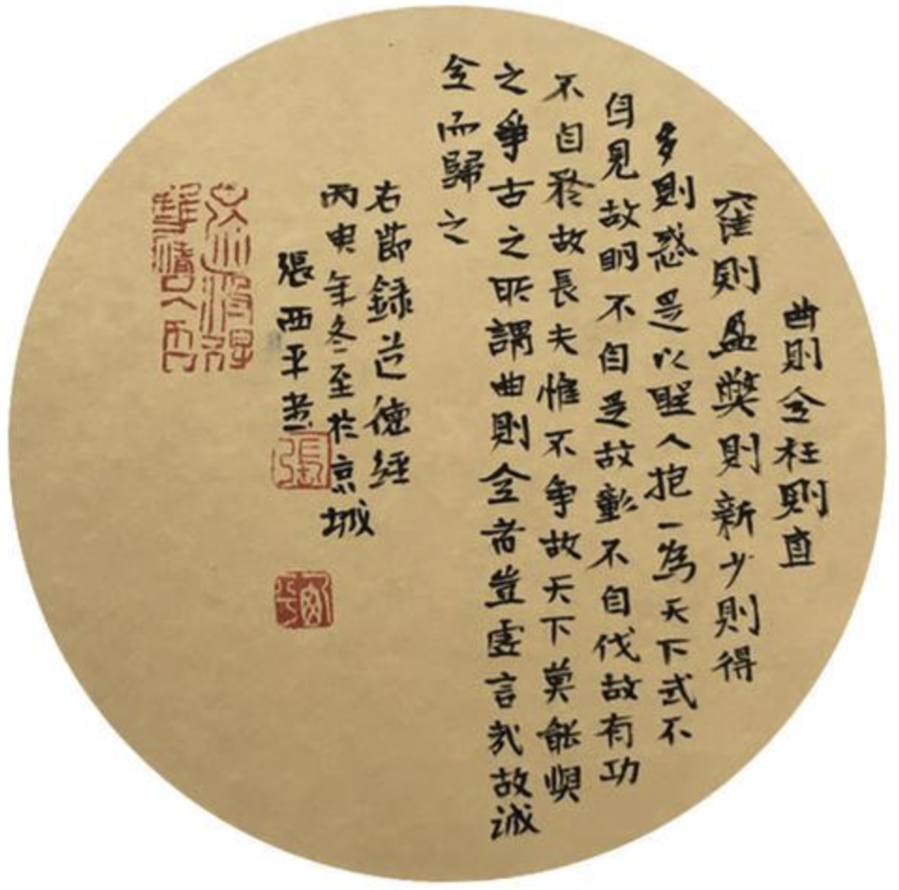
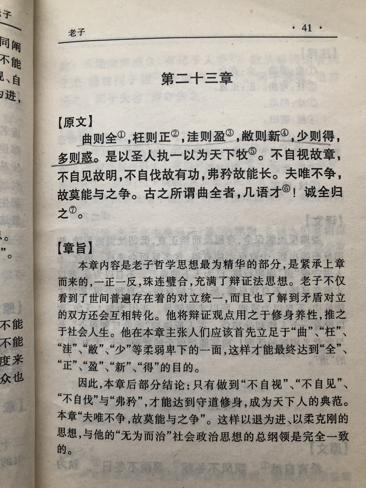
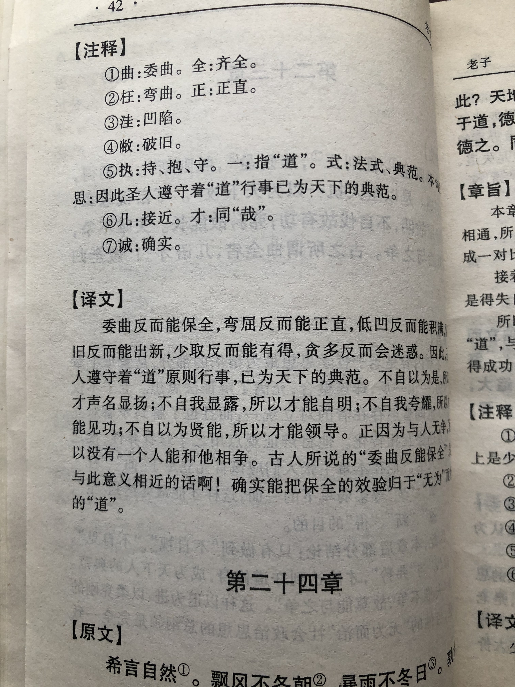

## 《道德经》第二十二章通行本原文：

    曲则全，枉则直；
    
    洼则盈，弊则新；
    
    少则得，多则惑，是以圣人抱一为天下式。
    
    不自见，故明；
    
    不自是，故彰；
    
    不自伐，故有功；
    
    不自矜，故长。
    
    夫唯不争，故天下莫能与之争。
    
    古之所谓“曲则全”者，岂虚言哉？
    
    诚全而归之。

## 译文：
 
    委曲便会保全，屈枉便会刚直；
    
    低洼便会充盈，陈旧便会新生；
    
    少取便会多得，贪多便会迷惑。
    
    所以有道的统治者坚守这一原则作为治理天下的范本。
    
    不自我表现，反能明显；
    
    不自以为是，反能彰明；
    
    不自我夸耀，反能有功；
    
    不自吹自大，反能长久。
    
    正因为不与人争，所以天下无人能与之争。
    
    古时“委曲保全”的话，怎么会是空话呢？
    
    它是能够实实在在达到的。

## 逐句解释：

### 曲则全，枉则直；洼则盈，弊则新；
曲，屈，委屈。全，保全。枉，屈枉，弯曲。洼，低水坑。弊，陈旧、陈腐。
委屈可以保全，屈枉可以刚直伸展；低洼可以盈满，陈旧可以换新。懂得委屈，忍一时之气，才能够保全自身，懂得适时弯曲才可以保持刚直不阿。低洼才能够接受注入，陈旧腐朽才会去旧迎新。

### 少则得，多则惑，是以圣人抱一为天下式。
少即是多，多了令人困惑。圣人以此为治理天下的规范。我们总想拥有更多，而忽略了人其实不应该贪多。乱花渐欲迷人眼，欲望多了，其实会蛊惑人心，挑起纷争。高明的统治者，知道不去贪多，而始终保持清心寡欲。

### 不自见，故明；不自是，故彰；
不自我表现，所以才显明。不自以为是，所以才得以彰显。你越是想要表现，爱出风头，自以为是，结果可能适得其反。你越是低调、谦虚，反而能受人瞩目，得到尊重。

### 不自伐，故有功；不自矜，故长。
伐，夸。矜，夸耀。长，长久。
不自我夸耀，因此获得功劳。不自吹自大，反而能保久全。从来自高自大，自以为是之人最后都没有好下场。那些居功自傲，争权夺利，相互倾轧的统治者最后都难得善终。那些甘居人后，让利于民，与世无争的领导者能永久被人纪念和尊敬。

### 夫唯不争，故天下莫能与之争。
所以唯有那些不去争权夺利，不去计较个人得失的领导者，最后天下没有能与之争衡的。领导者开疆拓土，争分夺秒，与时俱进是有必要的。但是这个争是为了自由和美好而争，而不是因为个人名利与得失。抛却名利，不计得失，一心为民，天下为公的领导者，这样的人深得民心，受人爱戴，最后是没有人能与之争衡的。

### 古之所谓“曲则全”者，岂虚言哉？诚全而归之。
古人所说的“委屈反而保全”，怎么可能是空谈呢？它是完全能够达到的。

### 心得总结：
老子用连续的六句话“曲则全，枉则直；洼则盈，敝则新；少则得，多则惑。”来表达了以退为进、不争而争的处世方式。老子这种正反连续的对比铿锵有力，非常生动。

在本章中，老子论述的重点在于“不争”。在老子看来，“不争”符合“道”的本质，炫耀、贪婪、自大、争强好胜违反了道的规律。人们只有保持谦卑，减少欲望，笃守安静才能获得真正的胜利。领导者依循“道”的规律，不争名利，无我利他，顺其自然才能“天下莫能与之争”。

可以说老子非常深刻，把事物的两面性看得非常透彻。老子总能站到普通人的对立面去思考，能把事物运行的根本规律找出来。所谓“反者道之动，弱者道之用”就是这个道理吧。通过本章，我们更加明白遇到逆境不可怕，遇到争夺也不可怕，我们始终都应该保持返璞归真，低调谦卑的心态。

最后，夫唯不争，故无尤。夫唯不争，天下莫能与之争！这不是叫统治者消极避世，无所作为，而是以不争去争，以无为胜有为，然后天下大治。

## 附帛书版：
帛书版第二十二章到二十四章与通行版顺序颠倒了。

帛书版二十三章与通行版二十二章同。帛书版二十四章与通行版二十三章同。帛书版二十二章与通行版二十四章同。

[返回目录](../README.md) &nbsp; [上一章](./21.md)&nbsp; [下一章](./23.md)

