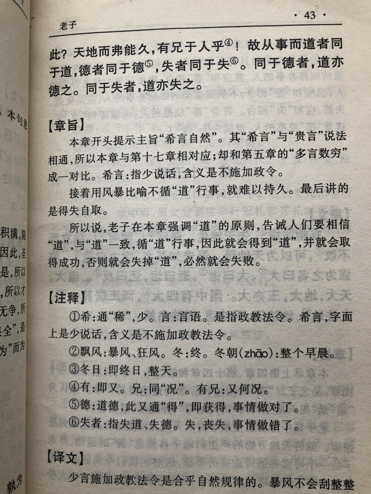

## 《道德经》第二十三章通行本原文：

    希言自然。
    
    故飘风不终朝，骤雨不终日。
    
    孰为此者？天地。
    
    天地尚不能久，而况于人乎？
    
    故从事于道者同于道；
    
    德者同于德；失者同于失。
    
    同于道者，道亦乐得之；
    
    同于德者，德亦乐得之；
    
    同于失者，失亦乐得之。
    
    信不足焉，有不信焉！

## 译文：
 
    统治者少点政令干预，是合乎自然的。
    
    狂风刮不了一个早晨，暴雨下不了一整天。
    
    谁使它这样的呢？天地。
    
    天地都不能狂暴不止，更何况是人呢？
    
    所以，遵循于道的就同于道，遵循于德的就同于德，遵循于失德的人就同于失德。
    
    同于道的人，道也乐于与他一起；
    
    同于德的人，德也乐于与他一起；
    
    同于失的人，失也乐于与他一起。
    
    统治者诚信不足，就得不到人们的信任。

## 逐句解释：

### 希言自然。
希：少。指统治者少施加政令、不扰民。
统治者少点干预，少发号施令，是符合自然规律的。政令频出，人们不知所以，不胜其烦。

### 故飘风不终朝，骤雨不终日。
飘风：大风、狂风。骤雨：激烈的暴雨。
所以狂风刮不过一早上，暴雨下不过一整天。

### 孰为此者？天地。
是谁让这样的？是天地！

### 天地尚不能久，而况于人乎？
天地尚且不能狂风暴雨不止，何况于统治阶级的政令呢？何况于王侯的暴政呢？

### 故从事于道者同于道；
从事于道者：按道办事的人。此处指统治者按道施政。 
所以统治者遵循于道就是同于道；

### 德者同于德；失者同于失。
统治者遵循于德的就有了德；不遵循道和德的就跟失道和失德一样。

### 同于道者，道亦乐得之；
遵循于道的人，道也喜欢和他在一起；喜欢道的人会聚在一起。

### 同于德者，德亦乐得之；
遵从于德的人，德也乐于与他在一起；喜欢德的人也会聚在一起。

### 同于失者，失亦乐得之。
失：指失道或失德。
不遵从道和德的人，失道和失德也常与之相伴。无德之人跟无德之人在一起。所谓志同道合，才能为伍。

### 信不足焉，有不信焉！
统治者缺乏信用，那人们就不会再相信他了！
统治者要言出必行，言必有信，否则百姓就不会再听他的号令了。所以统治者不要轻言，言多必失。大音希声，政令不要频发，频发就不珍贵了。

## 心得总结：
本章老子讲的是无为而治，道法自然。告诉领导者珍惜言行，不要频频颁布命令，干预百姓生产生活，而是顺其自然，遵从客观规律。

暴风不能刮很久，暴雨也下不了一天。这种暴风骤雨是来得快也去得快。因此，治理百姓也一样，不要横加干涉，朝令夕改。而是应该默默奉献，润物无声。

治理企业和国家有异曲同工之妙，如果动辄大刀阔斧，不停调整方针政策，来回更改方向目标，那么下面的人就会疲于奔命，不知所以。折腾数次以后，管理者的信任就会降低，最后员工就不会再信任领导者了。等到失去信任，人心惶惶，那团队也就失去了凝聚力，最后企业面临崩溃。

所以，领导者是很珍惜言行的，会遵循“道”的规律来行事。管理者给下面指明方向和目标，充分信任和授权，放手让下面去做，不要过度干预。中间建立监督机制，关注执行过程，最后衡量结果即可。在这种授权和监督之间领导和员工就会建立起一种信任，这样的企业就会充满希望。而那些过度干预，指手画脚，舍不得放权的领导者最后会把企业搞得一塌糊涂。

## 附帛书版：
帛书版二十四章与通行版二十三章同。

[返回目录](../README.md) &nbsp; [上一章](./22.md)&nbsp; [下一章](./24.md)

