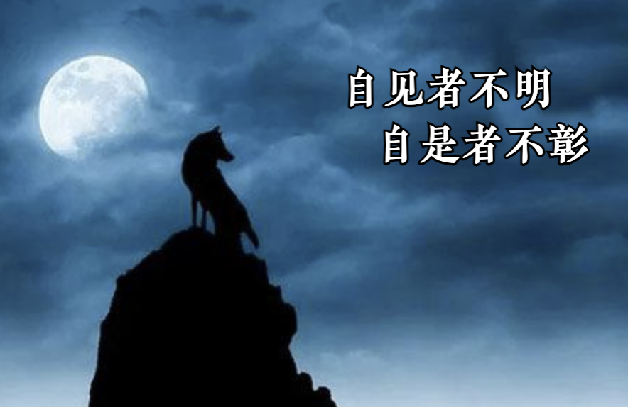
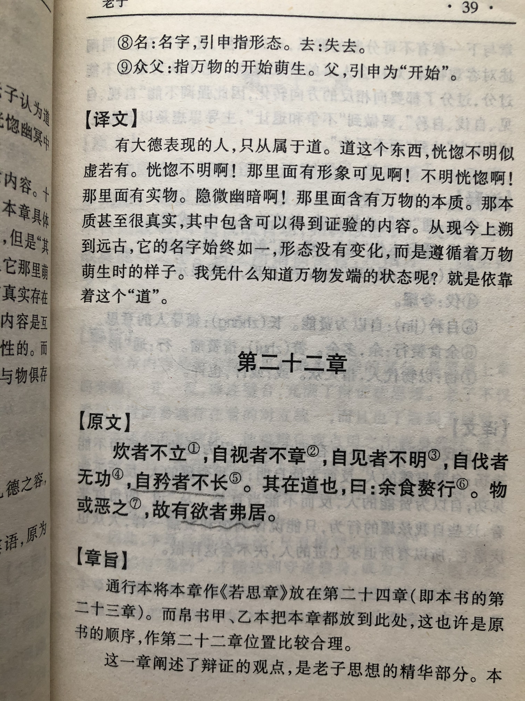
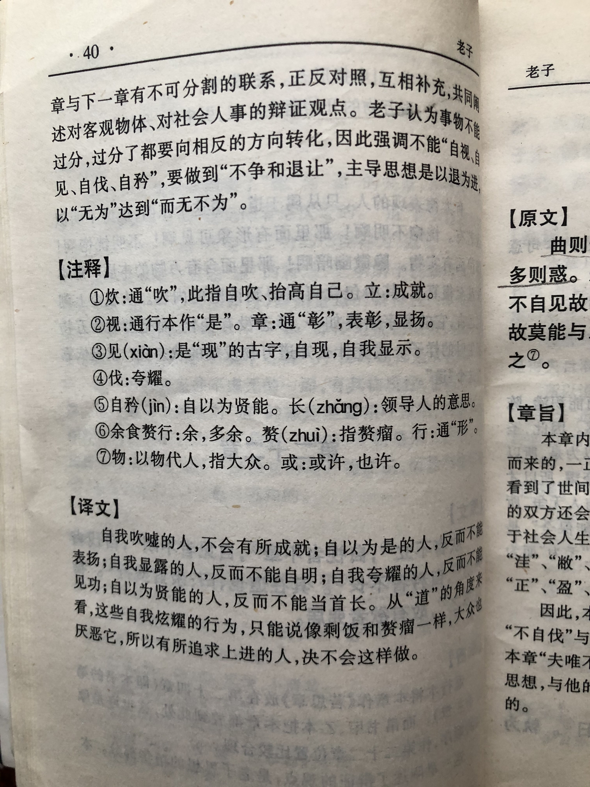

## 《道德经》第二十四章通行本原文：

    企者不立，跨者不行；
    
    自见者不明，自是者不彰。
    
    自伐者无功，自矜者不长。
    
    其在道也，曰余食赘行。
    
    物或恶之，故有道者不处也。

## 译文：
 
    踮起脚跟想要站得高，反而站立不稳；
    
    迈起大步想要走得快，反而不能远行。
    
    自我表现的反而得不到显明；自以为是的反而得不到彰显；
    
    自我夸耀的建立不起功勋；自高自大的不能做的长久。
    
    从“道”的角度看，以上种种多余的行为，就像是吃多了长出赘肉。
    
    因为它们是令人厌恶的东西，所以有道的人决不这样做。

## 逐句解释：

### 企者不立，跨者不行；
企，也有写炊，踮起脚尖，表示吹嘘，抬高。跨，跃，迈步。踮起脚尖站不稳当，跨步向前走不多远。不按照事物本来的逻辑就会不顺畅。

### 自见者不明，自是者不彰。
爱自我表现的不会显明，自以为是的不会彰显。真正彰显的是低调务实的人，而不是炫耀自夸的人。

### 自伐者无功，自矜者不长。
自我夸耀的没有功劳，自高自大的不会长久。没有功劳的才喜欢吹嘘，自视甚高的在位不会长久。

### 其在道也，曰余食赘行。
赘形：多余的形体，因饱食而使身上长出多余的肉。
对于懂得“道”的人来讲，这些冗余的行为就像吃得过多，长满赘肉。

### 物或恶之，故有道者不处也。
物或恶之，物指人或者一切东西，意思是人物都厌恶它。即上述种种自我膨胀就像赘肉一样令人厌恶，有道的人决不会那样做的。

## 心得总结：
这章与第二十二章的“不自见，故明；不自是，故彰；不自伐，故有功；不自矜，故长。”意思类似。都是告诫人们不要自夸、炫耀和膨胀，而是要保持谦虚、谨慎、低调。老子把那些不符合“道”的具体行为列举了出来，如抬高自己、夸耀自己、吹捧自己，把这些行为称之为冗余的赘肉，令人生厌。我们应该远离那些偏离“道”的行为，遵照“道”的规律去行事。

骄傲自大，自我夸耀的人其实内心脆弱，真正优秀的人是不屑于此的。优秀的人总是保持低调、朴素、自然，既不卖萌，也不装X。无论什么时代，无论哪个国家，只有那些质朴、纯真、善良的人性才会打动人，让人发出赞叹。两千年前的老子早就看的清楚明白。

如今网络世界，炫富、攀比、自吹自大、自我夸耀之人比比皆是，他们想要与众不同，受人瞩目。这其实与“道”是悖离的，这些行为最多暂时能吸引目光，然而过不多久就会被湮灭在众人的口沫当中。道理浅显易懂，但多少人能放下浮躁的心呢？希望看懂了这一章的朋友，能够真的静下心来，与”道“结合，与”道“为伍，踏踏实实做事，老老实实做人。

## 附帛书版：
帛书版二十二章与通行版二十四章同。

[返回目录](../README.md) &nbsp; [上一章](./23.md)&nbsp; [下一章](./25.md)

