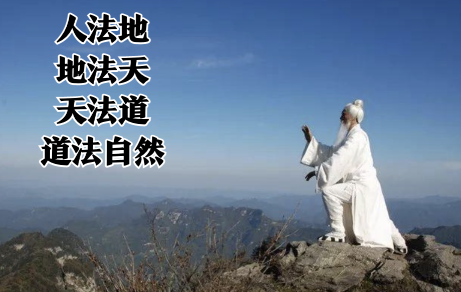
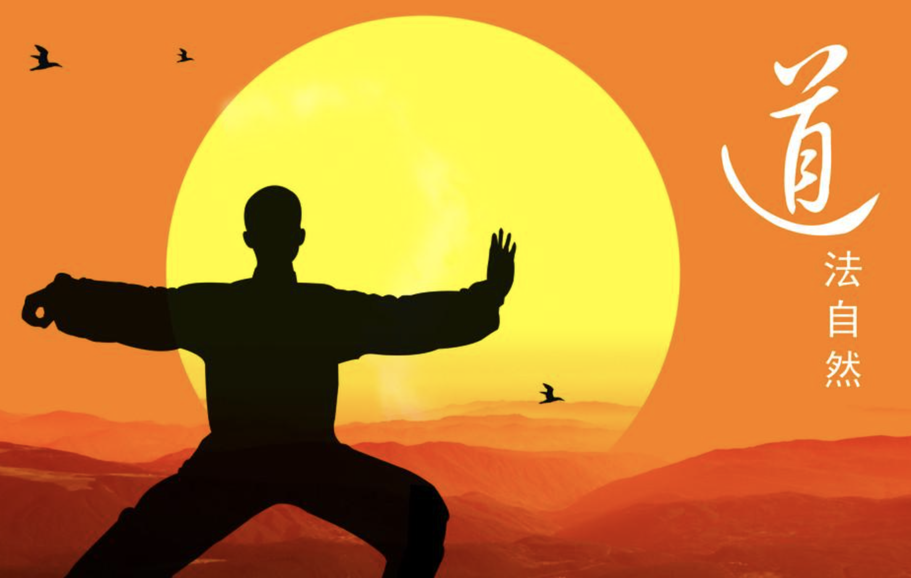
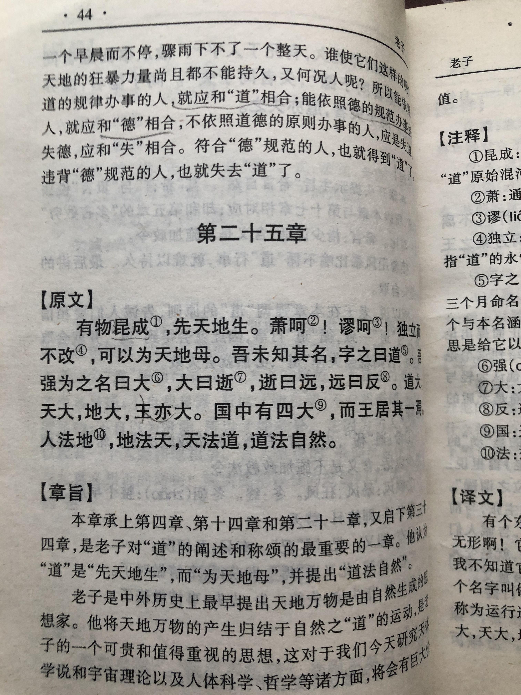
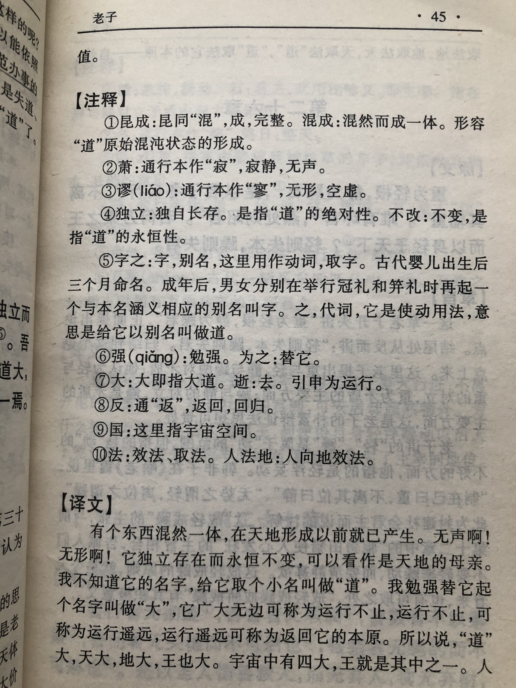

## 《道德经》第二十五章通行本原文：

    有物混成，先天地生。
    
    寂兮寥兮，独立而不改，周行而不殆，可以为天地母。
    
    吾不知其名，强字之曰道，强为之名曰大。
    
    大曰逝，逝曰远，远曰反。
    
    故道大，天大，地大，人亦大。
    
    域中有四大，而人居其一焉。
    
    人法地，地法天，天法道，道法自然。

## 译文：
 
    有一个东西混然而成，在天地形成以前就已经存在。
    
    它寂静到听不到声音，虚无到看不见形体。它不依靠外力而独立运行，循环往复而永不衰竭，可以作为万物的母体和根源。
    
    我不知道它的名字，勉强把它叫做“道”，再勉强给它起个名字叫做“大”。
    
    它广大无边而运行不息，运行不息而深邃遥远，深邃遥远又能返回本原。
    
    所以说道大、天大、地大、人也大。
    
    宇宙间有四大，而人居其中之一。
    
    人效法地，地效法天，天效法“道”，而道效法自然。

## 逐句解释：

### 有物混成，先天地生。
物，指道。混成，浑然天成。
有一个东西浑然天成，先于天地而存在。这个物体是“道”，是天地的母体，因此先天地生。

### 寂兮寥兮，独立而不改，周行而不殆，可以为天地母。
寂，安静。廖，虚空。寂兮寥兮：没有声音，没有形体。周行：循环运行。不殆：不息之意。
这个物体寂静而虚空，无声无息，独立运行着，周而复始，永不停息。

### 吾不知其名，强字之曰道，强为之名曰大。
强字之曰道：勉强命名它叫“道”。
我不知道它的名称，勉强称它为“道”，再勉强称之为“大”。

### 大曰逝，逝曰远，远曰反。
大，形容“道”是无边无际的、力量无穷的。逝，本意消失，指“道”的运行不止状态，无声无息，像消失了一般。 反：另一本作“返”。意为返回到初始状态，即本原。

### 故道大，天大，地大，人亦大。
人亦大，也有说“王亦大”，意为人乃万物之灵，与天地并立而为三才，即道大，天大，地大，人也大。

### 域中有四大，而人居其一焉。
域，宇宙空间。宇宙中有这四大，人是其中之一。老子将道、天、地、人并列，是宇宙中的主宰力量。

### 人法地，地法天，天法道，道法自然。
法，取法，效法，依循。人依循于地，地依循于天，天依循于道。道依循于自然，也就是回归本原。

## 心得总结：
本章是对于“道”的来源和运行状态的全面诠释，是对第十四章有关“惚恍”描述的补充，还阐述了天、地、人、道四者的关系。可以说是老子思想核心的体现，并引出了道法自然的概念。

“道”是一种什么东西，无法描述清晰，也无法确定其物质构成，只能说混混沌沌，恍恍惚惚，似有还无。也许“道”并非是一种东西，而是一种客观规律，或者是一种心里感受和认知。总之，“道”无法说明白，但确实又影响着天地万物和人类。

老子非常了不起的是指出了”道“的运行状态，即大到无边，无声无息，不停运转，由近及远到像要消逝，然后又由远及近，返回本原。”道“就这样循环往复，周而复始地运动着。他指出了万物是运动的而不是静止的，相互有联系的而不是孤立的，万物在运动变化后又不断回到原点，循环向前。现代哲学体系指出事物发展总的方向和趋势是由低级到高级、由简单到复杂的前进运动，也就是”螺旋式上升，波浪式前进“的发展规律。而老子在两千年前就已经洞悉了这个规律。

当然老子的思想非常朴素，就是效法自然，提倡清静无为，最后回归本真。这种初看起来似乎有点落后，与进步发展思想是违背的，但实际上等我们明白其中内涵后，我们却发现老子的话蕴含着高深的智慧。老子告诫我们应当以不变应万变，以无为胜有为，依循自然，天人合一，不断发展。这些观点与当代社会的和谐发展观也是一致的，西方社会也已认识到只有遵循自然、适应自然、效法自然，才能更好地改造自然和发展自然。由此，我们对于老祖宗留下来的东西应该与时俱进地去挖掘分析，而不是古板片面地看问题，否则我们就会陷入某种困境而无法自拔。

## 附帛书版：

[返回目录](../README.md) &nbsp; [上一章](./24.md)&nbsp; [下一章](./26.md)

