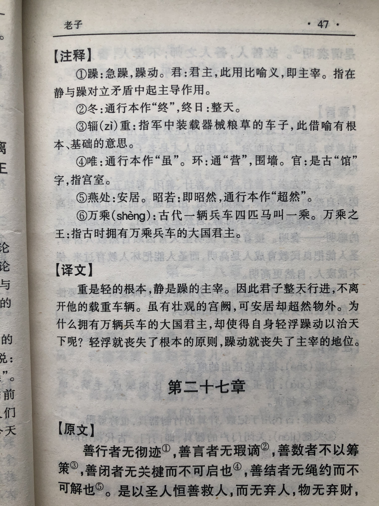

## 《道德经》第二十六章通行本原文：

    重为轻根，静为躁君，
    
    是以君子终日行不离辎重；
    
    虽有荣观，燕处超然。
    
    奈何以万乘之主，而以身轻天下？
    
    轻则失本，躁则失君。

## 译文：
 
    厚重是轻率的根本，镇静是躁动的主宰。
    
    因此君子终日行事保持厚重，就像行军打仗离不开辎重。
    
    虽有美食胜景，奢华享受，却能安然处之，不为所动。
    
    为什么大国的君主，却以轻率躁动来治理天下呢？
    
    轻率就会失去根本；急躁就会丧失主宰，不足为君。

## 逐句解释：

### 重为轻根，静为躁君，
重：厚重。轻：轻浮，轻率。本：根本。躁：动。君：主宰。
厚重是轻率浮躁的根基，镇静则是急躁的主宰。轻浮要依赖厚重，否则就会飘离；急躁要通过静心来控制，否则会失控。在轻与重、动与静这两对统一对立的矛盾现象中，重是根本，轻是其次，只重视轻而忽略重就会失去根本；静是根本，动是其次，只重视动而轻视静就会失去主导。

### 是以君子终日行不离辎重；
君子：也有作“圣人”。指修道之人。
辎重：古时军中运载器械、粮食的车辆。
所以君子行为处事时刻都要保持厚重，不离开自己所依赖的根基，就像行军打仗离不开装载粮食的车辆。君子坚守自己的操行和本质，不为浮光掠影所动。

### 虽有荣观，燕处超然。
荣观：指华丽的景观，贵族处所。燕处：安居之地，安然处之。
虽有华丽的风景，奢侈的享受，但身处其中，安然处之。意思是有道之人应该保持清心寡欲，守住本质，才能不为美景美色所动。

### 奈何以万乘之主，而以身轻天下？
万乘：乘指车子的数量。万乘指拥有兵车万辆的大国。以身轻天下：即以轻浮急躁的方式去治理天下，丢掉厚重，本末倒置。
为何一个万乘大国的君主，要以轻浮急躁的方式去治理天下，注重自身利益而轻视国家的利益呢？

### 轻则失本，躁则失君。
君王轻浮则会失去根本，浮躁则会失去主宰的地位。也就是当君王本末倒置，重视个人享受而轻视天下，办事急躁而不镇静，那么就会失去位置。

## 心得总结：
本章老子不再描述“道”，而是回到了修道行为上。老子告诫修道之人，应该保持沉稳厚重、清净自然，遇事分清主次，不急不躁、处之泰然。尤其在治理国家层面，要抓住根本利益，不要轻举妄动，躁动不安。

对于君王要求稳重和镇静，对于普通人来讲，其实也是一样的。一个人做事情不厚重，不沉稳，不抓事物的本质，那没人会想把大事交给这样的人办，这样的人不放心。一个人做事情毛毛躁躁，火急火燎，只看眼前，那也不敢给予重任，这样的人不靠谱。不厚重的人办事会缺乏果敢决断，容易在方向上出错；不冷静的人做事情缺乏耐心坚韧，容易在细节上马虎。能给予重任的，一定是沉稳厚重、沉着冷静，狠抓核心的人。

可现实中沉稳厚重、冷静沉着的人不一定会得到赏识，因为有的企业更喜欢快速决策、敢于试错、不断尝试的管理者。尤其是在这个高速发展的互联网时代，热钱来得太快，机会稍纵即逝，沉着冷静、审时度势、坚守核心，可能会丧失良机。因此，有些企业没有耐心坚持长期发展的观点，而是着眼于眼前利益，希望实现快速扩张，上市圈钱。一万年太久，只争朝夕。这句话其实被不少企业误读了，以为就要快，其实对企业长远发展有重大影响的关键时刻是要深思熟虑，拼命护住基本盘的，而日常经营的每一个决策也不要仓促决策、急躁冒进。只争朝夕是指抓住时机，全力以赴，但不是急切浮躁、冒失前进。

其实无论是长期发展战略，还是年度或季度工作目标，亦或者是产品更新和版本迭代，我们都应该保持审慎、稳重的态度，做好充分调研分析，三思而后行。沉稳厚重、冷静沉着，与快速决策、果断出手其实并不矛盾，矛盾的是很多人只关注快速决策，变得片面、毛躁、短视，这样的领导者往往只是为了个人的名利，而不是考虑公司整体利益。当然也有的领导唯唯诺诺，顾虑重重，考虑再三也不敢出手，这样的领导是不敢担责，害怕因决策失误而受到牵连。而真正靠谱的领导者，应该是规划长远，沉着冷静、稳重踏实、内心笃定，坚持自己的路，不为外界所动摇，而当考虑清楚后，就果断决策，义无反馈，全力以赴。

轻则失本，躁则失君。我们应该谨记这句话。无论什么时候都不要急功近利、心浮气躁，什么时候都要沉着冷静，稳如磐石；什么时候都要分清主次，守住自己的基本盘。

## 附帛书版：

[返回目录](../README.md) &nbsp; [上一章](./25.md)&nbsp; [下一章](./27.md)

