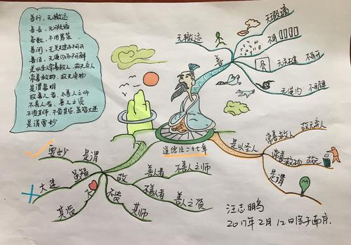
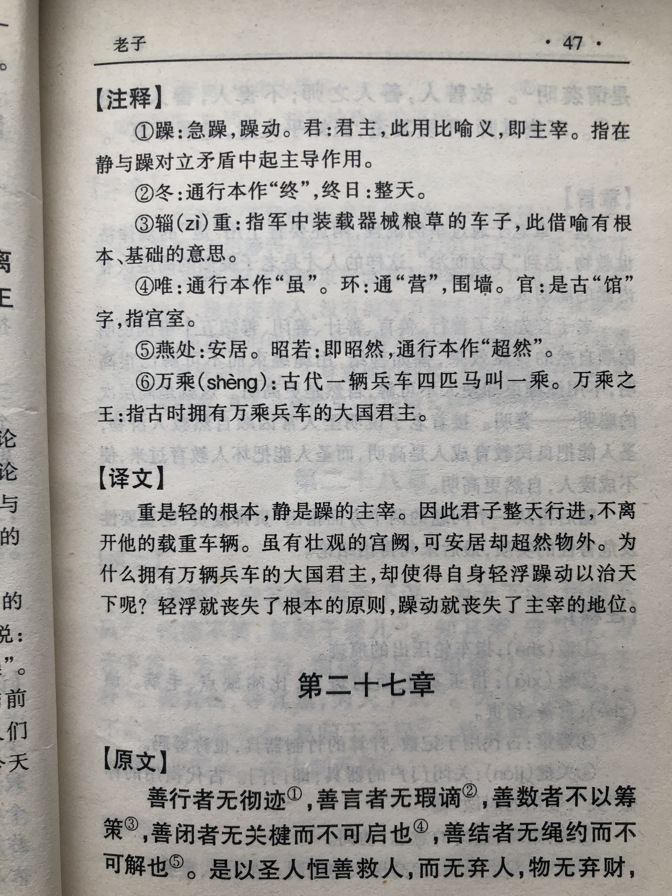
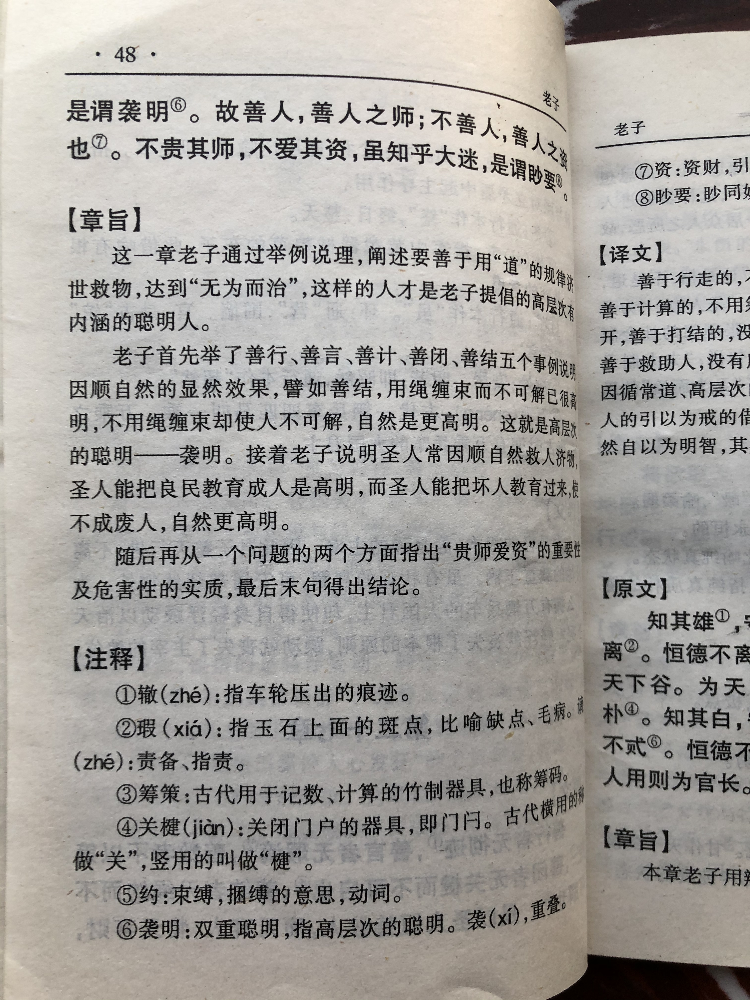

## 《道德经》第二十七章通行本原文：

    善行，无辙迹；
    
    善言，无瑕谪；
    
    善数，不用筹策；
    
    善闭，无关楗（jiàn）而不可开；
    
    善结，无绳约而不可解。
    
    是以圣人常善救人，故无弃人；
    
    常善救物，故无弃物，是谓袭明。
    
    故善人者，不善人之师；
    
    不善人者，善人之资。
    
    不贵其师，不爱其资，
    
    虽智大迷，是谓要妙。

## 译文：
 
    善于行走的，不会留下痕迹；
    
    善于言谈的，不会留下过失；
    
    善于计数的，无需筹码协助；
    
    善于关门的，不用锁具也让人打不开；
    
    善于捆缚的，不用绳索也让人解不开。
    
    因此圣人善于人尽其才，而没有不可用之人；
    
    因此圣人善于物尽其用，而没有不可用之物。
    
    这就叫做内藏的明白智慧。
    
    所以善人可以做不善人的老师，不善人可以做善人的借鉴。
    
    如果不尊重善人的指导，不珍惜不善人的借鉴，即使聪明绝顶，其实也是大糊涂。
    
    这就是“道”精深奥妙的地方。

## 逐句解释：

### 善行，无辙迹；
善于行走的人，是没有车辙痕迹的。意即真高明的人做完了事情都不留下痕迹，让人看不出来。一个人真的做了点事情，那最好别留下什么痕迹，而是好像什么也没有发生，让一切看起来顺其自然。

### 善言，无瑕（xiá）谪（zhé）；
瑕谪：过失、缺点、疵病。
善于言语的人，是不会有言语过失的。意即懂得尊重和谦卑，谨慎小心，在交谈时不会冒犯他人，就不会犯过错。最好的言论是少说多听，顺着别人的心意，不去触犯，这样就不会受人诟病。

### 善数，不用筹策；
数：计数、算数。筹策：古代用竹制的计数的器具。
善于算数的人，不用计数器也能算的明白。意即了然于胸，无需外物。善于算计的人其实是小聪明，而真正有智慧的人，根本无需算计，而是以赤诚之心待人，最后赢得别人的信任。

### 善闭，无关楗（jiàn）而不可开；
闭：关闭。关楗（jiàn）：关锁门户的器具。
善于锁门的人，没有锁具也一样能把门关好，而让人打不开。一个内心笃定的人，无需刻意躲闪，外部的喧嚣也很难侵入。

### 善结，无绳约而不可解。
绳约：绳索。约，指用绳捆物。
善于捆绑的人，就算没有绳子也捆得让人解不开。善于教化和治理，懂得自然无为的人，即使没有设立规约，没有强制力干预，人们也不会触犯规矩，逾越边界。

### 是以圣人常善救人，故无弃人；
所以圣人常常善于帮助人、教化人，人尽其才，而不会放弃人。

### 常善救物，故无弃物，是谓袭明。
袭明：内藏智慧聪明。袭，覆盖之意。
所以圣人常常善于挖掘物品的价值，物尽其用，而不会丢弃，这就是内藏的明智。

### 故善人者，不善人之师；
所以善人是不善人的老师。即善于用人和物的，是不善于用的人的老师。

### 不善人者，善人之资。
不善人是善人的借鉴。即不善人是一面镜子，可以用来参照，时刻提醒自己不要像不善人那样。

### 不贵其师，不爱其资，
资：取资、借鉴。
不尊重善人当老师，不珍惜不善人作为借鉴。

### 虽智大迷，是谓要妙。
虽然聪明但也是个大糊涂。这就是精深奥妙的玄妙之理啊！

## 心得总结：
本章老子是对“道法自然”和“无为而治”思想的引申。老子用“善行”、“善言”、“善数”、“善闭”、“善结”作比喻，说明人要善于行不言之教，善于处无为之治，善于用人，善于利物，一切依循自然。本章通过这五个“善于”把自然无为扩展到广泛的生活领域之中。

在实际生活和工作中，人们往往争权夺利、相互倾轧，做了成绩就处处炫耀，恨不得告诉全世界，哪里会“行无辙痕”呢？而言语交谈，常常也心怀叵测、阳奉阴违，哪里会坦诚以待呢？而与人合作精于算计，总想多占便宜，哪里肯待人以诚，合作共赢呢？而遇到事情就心浮气躁、急不可耐，哪里会保持内心的笃定，不为所扰呢？至于治理和管束，则不断设立规矩、朝令夕改，哪里会顺其自然，清静无为呢？人们种种表现都是不善人的表现，这样的行为与“道”是背离的，因此老子告诫人们要做个善人，从那五善开始，并以非善人为鉴。

所以，当学懂了这一章，我们应该从点滴开始 ，从小处着手，身体力行“善行”、“善言”、“善数”、“善闭”、“善结”，待人以诚，助人为乐，做一个真正的善人。

## 附帛书版：

[返回目录](../README.md) &nbsp; [上一章](./26.md)&nbsp; [下一章](./28.md)

