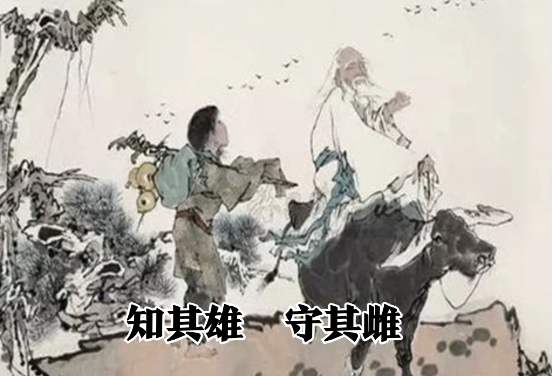
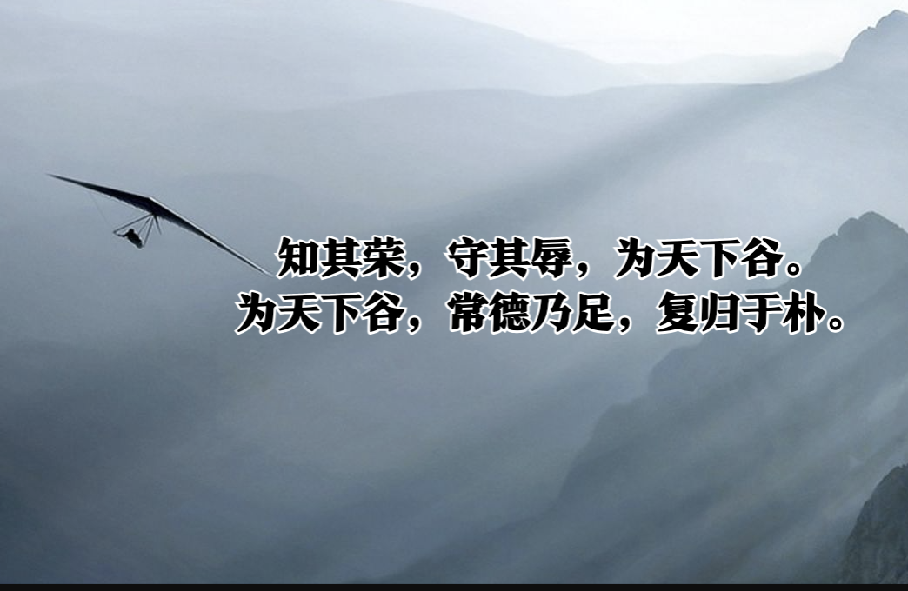
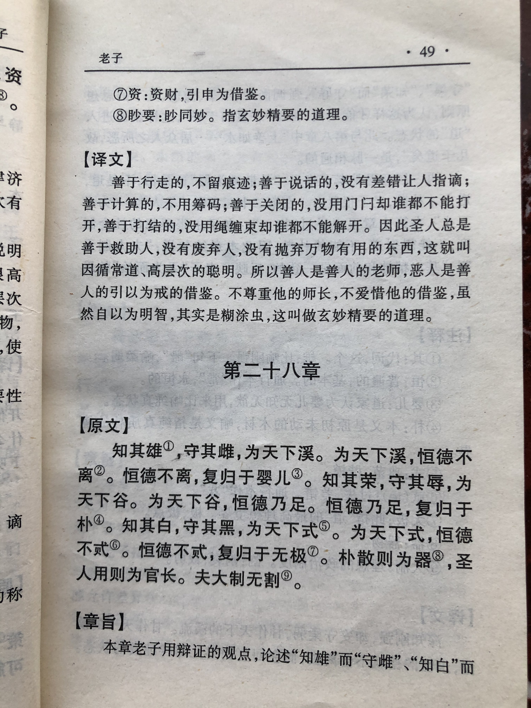

## 《道德经》第二十八章通行本原文：

    知其雄，守其雌，为天下溪。
    
    为天下溪，常德不离，复归于婴儿。
    
    知其白，守其黑，为天下式。
    
    为天下式，常德不忒，复归于无极。
    
    知其荣，守其辱，为天下谷。
    
    为天下谷，常德乃足，复归于朴。
    
    朴散则为器，圣人用之，则为官长，故大制不割。

## 译文：
 
    知道什么是雄强，却安守雌柔的地位，甘愿做天下的溪谷。
    
    甘愿做天下的溪谷，永恒的德就不会离去，就能回复到婴儿般纯净的状态。
    
    深知什么是明亮，却甘于暗昧的地位，甘愿为天下做示范。
    
    甘愿做天下的示范，永恒的德行便不会离失，就能回归到无极的状态。
    
    深知什么是荣耀，却安守卑辱的地位，甘愿做天下的川谷。
    
    甘愿做天下的川谷，永恒的德性才得以充足，就能回复到素朴自然的状态。
    
    朴素的“道”散开能够成就万物，有道的人用这种方法，则可为群官之首，
    所以完整的物品是不可分割的。进入了“道”的状态，黑白、雄雌、荣辱等也无需分割。

## 逐句解释：

### 知其雄，守其雌，为天下溪。
雄：比喻刚劲、强大。雌：比喻柔静、谦下。溪：也有写谿，溪流、溪谷。
知道什么是雄壮，却静守雌柔，甘愿做天下的溪谷。意为即便取得巨大成绩，也应该保持低下，守住一份静柔。

### 为天下溪，常德不离，复归于婴儿。
常德：恒久的德。
甘愿为天下的溪谷，德就恒久不离，就像回归到婴儿般纯净无暇的状态。

### 知其白，守其黑，为天下式。
式：楷模、范式
知道什么是光芒耀眼，却宁愿独守那份昏暗静默，这就是为天下做示范。也就是当你身处耀眼的光芒中时，一定要放低姿态，不要居功自傲。

### 为天下式，常德不忒，复归于无极。
忒：过失、差错。无极：无穷、终极。
为天下以身示范，德行不会出现差错，然后回复到无极。表示保持低姿态，不失德行，回归到万物初始的朴素状态，没有形名之分，进入到终极的“道”。

### 知其荣，守其辱，为天下谷。
知道什么是荣耀，甘愿守住那份卑辱，像天下的川谷。人应该像川谷保持低下，容纳细流，汇聚江海。

### 为天下谷，常德乃足，复归于朴。
朴：朴素，原始未经雕琢的原木。
愿为天下的川谷，恒久的德行才能充足，最后回归到朴素自然的混沌状态。

### 朴散则为器，圣人用之，则为官长，故大制不割。
器：器物。指万事万物。大制不割：制，制作器物，引申为大道；割，割裂。此句意为：入“道”之后，回归一种浑然一体的朴素状态，无需分割。
朴素的“道”散开能够成就万物，有道的人用这种方法，则可为群官之首，成为领导者。而进入了“道”，则保持朴素自然，形名不分，黑白、雄雌、荣辱等也无需分割。

## 心得总结：
本章老子是在详细讲解修道之人应该保持什么状态，应该如何对待荣耀和卑辱。总体上依然与之前篇章类似，告诫人们应当保持低调、朴素和谦卑，以柔克刚，以弱胜强。

人总希望获得荣耀，希望光芒万丈，希望获得更多的权力和名望。然而如果一个领导者醉心于此，那么穷极一生，最后依然会一无所有，甚至身败名裂。“知其荣，守其辱，为天下谷。为天下谷，常德乃足，复归于朴。”这是告诉我们虚怀若谷，保持朴素自然。人如果丢掉了那份质朴，去追名逐利，最后就会变得面目狰狞，与“道”相去甚远。

现实社会中，人们往往争权夺利、自私贪婪，少有做到低调谦卑，无我利他，而有如此境界的人常常会被埋没掉，或者被遗忘掉。在一个弱肉强食，讲究丛林法则的社会，金钱和权力代表一切，至于德行、修养，人们往往会视而不见。然而天道轮回，总有一天，那种遵循“道”之规则的人，会获得真正的尊敬。而那些权势熏天，自高自大，目中无人的人，一开始人们总是敬畏和害怕他，但一旦离开其位，人们就会争相唾骂，弃之如敝履。

"朴散则为器，圣人用之，则为官长，故大制不割。"，朴素的”道“四散漫开，可以成就器物，而人也可以学会这样，将”道“融入到日常生活和学习、工作当中。真的懂得”道“的人，始终保持一种混沌朴素的状态，不重名利，不分形名，不在乎黑白、雄雌、荣辱，而是浑然一体，如婴孩般纯净美好。

## 附帛书版：

[返回目录](../README.md) &nbsp; [上一章](./27.md)&nbsp; [下一章](./29.md)

