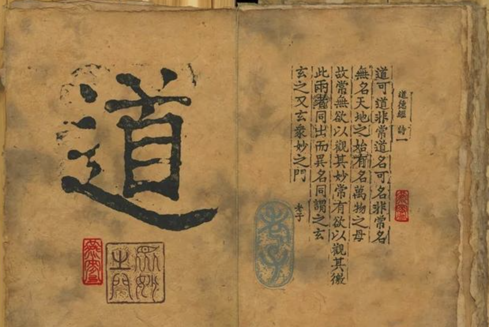
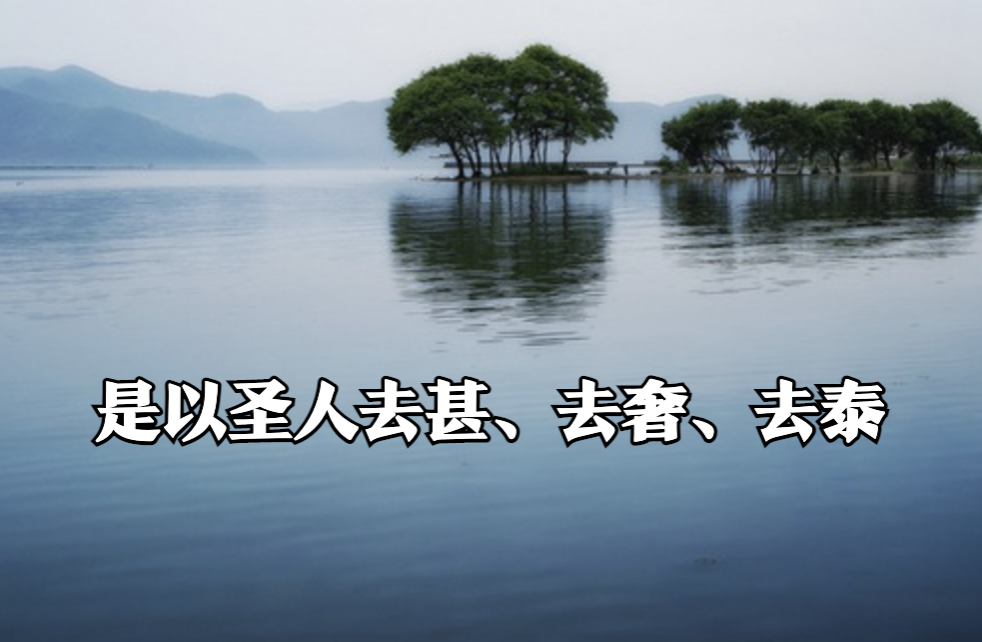
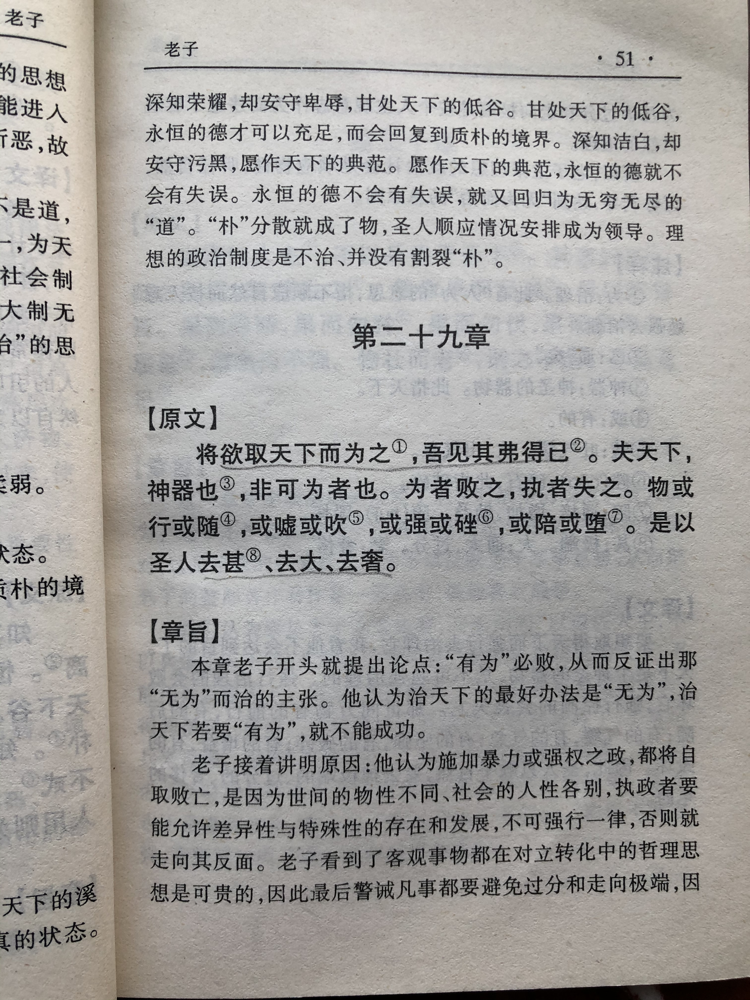
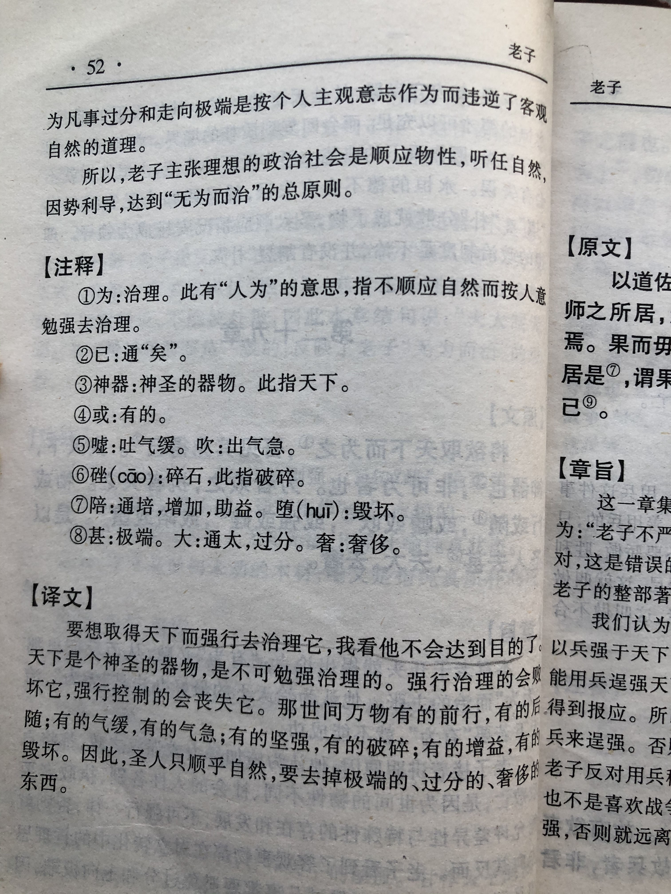

## 《道德经》第二十九章通行本原文：

    将欲取天下而为之，吾见其不得已。
    
    天下神器，不可为也，不可执也。
    
    为者败之，执者失之。
    
    是以圣人无为，故无败，故无失。
    
    夫物或行或随；或歔（xū）或吹；或强或羸(léi)；或载或隳(huī)。
    
    是以圣人去甚、去奢、去泰。
    
## 译文：
 
    治理天下，采取强力干预，是不能达成目标的。
    
    天下的人民是神圣的，不能够违背人民的意愿和本性强力统治。
    
    用强力治理天下，会败坏天下；
    
    用强力执掌天下，会失去天下。
    
    因此，圣人实施无为而治，所以不会失败，也不会失去。
    
    人们有前行和后随，有轻缓和气急，有刚强和赢弱；有安稳和危险，不一而同。
    
    因此，有道的人保持自然朴素，要除去那种极端的、奢侈的、过度的东西。

## 逐句解释：

### 将欲取天下而为之，吾见其不得已。
取：为、治理。
为：指有为。
不得己：达不到、得不到。
想要治理天下而采取“有为”干预的方式，我看是没法成功的。

### 天下神器，不可为也，不可执也。
天下：天下，指天下人
神器：神圣的器物。
天下的百姓是神圣的，不可强制干预，更不可强迫其意志。而要顺木之天，以致其性。

### 为者败之，执者失之。
执：掌握、执掌
违反民意，任性而为的会失败，罔顾民意，执掌了天下也会失去。顺天应人的才是合适的方式。

### 是以圣人无为，故无败，故无失。
所以得道的统治者施行无为之治，因而不会失败，也不会失去。无为而治是一种更高级的有为，做了看起来好像什么也没有做。

### 夫物或行或随；或歔（xū）或吹；或强或羸(léi)；或载或隳(huī)。
随：跟随、顺从。
歔：轻声和缓地吐气。
吹：急吐气。
赢：赢弱、虚弱。
载：载，安稳。
隳：隳，危险。
人或行或随，或缓或急，或强或弱，或稳或危。
人们在行为处事，秉性不一，形态各异。我们不能设立一个规矩，要求保持一个行为，而是应该尊重个性差异，遵循不同的想法。

### 是以圣人去甚、去奢、去泰。
甚：极致。奢：奢侈。泰：极、太。帛书版是去甚、去大、去奢。
所以得道的人或有道明君，他们会去掉极端、奢侈、贪婪，而保持朴素自然。

## 心得总结：
这一章是老子继续讲无为而治。老子告诫统治者，不能强制干预，不能施暴政，不能采取极端的、奢侈的、过度的法度来治理。

如果君王想拿国家来孤注一掷，那么就会招致失败；想把天下当作个人私产，满足私欲，最后就会失去天下。所以，圣人治理国家，都是为了努力消除个人的偏执，去除奢华和贪婪的念头。有道的君主懂得这个道理，所以施行无为而治，这样就不会招致失败；因为圣人从来不想去掌控百姓，所以也不会失去。顺天应人，尊重民意，以民为本，这样的方式才会大治天下。

夫物或行或随；或歔（xū）或吹；或强或羸(lei)；或载或隳(huī)。这句不光是适用于国家，也适用于企业与家庭。我们要知道人各有异，不一而同。如果强迫限制某一种行为方式，那就会抹杀个性，最后适得其反。

企业员工管理最主要的是发挥员工的创造力和活力。只有尊重差异，取长补短，才能激发潜能，让员工看到希望，而不是设立规矩，强行干预和控制员工的思想和行为。有的企业喜欢洗脑员工，强迫员工意志，搞得跟集中营似的，弄得人心惶惶，最后企业被败坏得一塌糊涂。

家庭教育也是一样，应该顺着孩子的天性发展，而不是强行干预，揠苗助长。每个孩子都有自己的发展之路，任何强力干预，自以为是的执念，都是不适当的。

是以圣人去甚、去奢、去泰。其实无论管理者还是个人都应该保持简单朴素，去掉自私贪婪，去掉欲望杂念，去掉过度措施。有道的人，能够不忘初心，回归自然，能真正认识生活，理解人生，最后取得不错成绩，成就自我。

## 附帛书版：

[返回目录](../README.md) &nbsp; [上一章](./28.md)&nbsp; [下一章](./30.md)

