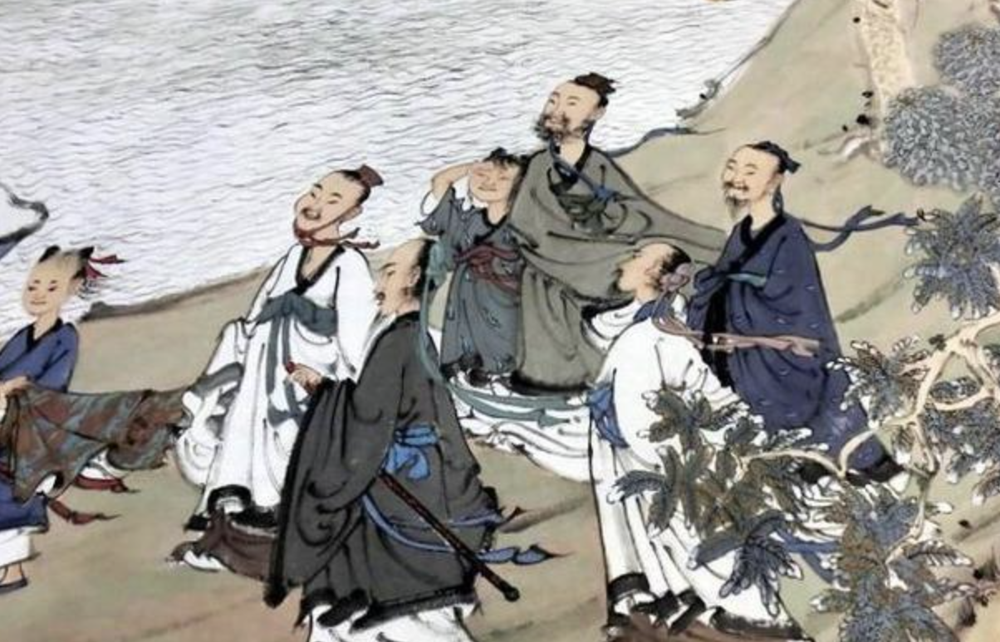

## 《道德经》第三章通行本原文：

    不上贤，使民不争；
    
    不贵难得之货，使民不为盗；
    
    不见可欲，使民心不乱。
    
    是以圣人之治，虚其心，实其腹，弱其志，强其骨。

    常使民无知无欲，使夫智者不敢为也。
    
    为无为，则无不治。

## 译文：
 
    不推崇有才德的人，不使老百姓相互争夺；
    
    不珍贵难得的财物，不使老百姓心生偷盗；
    
    不炫耀引起贪心的事物，使民心不迷乱。
    
    因此，圣人的治理原则是：让百姓保持内心的虚空，吃饱穿暖。

    减少功利心，增强百姓的筋骨体魄，使老百姓去除智巧，没有贪欲。
    
    使得贪婪智巧之人不敢任意妄为，圣人按照无为的方式行事。

    顺其自然，依循无为而治，那么天下就没有什么不能治理的了。   

## 逐句解释：

### 不上贤，使民不争；

不崇尚或推举圣贤，使得人民不去争权夺利。即不去鼓励人人都做圣贤，尤其是那些张口闭口君子风范，仁义道德的贤。因为人们在争夺的过程中往往没有成为圣贤，反而变得争权夺利，尔虞我诈。要知道圣人与大盗也就一步之遥。有很多所谓的“圣贤”也是一个幌子，拿来欺骗老百姓的。有如君子剑岳不群，也如一些汉奸走狗、贪官污吏、冠冕堂皇之辈。

### 不贵难得之货，使民不为盗；

不拔高难得之货的价值，不去提倡奇珍异宝，使人们不为了那些稀奇的东西去抢夺。物以稀为贵，现今社会的珠宝黄金钻石，其实并无多大实用价值，然而却被商家不断炒作，勾起大众的欲望，从而使得攀比成风，炫富盛行。对于有钱人，就是要拥有稀世之宝，以示与普通人的区别，彰显自己的富贵。这都是因为社会风气点燃了人性中丑恶的一面，把人性的贪婪唤醒。

人吃五谷杂粮，穿粗布长衫，喝清茶淡水即可，不用非得山珍海味，绫罗绸缎，人参燕窝。与其贵难得之货，不如鼓励多读书，多充实精神力量，让人们变得更加丰富和有内涵。与其唤起人性贪欲，不如鼓励人人修身养性和奉献爱心。如今世风日下，人们表面虽不为盗，但实际上却是戴着面具的伪君子。我们应当听取古人的智慧，返璞归真，回归到人性的本真中来。

### 不见可欲，使民心不乱。

不去彰显和炫耀那些引起人们欲望膨胀的财富和事物，可使得人们内心安宁而不生乱。领导者也不要展露自己的欲望爱好，使得下面不断揣摩。欲望是一把双刃剑，失去了欲望，人活着缺乏动力；过分的贪婪则会导致人性凶残，暴虐无道。适度的竞争是有必要的，平均主义会导致人们懈怠懒惰，但是一定要适度，正确地引导和示范非常重要。

### 是以圣人之治，虚其心，实其腹，弱其志，强其骨。

这句话像大白话一般，无生僻字，很好理解，就是字面意思。少想、吃饱、不作、身强体壮。这里圣人当为统治者。表面看来就是让人们吃饱喝足，少想多干。但背后意思历来颇有争议。有的观点认为老子在劝解统治者采用愚民政策，让人民成为干活的机器，吃饱喝足强健体魄就行，无需个人意志和自由，即去掉人们的欲望，使民无知。有的观念则认为老子并非鼓励愚民政策，而是采取的返璞归真，回归本源，与民休息的政策，这与前面的句子衔接的关系。前面谈到了要使民不争，去掉多余的欲望，使民不乱不为盗。统治政策只有去掉人们多余的欲望，让生命回归本质，人们才能活得充实，得到真正的自由。

我觉得第二种意思才是老子的本意，因为老子的本意当是尊重民众，而不是愚弄百姓，让人民在满足需求和实现欲望之间找到平衡。当然了两千多年前的古人究竟怎么想的我们也不用过分较真，如何解读应当与时俱进，而不要执拗于表面字眼。至少当今社会，自由和民主是大势所趋，人们需要自由意志和自由思想，封建朝代的压迫统治只会一次接一次地被推翻。我们应当尊重民意，顺其自然，让人们回归到本真的状态。

### 常使民无知无欲，使夫智者不敢为也。为无为，则无不治。
让人们不去胡思乱想，保持少私寡欲的状态，让人们那些挖空心思不断满足自己贪欲的人没有好下场，从而不敢那样去做。人们不去那样做，也消除了贪欲，那么就没有什么不能治理的了。这个用在国家或者企业等组织都是可以的，统治者和管理者要身先示范，放下欲望，再告诫老百姓也要做到戒除贪婪，放下欲望，一切顺其自然，那样的话就能够治理好国家或者企业了。

## 心得总结：
这章老子是在告诉统治者要遵循自然，返璞归真，去除多余的欲望杂念。行不言之教，用无为、自然的方式去治理天下。而从企业管理角度看，其实这个道理是相通的。管理除了管事管业务，更多的其实是管人，而管人其实比管事更复杂。

而如何管人呢？老子的意思是管理者当以身作则去除多余的欲望，不见可欲，依循自然，让员工吃得饱、穿得暖，强健体魄，也去除杂念，安心地工作和生活。从而员工心态端正，工作积极，彼此达到一种和谐和默契，最后打造出良好的团队氛围来，这时候团队创造力就显现了，企业得到了有效治理。

老子绝不是要消极无为，放弃竞争。老子是告诫大家企业内部要放弃攀比之心，要遏制管理者过度的欲望，以一种平和的心态来展开竞争。在残酷的市场环境中，企业当然要竞争，也唯有不断竞争才能创造价值。但这是针对外部而言，且是从事业的角度来看，而对于内部治理以及人员管理的角度看，我们就不应该采取激进的管理手段，而是应该采用顺其自然，与民休息的策略。

对于内部治理，表面看起来是松散的，是自由的，甚至无管理的，但其实这是更高层次的管理智慧，尤其是对于科技类企业，员工知识层次较高，本身很自律，积极性也很高，大家也都明白，我们应当采取的是给予宽松的氛围以及优厚的待遇，充分信任和尊重研发人员，鼓励他们自由发挥创造，把管理融入无形当中，而不是横加干涉、制造矛盾、朝令夕改，我们只需要设定愿景目标和进行文化制度建设，统一大家的思想，再设定年度和季度的OKR，然后众志成城，奋发图强，竞手可破也。

现在一些企业喜欢末尾淘汰制，还鼓励狼性文化，殊不知末尾淘汰是针对确实不合格的人准备的，而不是设立一个制度，每个部门必须末尾淘汰。至于狼性文化，那是针对外部来讲的，对外要敢拼、敢打、敢抢，而对于内部，你鼓励谁加班工时较长，鼓励996，鼓励大小周，鼓励不吃不喝睡在公司，鼓励大年三十值守做什么？打了鸡血对外拼搏，这是有必要的，而且是对事来讲，而对于内部来讲，尤其是人员的管理，我们应当采取充分信任和尊重、授权的模式，顺木之天、以致其性。

老子的“无为”管理思想，有三种境界，一是“无为而为”，就是以不做为做，看起来没做，其实做了；二是“顺性而为”，就是按照事物本来的规律去做，顺其自然；三是“为而无为”，就是做得非常自然，看起来就像什么都没做一样。无论是企业管理还是治理国家，这都值得我们借鉴和参考。

## 附帛书版：

[返回目录](../README.md) &nbsp; [上一章](./2.md)&nbsp; [下一章](./4.md)

