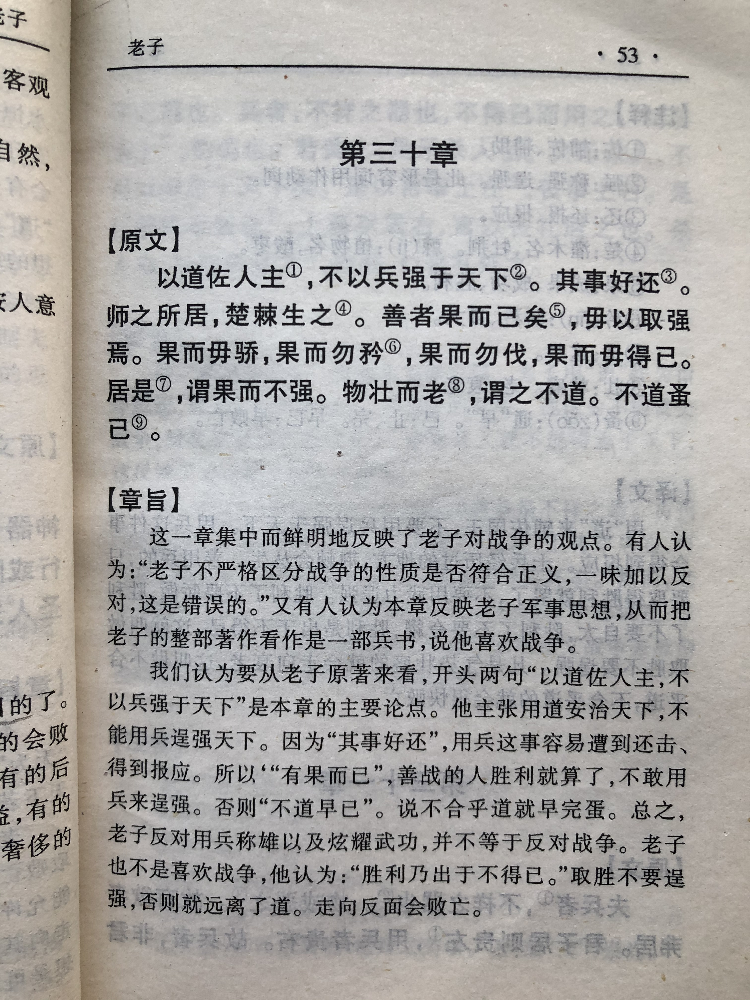

## 《道德经》第三十章通行本原文：

    以道佐人主者，不以兵强天下，其事好还。
    
    师之所处，荆棘生焉；大军之后，必有凶年。
    
    善者果而已，不敢以取强。
    
    果而勿矜，果而勿伐，果而勿骄，
    
    果而不得已，果而勿强。
    
    物壮则老，是谓不道，不道早已。
    
## 译文：
 
    遵照“道”来辅助国君的，不会以武力逞强于天下，以武力逞强的会很快遭受报应。
    
    军队所到之处，荆棘丛生；
    
    大战之后，就是饥荒岁月。
    
    善人（有道的统帅）达到目的就适可而止，而不以武力来逞强。
    
    善人不以战功来自大，不以战功来夸耀，不以战功而骄傲。
    
    善人有战功是不得已而为之，有了战功也不逞强。
    
    事物（军队）过于强壮就会走向衰弱，这是因为不符合“道”，不符合“道”很快会衰亡。

## 逐句解释：

### 以道佐人主者，不以兵强天下，其事好还。
还：报应。
按“道”来辅佐君王的，不以兵力强盛而逞强天下，以兵力逞强的会遭受报应。世界上总有更强大的军队，若以强凌弱，迟早也会被更强大的灭掉。

### 师之所处，荆棘生焉；大军之后，必有凶年。
凶年：荒年、灾年
军队所到之处，荆棘丛生。大战过后，一定是饥荒年代。形容军队打仗使得百姓流离失所，民不聊生。

### 善者果而已，不敢以取强。
善者：善人，也就是得道之人，这里指善于用兵的统帅。果，战果，成功之意。指达到获胜的目的。取强：逞强、好胜。
善于用兵的统帅有了战果，达成目标就可以了，而不是争强好胜，以兵力逞强。战争要出于人道，符合民意，且达成目标即可，不能耀武扬威，横行天下。

### 果而勿矜，果而勿伐，果而勿骄。
不敢：帛书本为“毋以取强”。
善人有了战果也不要自大，不要夸耀，也不要骄傲。所有的战争都是为了维护和平安宁，达成这个目标后，也不要狂妄自大，骄纵跋扈，而应该保持平常心，顺其自然。

### 果而不得已，果而勿强。
善人有了战果、达成目标是属于不得已而为之，有了战果也不会逞强。战争不是件好事，不得已而为之，不要成为战争狂人和战争机器。

### 物壮则老，是谓不道，不道早已。
物壮：强壮、强硬。不道：不合乎于“道”。
早已：早死、很快完结。
事物过于强壮，就会走向衰弱，这是因为不符合“道”。不符合“道”的即使再强壮很快也会衰亡。物极必反，月盈则亏。凡事有度，事物都有其生长的节奏，不要人为打破平衡，一强再强，那样的强大很快就会衰亡。

## 心得总结：
本章老子强调的核心是凡事有度，不要逞强，尤其是军队作战，达成目标即适可而止，而不要继续逞强，耀武扬威。

有道之人辅佐君主，不要以强大的武力来征服天下，因为战争不是好事，都会给百姓带来灾难。所以得道的统帅发动战争的目的在于维护和平与安宁，而目标一旦达成就即刻收兵，还百姓以安宁。在这个过程中，即使获得战功无数，也不要以此作为荣耀。历史上像张良、刘伯温、王阳明、曾国藩等都是这样的人，不会居功自傲，拥兵自重，最后就能得到善终。

最后一句“物壮则老，是谓不道，不道早已。”讲的是自然生长出来的东西，已经很强盛了，就不要再强行使其壮大。比如地里长出了果实，树上开满了花，军队足以保家卫国，已经很强盛了，就不要再增强它了。一切事物都要合乎自然，过于强壮就会走向事物的反面。

老子这一章开始进行了论兵之道，指出战争会带来危害，使百姓遭殃，战争达成目标即可，不要逞强天下。当然，这里老子并非用来阐述战争，而是以战争来告诫统治者勿要逞强，当适可而止。历史上很多战争狂人，不断发动战争，妄图称霸全球，最后都落得身败名裂的下场。战争要符合正义，战争还得适可而止。老子所主张反战的思想，可以说有着非常积极的意义。

已经很强大了，就不要再使它继续强大；已经盈满了，就不要再继续注入。凡事有度，如果不懂得适可而止，不懂得顺其自然，一味地快速发展壮大，最后会很快败亡。历史上这种例子非常多。当秦始皇灭六国统一中原时；当汉武帝开疆拓土出击匈奴时，当成吉思汗的铁骑横跨亚欧非时；最强大的时候，却往往是王朝衰落的开始。国家如此，企业也如此，对普通人来讲，何尝不是这样。人的欲望无止境，而如果不遵循于客观自然，一味逞强，最后也会适得其反。

学懂了这一章，对于统帅来讲，要懂得勿要逞强，适可而止。对于普通人来讲，要顺其自然，不要好高骛远，盲目壮大。懂得了“道”，遵循于“道”，才能真的成就自我。

## 附帛书版：

[返回目录](../README.md) &nbsp; [上一章](./29.md)&nbsp; [下一章](./31.md)

