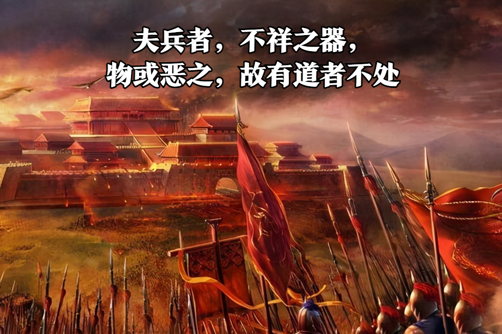
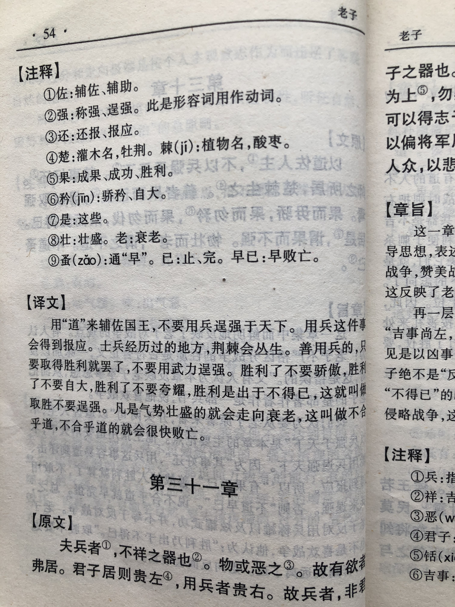

## 《道德经》第三十一章通行本原文：

    夫兵者，不祥之器，物或恶之，故有道者不处。
        
    君子居则贵左，用兵则贵右。
        
    兵者不祥之器，非君子之器，不得已而用之，恬淡为上，胜而不美，而美之者，是乐杀人。
        
    夫乐杀人者，则不可得志于天下矣。
        
    吉事尚左，凶事尚右。
        
    偏将军居左，上将军居右。
        
    言以丧礼处之。
    
杀人之众，以悲哀莅之，战胜以丧礼处之。
    
## 译文：
 
    兵器，是不祥的东西，人们都厌恶它，所以有“道”的人不使用它。
    
    君子平时居处以左为贵，而用兵打仗时就以右为贵。
    
    战争是不祥的东西，不是君子所使用的，万不得已而使用它。
    对于战争最好淡然处之，打胜也不要得意洋洋，如果得意洋洋，那就是喜欢杀人。
    
    凡是喜欢杀人的人，就不可能得志于天下。
    
    吉祥的事情以左边为上，凶险的事情以右方为上。
    
    偏将军居于左边，上将军居于右边。
    
    这是说明用兵打仗要以丧礼仪式来处理。
    
    战争中杀人众多，要用悲哀的态度对待，打了胜仗，也要以丧礼的仪式去对待战死的人。

## 逐句解释：

### 夫兵者，不祥之器，物或恶之，故有道者不处。
兵者，指兵器，也指战争用兵。夫，作为发语词。 
兵器是不祥之物，人们都厌恶它，所以有道之人不使用它。

### 君子居则贵左，用兵则贵右。
贵左：古人以左为阳以右为阴。阳生而阴杀。古代的礼仪，主居右，客居左，所以居左也有谦让的意思。
君子平常以居左为贵，而用兵是以右为贵。

### 兵者不祥之器，非君子之器，不得已而用之，恬淡为上，胜而不美，而美之者，是乐杀人。
恬淡：安静、沉着。
战争是不祥的事物，不是君子所喜欢的，迫不得已而使用。打仗要淡然处之，胜利了也不得意忘形，得意忘形的话那就是喜欢杀人。

### 夫乐杀人者，则不可得志于天下矣。
喜欢杀人的人，那是不可能得志于天下的。人们喜欢和平美好，而战争会带来破坏。

### 吉事尚左，凶事尚右。
吉庆的事情以左为上，凶险的事情以右侧为上。

### 偏将军居左，上将军居右。
所以偏将军在左边，上将军在右侧。这里说明行军打仗与日常居处不同，日常贵左，而行军尊右。

### 言以丧礼处之。
这说明行军打仗应该以丧礼的仪式来对待。吉事尚左，凶事尚右。打仗遵右，因此是凶事。

### 杀人之众，以悲哀莅之，战胜以丧礼处之。
莅之：到达、到场。
战争会杀很多人，所以应该以悲哀的态度来对待，打了胜仗也要以丧礼来对待。因为战争是不祥之事，会杀掉很多人，这也不值得庆贺，所以即便得胜了也要保持肃穆悲哀。

## 心得总结：
本章老子重点在于反战，即战争是不祥的，有道之人不要轻易发动战争，打仗也要适可而止，胜利了也不要骄傲。毕竟战争是杀人的事情，杀人不是件好事，人们都很厌恶，因此能不开战就不开战，能缩小战争范围就缩小，老子通过这章把反战思想彻底地表达了出来。

老子所处的年代，正是春秋末期，那时候天下诸侯割据，战火不断，百姓流离失所。老子看到了这种现象，痛心疾首，他告诫统治者应该爱好和平，珍惜生命。“杀人之众，以悲哀莅之，战胜以丧礼处之。”，这体现了一种悲天悯人的心态 ，对待逝去的生命，我们应该哀悼，而不要以嗜血为荣。可以说两千多年前的老子，思想是非常先进的，即便放到现在，也非常有借鉴意义。

其实老子这一章老子虽然说是在反战，但是其实本质上是在说“道”的规律，即遵循自然，是劝诫领导者要放弃个人私欲，回归朴素，不要用武力来满足个人的欲望。

统治者如此，普通人也应该这样，即减少私欲，抱朴守素，保持淡泊，切不可为了自己的私欲而侵害他人利益。对于战争，我们始终要抱有反对的态度，对于生命我们始终抱有尊重的态度。修身养性，读书进步，虽然只是一介平民，我们也应该有反对战争的勇气和悲天悯人的情怀。

## 附帛书版：

[返回目录](../README.md) &nbsp; [上一章](./30.md)&nbsp; [下一章](./32.md)

