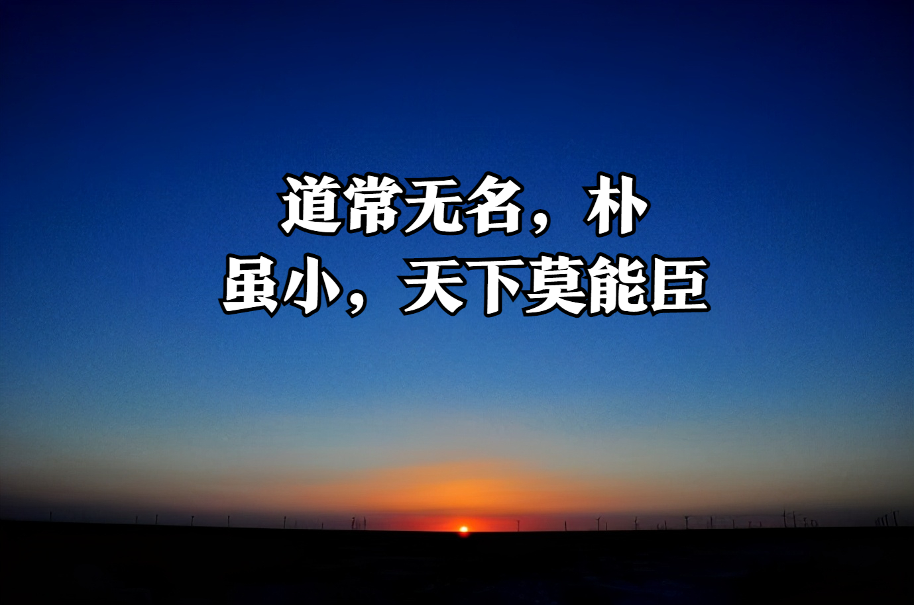
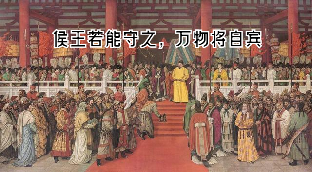
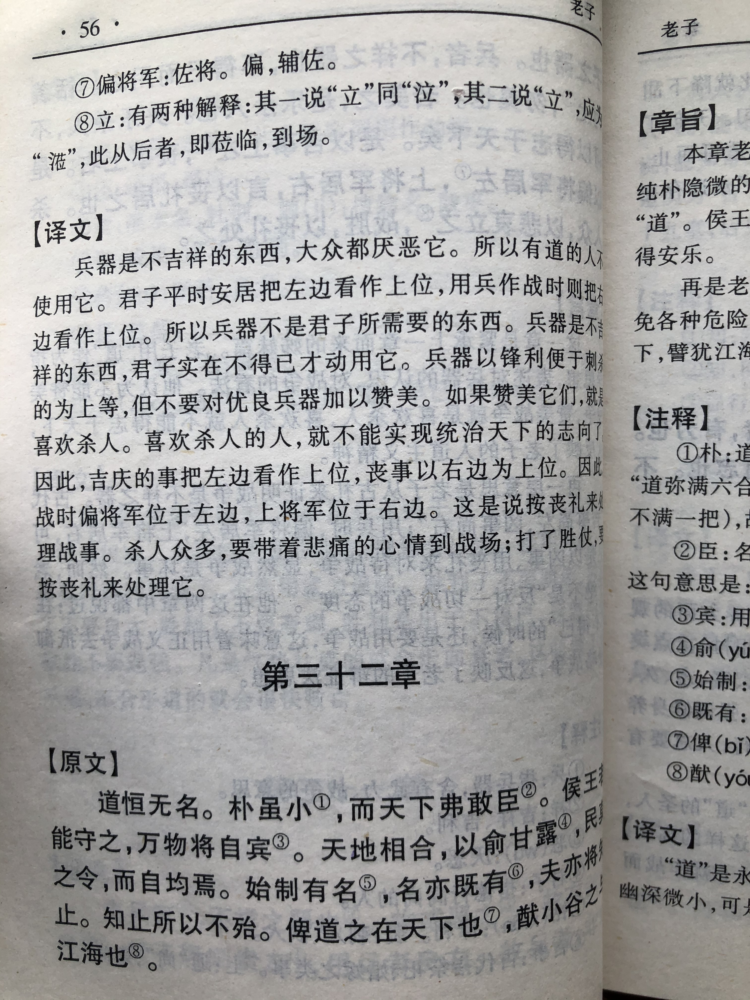
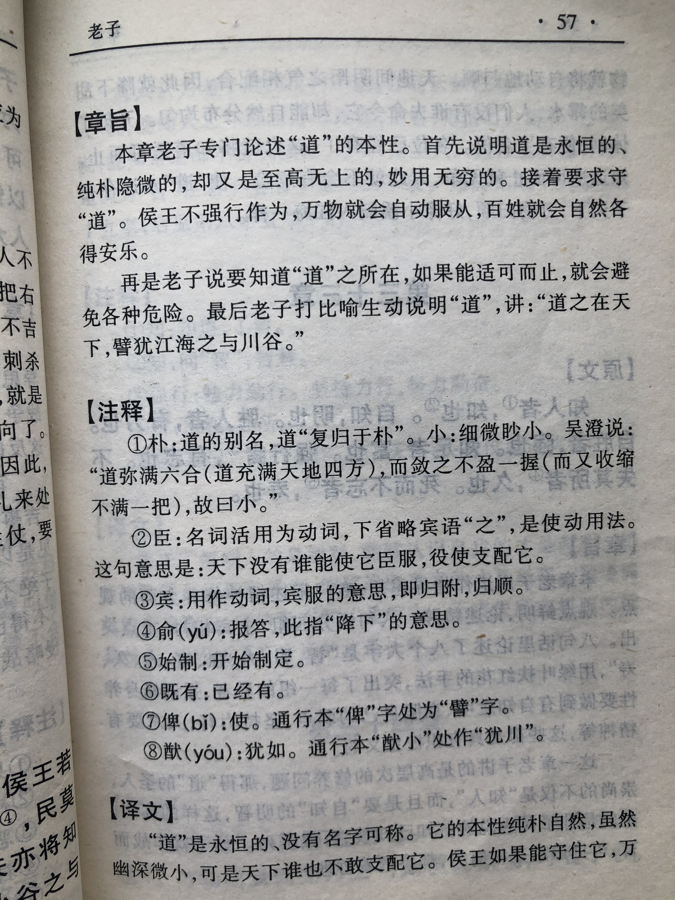

## 《道德经》第三十二章通行本原文：

    道常无名，朴。
    
    虽小，天下莫能臣。
    
    侯王若能守之，万物将自宾。
    
    天地相合，以降甘露，民莫之令而自均。
    
    始制有名，名亦既有，夫亦将知止，知止可以不殆。
    
    譬道之在天下，犹川谷之于江海。
    
## 译文：
 
    “道”始终是无名无状，却很质朴。
    
    它很小，细不可见，但天下却没有什么能支配它。
    
    王侯如果能够按“道”的原则治理天下，万物将会自然地归从。
    
    天地阴阳之气结合，就会降下甘露，没有人指使就能自然均匀分布。
    
    治理天下就要建立相关体制，确定各种名分。
    
    名分既然有了，也要有所制约，明白了各自制约，知道适可而止，就没有什么危险了。
    
    “道”存在于天下，发挥着作用，就好像山川河谷都流归江海一样，一切都顺其自然。

## 逐句解释：

### 道常无名，朴。
无名、朴：这是指“道”的特征。
“道”始终无名无状，非常质朴。有的版本断句为“道常无名，朴虽小，天下莫能臣。”，其实两者都可以。

### 虽小，天下莫能臣。
小：形容“道”很细微，隐不可见。
莫能臣：臣，使之服从。这里是说没有人能臣服和支配它。
“道”虽然细不可见，但却没有什么能让之臣服。“道”是一切的母体，它主宰和支配着万物，而万物支配不了它。

### 侯王若能守之，万物将自宾。
自宾：宾，服从。自将宾服于“道”。
各诸侯君王如果能遵循“道”的规律，那么天下万事万物都会自然而然地顺从臣服。

### 天地相合，以降甘露，民莫之令而自均。
相合：相结合。甘露：甜美的露水。自均：自然均匀。
天地之气相互结合，就会降下甘露，没人干涉它也会自然均匀地分布。这说明，“道”非常平等，不会厚此薄彼。

### 始制有名，名亦既有，夫亦将知止，知止可以不殆。
始制有名：开始制定各种名分，即官职的等级名称。
治理天下需要建立体制，确立各种名分，名分有了，也要建立相关制约，有了制约，人们就知道什么该做，什么不该做。知道什么不该做，懂得适可而止就不会有危险了。

### 譬道之在天下，犹川谷之于江海。
譬：比如。犹：如同。此处可理解为“道之在天下，譬犹江海之与川谷”。
“道”存在于天地之间，不停运作，就如同山川河谷等细流汇入江洋湖海，一切都很自然。

## 心得总结：
本章一方面讲统治者应该按照“道”的规律去治理天下，老百姓自然会归从和拥戴。另一方面讲适可而止。

“道”是无法名状的，混混沌沌，说不清楚，而行政司法制度需要明确范围，还需要建立相关制约，并且要适可而止，不能事无巨细，到处干预，这样才不至于出现危险。

“道”存在于天地万物之中，而万物也都受着“道”的支配和影响。如果万物合乎于“道”，那么一切非常和谐自然，天下归顺，百姓安宁。如果不合乎于“道”，则人心惶惶，天下分崩离析。

至于究竟“道”是什么？“道”很细小、质朴、混沌，主宰着万事万物，但没法说得清楚，它似有或无，气息微弱，默默运行，永不停歇。究竟什么是“道”，这根本就说不清楚的，因为无法名状。

如果非要描述“道”，那就是“朴”。如果人们懂得了“朴”，那么天下万物都会自然而然地为他服务。但什么是“朴”呢？这个其实也说不清楚。只能说质朴、朴素、自然、纯真。如果君王拥有了这些品质，那么百姓都来归顺，天上都会降下甘露；如果普通人拥有了这些品质，办事会处处通顺，人们也一定会赏识他。

“道”虽细小，但却支配着万事万物。“道”的本性质朴，这是我们应该遵循和学习的。无论经历多少事，无论身居何位，无论失落还是彷徨，无论欢喜还是痛苦，我们都应该回归朴素，不忘初心，保持纯真的质朴。

## 附帛书版：

[返回目录](../README.md) &nbsp; [上一章](./31.md)&nbsp; [下一章](./33.md)

