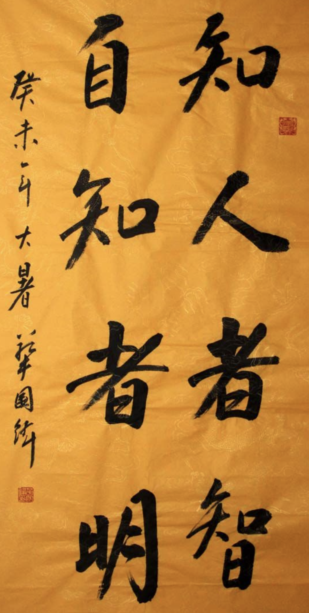

## 《道德经》第三十三章通行本原文：

    知人者智，自知者明；
    
    胜人者有力，自胜者强；
    
    知足者富，强行者有志；
    
    不失其所者久，死而不亡者寿。
        
## 译文：
 
    了解别人是有智慧，认识自己才是真高明。
    
    战胜别人是力量强大，战胜自己才是坚强。
    
    知道满足的人是富有的，自强不息的人是有志气的。
    
    人始终不失去根本的能够长久，人到死都没有失“道”的才是长寿。

## 逐句解释：

### 知人者智，自知者明；
知：知道、了解。智：智慧。明：明白，高明。
知道他人是有智慧的，知道自己的才是高明的。能了解他人说明懂得换位思考，能够去认识和理解他人，这样的人已经很不错了。但如果了解自己的优缺点，知道自己想要的是什么，那就是有自知之明，这样的人才真高明。

### 胜人者有力，自胜者强；
力：力量。强：刚强、坚强。
战胜他人是因为比对手力量大，而能够战胜自己的才是真的坚强。战胜弱者其实没什么可说的，因为力量不同，战胜强者也没有什么值得炫耀，因为偶然因素或者对方疏忽大意。真正厉害的是战胜自己的人，消除自己的贪婪和自私，克制自己的欲望，保持朴素自然和内心的淡泊，这样的人才是真正强大的人。

### 知足者富，强行者有志；
富：富有，指内心丰富。志：志气。强行：坚持不懈、持之以恒。 
知道满足的人内心非常丰富，自强不息的是有志气的。知道满足，懂得适可而止，这样的人才会内心富有，否则欲望就像无底洞，永远得不到满足。坚持不懈，自强不息的人永远打不垮，这样的才是有志气的人。遇到挫折和困难就气馁和妥协的，那样的人并不坚强。天行健，君子自强不息。只有持之以恒，愈挫愈勇，不断拼搏，才能达成自己的目标。

### 不失其所者久，死而不亡者寿。
死而不亡：亡，有写忘、妄。身虽死而“道”犹存。
人始终不失去其所拥有的根本的“道”，到死也没有失去，那么就是长久和长寿了。
这里关于“其所”和“不亡”有多个解说版本。有的解释为所拥有的与不被忘记，有的解释为处所根基和不狂妄。其实意思都差不多，只是理解角度不同而已。至于人死之后能够精神永存，不被后世所忘怀，老子可能不会刻意强调这个，因为有这个想法就不是“道”了。

## 心得总结：
本章大家相对熟悉，文字也好理解，通俗易懂，有些语句早就成了日常生活中大家所用的口语。比如：自知者明，知足常乐，自胜者强等。

老子这一章充满着人生哲理和大智慧。当人们身处卑微和低谷的时候，就越需要读读老子的这一章。老子阐释了自胜、自强、不亡的概念，主张人要不断修身养性，培养自己的意志。其中最能体现意志的是“自胜者强”和“知足者富”两句，人在任何时候都不要放弃自我，而是应该战胜自我、超越自我，人在任何时候都不要放纵无度，在物质享受方面要适可而止，而在自我修炼和对“道”的坚持上应该永无止境。

“不失其所者久，死而不亡者寿”，这句话告诫我们人不应该离开根本，你所擅长的，你所依仗的不要轻易离弃，你所追寻的应该坚持不懈，这样才能长久。人固有一死，但死有重于泰山，有轻于鸿毛。人即便是死了，但始终无改自己所坚持的“道”，那么就是真的长寿。而当你坚持按“道”的规律去执行，那么即便是死了，你的精神也会永世长存。

人的一生很短暂，如白驹过隙。人不要为名利而束缚，也不要跟他人争输赢、论长短，而是要自强不息，不断超越自我，为这个社会做点贡献，为他人做点事情。这样的人生才有意义和完整。

## 附帛书版：

[返回目录](../README.md) &nbsp; [上一章](./32.md)&nbsp; [下一章](./34.md)

