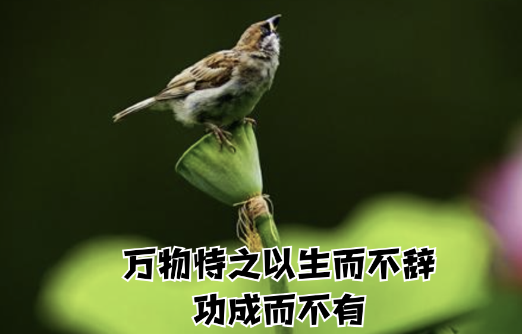
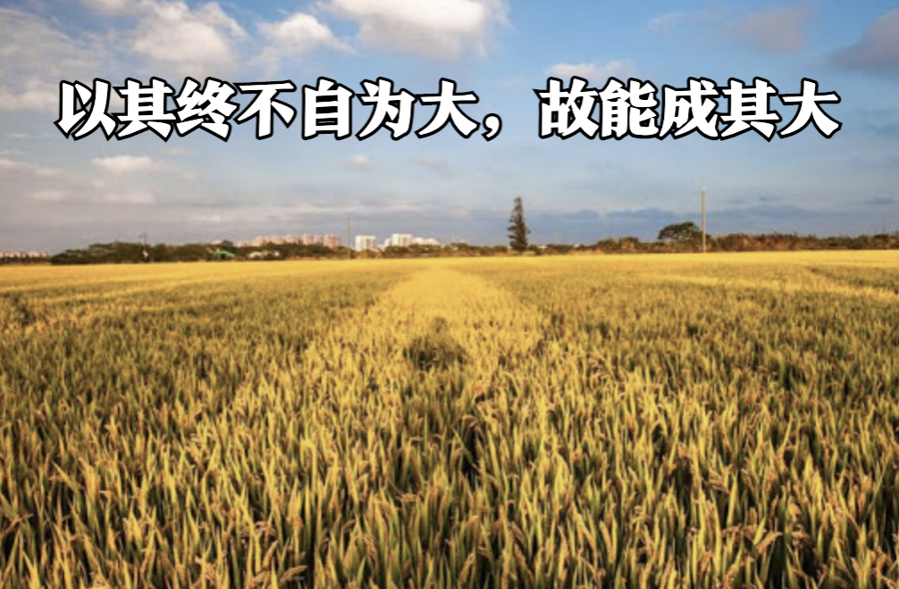
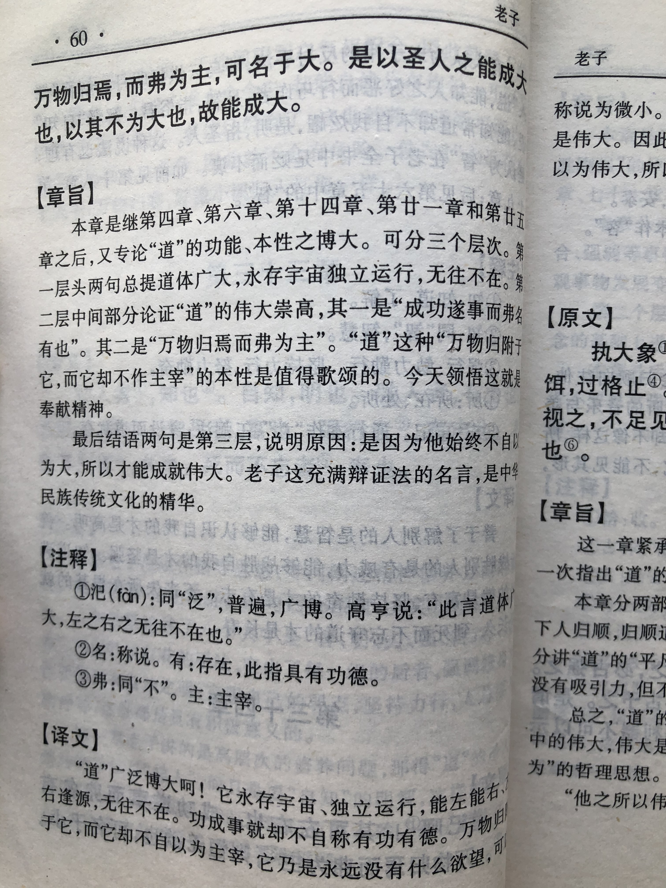

## 《道德经》第三十四章通行本原文：

    大道汜兮，其可左右。
    
    万物恃之以生而不辞，功成而不有。
    
    衣养万物而不为主，常无欲，可名于小；
    
    万物归焉而不为主，可名为大。
    
    以其终不自为大，故能成其大。
        
## 译文：
 
    大道广泛无边，上下左右无所不及。
    
    万物依赖它生长而不推辞，有了功绩，也不居功和占有。
    
    它养育万物而不自以为主宰，始终保持无欲状态，这可以称之为“小”。
    
    万物归附，它也不自以为主宰，这可以称之为“大”。
    
    正因为他不自以为大，所以才能成就它的大德。

## 逐句解释：

### 大道汜（sì）兮，其可左右。
汜（sì）：也有写泛，意为河流遍布向四处漫流。
大道宽泛，四处遍布，上下左右无处不在。

### 万物恃之以生而不辞，功成而不有。
恃：依靠。辞：推辞。
万物都依赖生长，它并不推辞。有了功劳也不占有和居功。

### 衣养万物而不为主，常无欲，可名于小；
衣养：衣被，可覆盖，意为生养、滋养。小：渺小。
生养万物而并不自以为主宰，始终保持朴素自然，默默奉献，可以称之为渺小。

### 万物归焉而不为主，可名为大。
归焉：归附。
万物归附也不自认为主宰，可以称之为伟大。“道”能让天下万物归附，它的影响大到无边，但是却从不认为应当占有。“道”既小又大，似有或无。

### 以其终不自为大，故能成其大。
大：伟大，指“道”作用无边。
以其始终不自以为伟大，反而能成就伟大。你越是想要的，却得不到，你越是不经意的，却能收获。保持谦让是一种美德，与人无争是一种智慧。

## 心得总结：
老子这章主要讲“道”的表现形式，也就是“德”。“道”养育万物，却不自恃有功，也不自以为大。正因为“道”不自以为大，所以才成其大。

大道宽泛无边，是万物的主宰。但它无欲无求，无名无利，也不需要去掌控和干预万物。大道默默运行，它悄悄发生着作用，好像什么也没有做，但却对万物产生着深远影响。大道的这种表现形式就是“德”。

人类自诩为万物的主宰，以为可以改变自然，操控万物，殊不知人类之所以能够生存和发展，正是依赖自然界的万事万物。人类不是自然万物的主宰，相反还是自然万物的附属。如果我们明白了这个道理，那么我们就会顺其自然、适应自然、发展自然，而不是破坏自然、操控自然、主宰自然。

生而不有，为而不恃。生之养之并不占为己有，有所作为但不以此为傲。有的君王把天下看成自己的私产，以为可以为所欲为；有的老板把企业看成是个人财产，以为可以任意处置；有的父母把孩子看成是自己的附属，以为可以任意控制。这都是不懂得“道”，缺失了“德”。老子告诫人们即使有了功绩也不要居功，即使有了奉献也不要求回报。君王功绩再大，那也是人民的力量；企业主功劳再多，那也是员工的辛劳；父母付出再多，那也是孩子的努力。如果一个人把这些都想清楚了，那么就不会再感到困惑了。

“德”是一种外在表现，其内在是“道”。遵照“道”的规律，表现“德”的行为，滋养万物，不居功、不自大，无我利他、无私奉献。这样的人，才是有大德的人。这样的人，虽然不自以为大，却终能成其大。

## 附帛书版：

[返回目录](../README.md) &nbsp; [上一章](./33.md)&nbsp; [下一章](./35.md)

