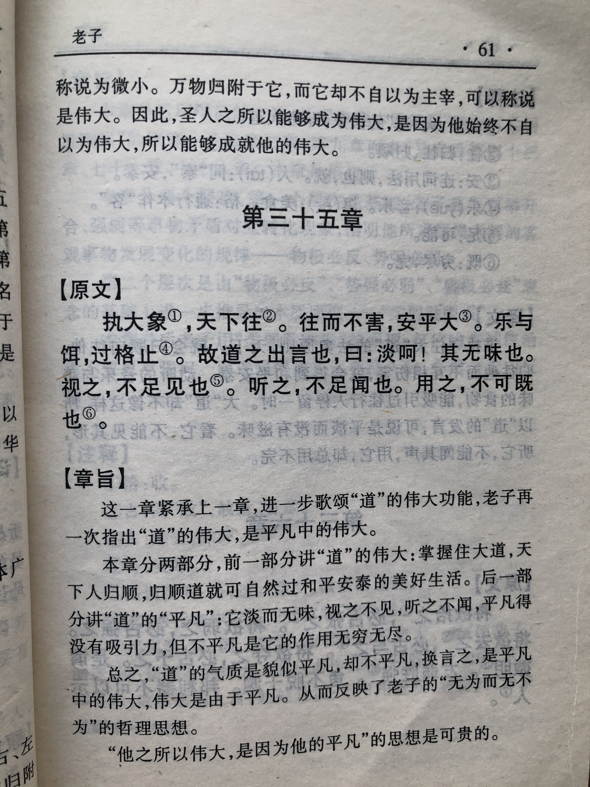

## 《道德经》第三十五章通行本原文：

    执大象，天下往。
    
    往而不害，安平太。
    
    乐与饵，过客止。
    
    道之出言，淡乎其无味。
    
    视之不足见，听之不足闻，用之不可既。
        
## 译文：
 
    奉行了大道，天下人就会争相投奔而来。
    
    人们争相投奔大道，就不会相互伤害，天下将会安稳太平。
    
    面对音乐与美食的诱惑，人们会停步不前。
    
    “道”说出口来，会觉得淡然无味。
    
    “道”看起来似乎不可见，听起来似乎不可闻，但是它的作用却无穷无尽，用之不竭。

## 逐句解释：

### 执大象，天下往。
执：拿着、持有。大象：大道之象。往：前往。
如果秉持大道，那么天下人都会前来归顺。

### 往而不害，安平太。
太，同“泰”，平和、安宁的意思。
人们归顺大道，那么就不会相互侵害，天下也就安稳太平。

### 乐与饵，过客止。
乐与饵：音乐和美食，指精神与物质享受。
遇到音乐和美食，人们往往会禁不住诱惑。

### 道之出言，淡乎其无味。
“道”经言语说出来，变得淡然无味。指“道”不像音乐和美食那么吸引人。

### 视之不足见，听之不足闻，用之不可既。
既：尽的意思。
“道”似有或无，你看不见，也听不到，但它的作用却绵绵不断，永不枯竭。

## 心得总结：

这章回到了“道”的作用和好处的描写。虽然书本里不断提到“道”，但这并不是简单重复，而是层层深入，使人切实感受“道”的伟大力量。这章就是告诉人们，“道”虽然平淡无奇，视而不见，听之不闻，但作用却无穷无尽，默默影响着万事万物。领导者只要秉持了大道，那么人心将会归附，天下将会安宁。

“乐与饵，过客止。道之出口，淡乎其无味。”大道不像音乐美食那么对人们充满了诱惑，让人停步不前。大道无形无色，淡然无味，一般人很难持之以恒地去追求。能坚持不懈追求“道”的人，一定是能够忍受孤独和寂寞，忍受冷嘲热讽，忍受不公平对待的人。这个世界诱惑太多，人们的声音嘈杂无比，如何能保持冷静，克制欲望，坚守心中的“道”，这点着实不容易。声色诱惑虽然迷人，然而过了新鲜劲，人们很快就会感到厌烦。“道”教给人们的是真正的大智慧，可以让人茅塞顿开、不再困惑。所以，大道虽然没有那么动听好玩，然而一旦拥有则会终身受用。

追求享乐是人之本性。在眼花缭乱的社会中，人们很难克制自己的欲望，纸醉金迷的时代，人们都向往名利财富。如何才能在现实生活中追求大道而不偏离呢？这就需要人们有清醒的头脑，始终保持朴素自然，不为声色所动。

老子的智慧在于，时时刻刻能给你警醒，并且句句切中要害。人们总是喜欢表面的浮华，却忽视平淡的生活。老子的思想其实早就影响到中国人的方方面面，很多成语也都出自《道德经》。只可惜《老子》不是作为学生的专修课程，实在有点可惜了。其实无论什么行业，无论什么职位，也无论什么年龄，读读《老子》，理解万物的运行规律，理解人生的本质，这是非常有意义的事情。我们应该谨记，“道”能给我们带来真的幸福和安宁。

当然，不要拿现在的逻辑体系去求证老子的思想，去谈逻辑的缜密性，去谈系统化结构，去逐句逐字较真。中国传统文化偏向抽象文化，比较重视意境，而不是具象的逻辑推理。对于传统国学不要去严苛什么“演绎、归纳、类比”之类，而是需要自己去感悟，而且不同的人看法可能完全不同。于我而言，我觉得老子的思想非常值得研究，对于提高整体世界的认识很有帮助，对于提升自己的人生境界也很有帮助。当然不是要去求仙成道，也不是把道家当做信仰，而是当做一种学术，结合马列主义、资本主义等各种思想学说，不断深入学习，这个过程很有意思，会逐渐使得自己不再局限和狭隘，渐渐变得开明起来。

最后，学了本章的应该明白，我们远离那些声色的诱惑，克制欲望和贪婪，保持朴素和淡然，孜孜不倦地接近“道”，秉持“道”的精神，保持“德”的行为，做到无我利他，默默奉献。

## 附帛书版：

[返回目录](../README.md) &nbsp; [上一章](./34.md)&nbsp; [下一章](./36.md)

