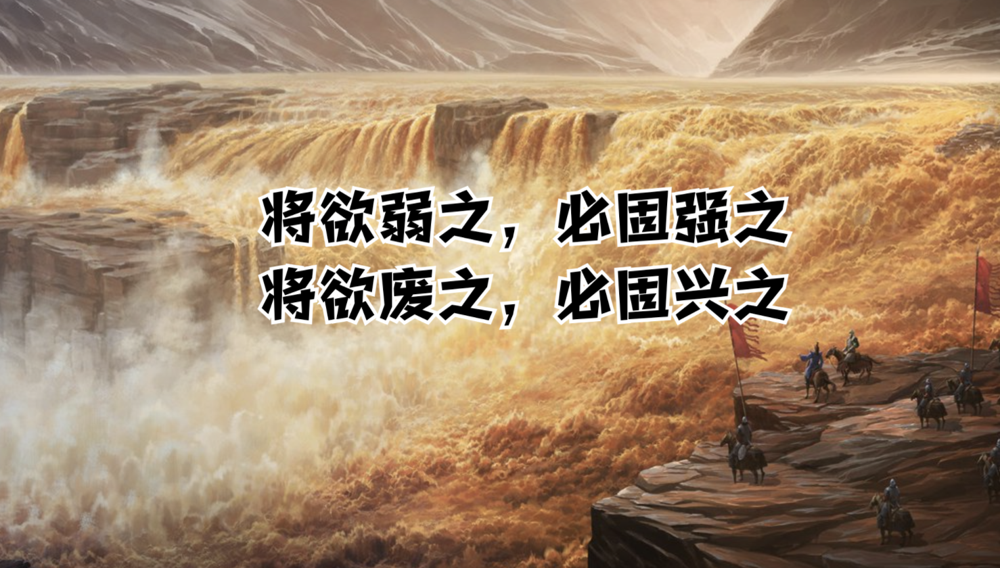

## 《道德经》第三十六章通行本原文：

    将欲歙之，必固张之；
    
    将欲弱之，必固强之；
    
    将欲废之，必固兴之；
    
    将欲取之，必固与之。
    
    是谓微明，柔弱胜刚强。
    
    鱼不可脱于渊，邦之利器不可以示人。
        
## 译文：
 
    想要收拢它，必先扩张它；
    
    想要削弱它，必先增强它；
    
    想要废除它，必先兴举它；
    
    想要夺取它，必先给予它。
    
    这就是微妙的高明，是以柔弱胜刚强。
    
    鱼不可以脱离开深水，国家的利器不可以轻易示人。

## 逐句解释：

### 将欲歙(xī )之，必固张之；
歙：敛，合。
想要收缩它，可以先扩张它。事物会对立转化。如果不断扩张，使得物体不断膨胀，最后它会自我爆炸。

### 将欲弱之，必固强之；
固：暂且。
想要弱化它，可以先使它强大。然后强大到骄傲自满、飞扬跋扈的地步，那时就会不堪一击了。

### 将欲废之，必固兴之；
兴：兴旺、兴举。
想要废除它，就先去兴旺它。不断兴旺它，使其变得狂妄自大、飞扬跋扈，最后它会轰然倒塌。

### 将欲取之，必固与之。
取：一本作“夺”。与：给，同“予”字。
想要夺取它，可以先给予它。不断施之以利，然后可以趁其不备，一举拿下。

### 是谓微明，柔弱胜刚强。
微：微妙，隐藏。
这就是微妙高深的道理，即以柔弱胜刚强。从事物的对立面来打败它。

### 鱼不可脱于渊，邦之利器不可以示人。
鱼儿不能离开深渊，国家的利器不可以轻易向人展示。这里利器有不同的说法，有的说是政令法规，有的说是国家权力，有的说是重大武器。都有道理，但都不完整，这里当作国家的强大力量。这种东西不要轻易去向人示威。

## 心得总结：

老子这一章充满了辩证思想，主要是讲矛盾的对立转换，以及柔弱胜刚强。同时告诉人要守住根本的东西，不要随意炫耀自己的力量。

人们通常看到问题正面，老子更喜欢看到问题的反面。想要收缩一个物体，人们通常会不断捆紧，而事实上却会遭到反弹，老子告诫我们不如使其扩张，让它得意，然后它自己就撑不住了。想要削弱一个东西也是这样，废除或夺取一个物体也是如此。不一定从正面出手，而是出其不意，故意纵容，使其得意忘形，然后一举拿下。这是一种很高明的战略思想，对于战争或者竞争都很有借鉴意义。

以弱胜强，以柔克刚，以小博大、以静制动。这都是利用事物的矛盾和人性的弱点来获取胜利的手段。事物在发展过程中，当走到某一个极限时，就会朝着相反的方向变化。所谓物极必反，月盈则亏，日中则昃。人性都有自大狂妄的一面，不断恭维夸赞，就会使其陶醉在糖衣炮弹中。我们不用担心对方的强大，也不用担心自己的渺小。时机尚未成熟，对手比较强大，那就不断使其骄纵，不断使其狂妄。而当时机来临，就迎头痛击，毕其功于一役。越王勾践，卧薪尝胆十年，使得吴王狂妄得意，最后一举歼灭。所以身处逆境，被对手压制不要恐慌，先不断示弱，使得对手不断狂妄自大，然后韬光养晦，细细打磨好自己的产品，静待时机，最后一举打败对方。

“鱼不可脱于渊，邦之利器不可以示人。”鱼不能离开水，人不能离了根基，也就是不能偏离了“道”。相对于刚强和壮大，老子告诫我们要保持柔静和弱小，即便我们拥有了强大的力量，我们也不要轻易示人，而是应该保持朴素、低调和自然。

## 附帛书版：

[返回目录](../README.md) &nbsp; [上一章](./35.md)&nbsp; [下一章](./37.md)

