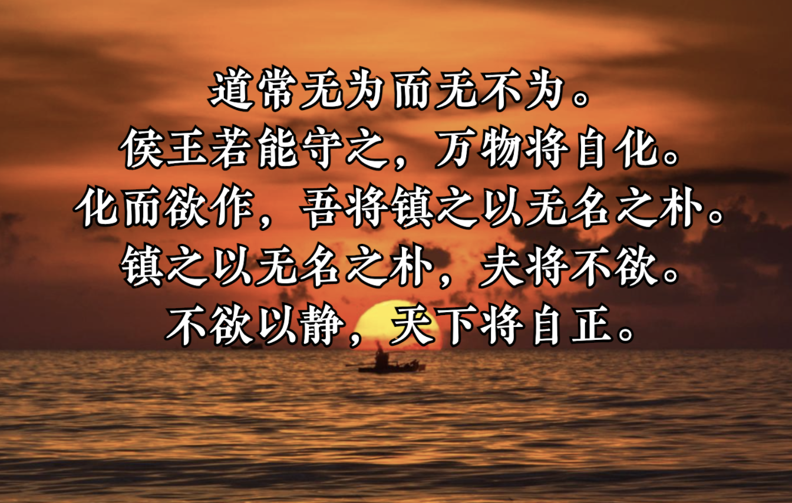
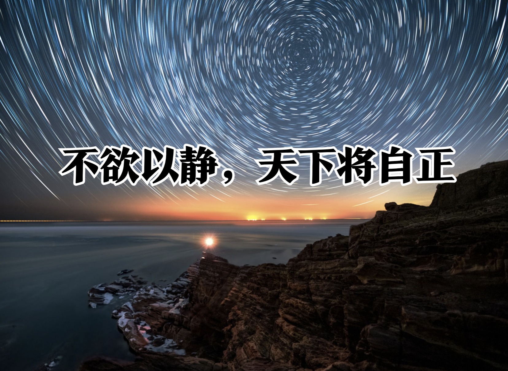
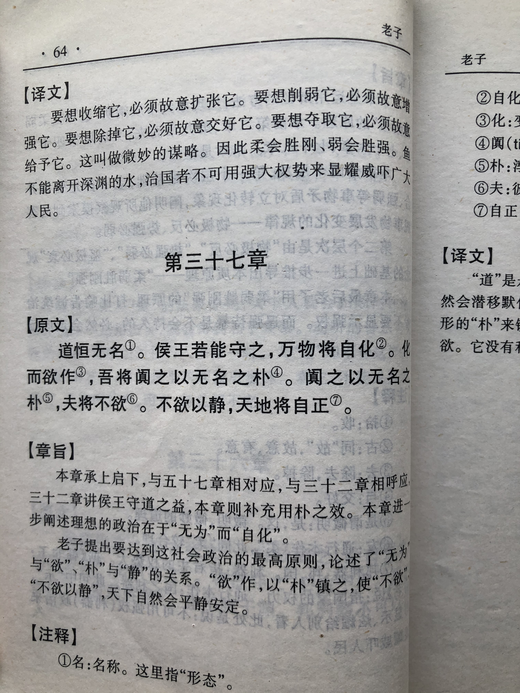
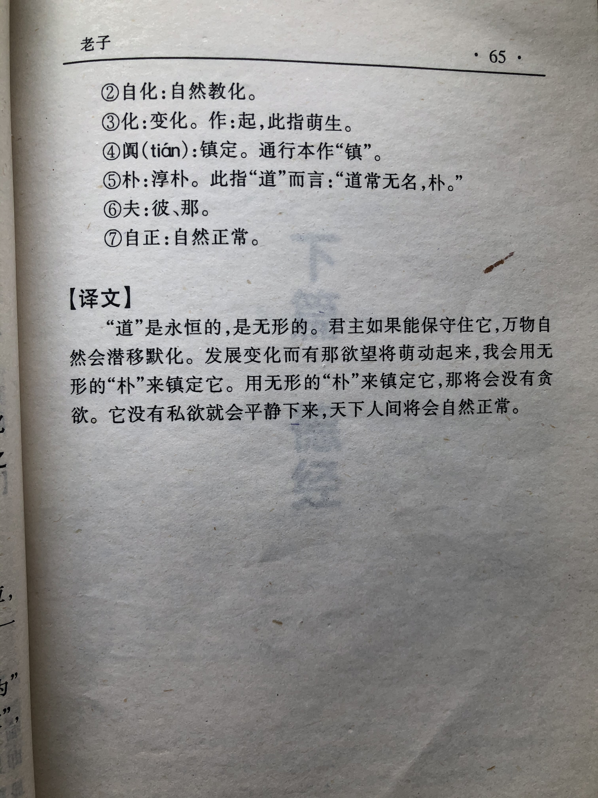

## 《道德经》第三十七章通行本原文：

    道常无为而无不为。
    
    侯王若能守之，万物将自化。
    
    化而欲作，吾将镇之以无名之朴。
    
    镇之以无名之朴，夫将不欲。
    
    不欲以静，天下将自正。
        
## 译文：
 
    道通常看起来什么也不作为，但它实际上却无所不为。
    
    王侯若能遵照它的规律，万物就会自我成长，自我化育。
    
    万物自生自长而产生贪欲时，就用“道”的德行来让其回归混沌朴素。
    
    万物回复到混沌朴素状态，就不会有多余的欲望。
    
    万物去除了多余的欲望，回归柔静，天下便自然达到和谐与安宁。

## 逐句解释：

### 道常无为而无不为。
无为：“无为”是指顺其自然，不妄为。无不为：无所不为。
“道”通常看起来无所作为，而实际上无所不为。这就是润物细无声，做了事情而让人察觉不出来，让人觉得一切自然而然。

### 侯王若能守之，万物将自化。
守之：即守道。之，指道。自化：自我化育、自生自长。
君王如果能够遵守“道”的法则，那么万物都可以自我化育和生长，不要太多干预。

### 化而欲作，吾将镇之以无名之朴。
欲：指贪欲。朴：道的形态，混沌、朴素。
万物自我成长产生贪欲时，我就用“道”来引领它回归朴素自然。

### 镇之以无名之朴，夫将不欲。
无名之朴：“无名”指“道”。“朴”形容“道”的真朴。
当用“道”来引领它，使它返璞归真后，那万物就不会再有贪欲了。

### 不欲以静，天下将自正。
不欲：无欲。
去除贪欲保持静柔，那么天下自然会和谐与安宁。天下会自动回归正道，这就是自然。

## 心得总结：

本章与之前章节相互贯穿，再次指出“道”的作用表面上看无所作为，而实际上无所不为。同时强调，只要遵循了“道”的规律，从上到下保持清心寡欲，回归朴素自然，那天下就会太平，百姓就会安居乐业。

关于无为和朴，前面章节也多有论述。

本章进一步强化了无为的理念，老子告诫君王“侯王若能守之，万物将自化”、“不欲以静，天下将自正。”老子的治国的根本在于无为，治民的根本在于无欲。无为不是毫不作为，而是无所不为、以无为胜有为。无欲也并非像佛教一般四大皆空，毫无牵挂，老子的无欲是无欲则刚，通过去除贪欲，保持昂扬的斗志，本质上是保持高尚的情操，去除低级的欲望。老子不是让统治者修道炼丹，不问世事，他希望统治者建立一套符合自然法则的治国策略和行政法令，减少人们的贪欲，给予人们以自由，少干预和少破坏，一切遵循自然。

“朴”表意为未经雕琢的原木，实际就是“道”，具体形态就是混沌、朴素、暗眛，也就是一种天然的质朴。与物质享受和声色犬马不同，在质朴状态下，人们日子过得普通平淡，但会活得非常充实，也非常快乐。所以，如果我们能遵守“道”，保持“朴”，那就会自我升华，让人生更有意义。

可以说老子的思想是非常先进的，看得很长远。遵守老子的思想有利于人与自然的和谐发展，以及人与人的和谐共处，能让社会更加安宁，也能让我们更好地实现自我价值。

老子的话有没有道理？辩证地分析，既有道理也没有道理，总体上有道理，细节上不够充分。有道理的是出发点和目标是顺其自然，这是正确的；不充分的是如何才能达成顺其自然呢？如何才能去除多余的欲望呢？老子没有给出具体的说明。无论是治理国家还是企业，不干预是不行的，那会导致混乱，多干预也是不行的，那会限制自由发展。设立规矩，限制行为，控制与放权，自由与约束，关于这个度的把握，这不是件容易的事。

老子的“道”是一种感受和理念，并没有明确的定义和界限。不同的人感悟不同，不同的时候、情形感受也不同。我们没有必要细究每一个字词和逻辑，我们只需要体悟到“道”的精髓，感受那种朴素自然，宁静淡泊即可。当我们渐渐有所体悟，能够感同身受了，那么也就入了“道”了。当我们入了“道”，也就明白了人生的真谛和意义了。

“不欲以静，天下将自正。”老子的告诫本就是一种无为而无不为的体现。话说得并不重，也没有强制约束力，然而影响却深远无比。保持朴素，回归自然，无为而无不为，人生终将精彩。

## 附帛书版：

[返回目录](../README.md) &nbsp; [上一章](./36.md)&nbsp; [下一章](./38.md)

