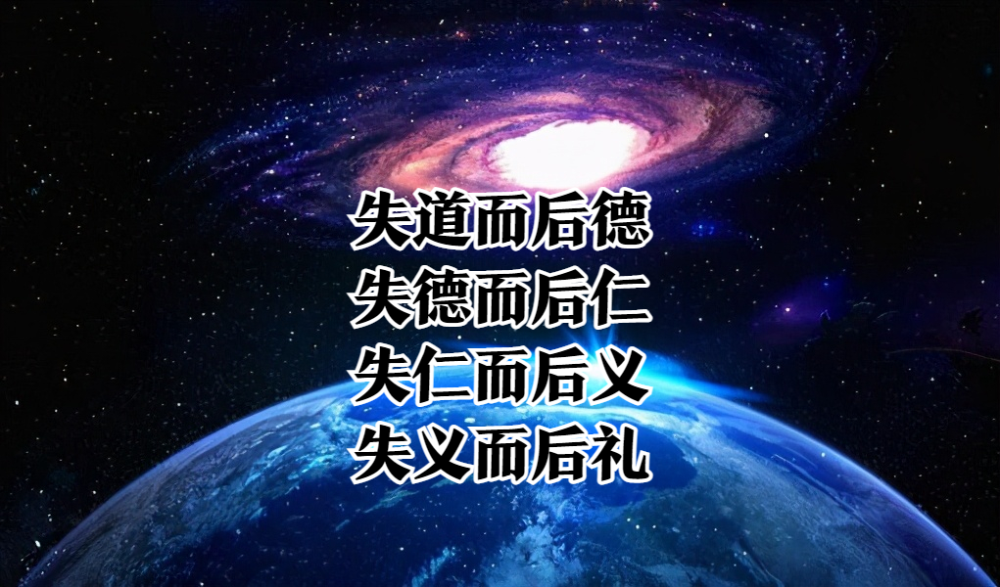
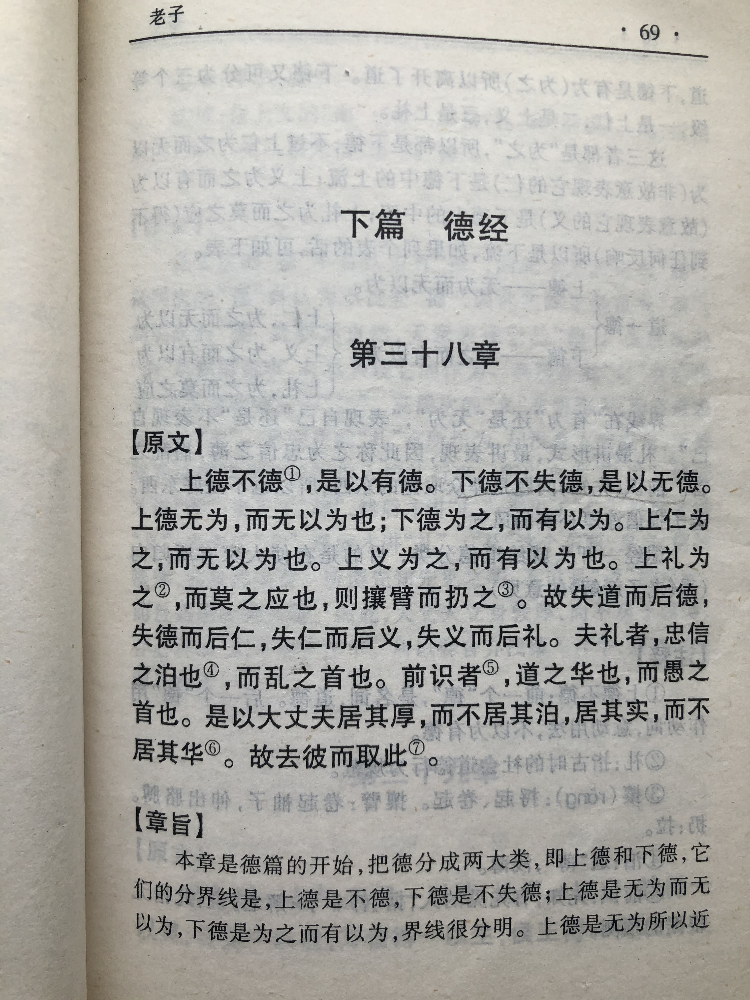

## 《道德经》第三十八章通行本原文：

    上德不德，是以有德；
    
    下德不失德，是以无德。
    
    上德无为而无以为；下德为之而有以为。
    
    上仁为之而无以为；上义为之而有以为。
    
    上礼为之而莫之应，则攘臂而扔之。
    
    故失道而后德，失德而后仁，失仁而后义，失义而后礼。
    
    夫礼者，忠信之薄而乱之首也；前识者，道之华而愚之始也。
    
    是以大丈夫，处其厚，不处其薄；居其实，不居其华。
    
    故去彼取此。
    
## 译文：
 
    上等的德不表现出德的形式来，而实际上是有德的。
    
    次等的德处处表现出没有失去德，而实际上还没有达到德。
    
    上等的德遵照无为而不去刻意为之，次等的德是有所作为而有意为之。
    
    上等的仁是有所作为而不去刻意为之，上等的义是有所作为而刻意为之。
    
    上等的礼有所作为而得不到响应，于是扬长胳膊，硬拉着人们遵照礼仪。
    
    所以，丧失了道后才会讲德，丧失了德后才有仁，丧失了仁后才有义，丧失义之后才是礼。
    
    礼这个东西，是忠信不足的产物，也是祸乱之首；
    
    先见之明，礼是道、德、仁、义变得浮华时才出现的，当然就是社会动乱的祸首了。
    
    依据先知，礼不过是道的虚华表面，也是愚昧的开始。
    
    因此，大丈夫为人当敦厚而不轻薄，朴实而不虚华。
    
    所以，我们应当舍弃轻薄虚华而采取朴实敦厚。

## 逐句解释：

### 上德不德，是以有德；
上：上等的，好的。德：是道的形式。
上等的“德”不刻意表现出“德”来，实际上是有“德”的，只不过看起来好像没有“德”一样。这是高级的“德”。

### 下德不失德，是以无德。
下：下等，低级。
下等的”德“表现为不失其“德”，而实际上还没有达到“德“的状态。”德“不会刻意表现出来，而是自然而然。

### 上德无为而无以为；下德为之而有以为。
以为：作为，刻意为之的行为。
上等的”德“遵照无为而不去刻意为之，下等的”德“有所作为是有意表现出来的。无为是一种做了事，但让人看不出来，做得很自然，这是一种高级的有为，而低等的有为就是明显地去表现了。

### 上仁为之而无以为；上义为之而有以为。
上等的“仁”是有作为但不是刻意去那样表现，上等的“义”是有作为且是有意那么做。相比而言，“仁”虽然有所表现，但更加无心一些，而“义”表现出来的则是刻意而为之了。

### 上礼为之而莫之应，则攘臂而扔之。
攘：捋起衣袖露出手臂。扔：用力拉扯的动作。
上等的”礼”是刻意表现但众人并不响应，只能振臂高呼，强拉着人们来遵照礼仪。的确，“礼"一种非常看重形式的规范，对人们的要求非常多，如果人们不顺从 ，则采取强制手段。

### 故失道而后德，失德而后仁，失仁而后义，失义而后礼。
所以失去了“道”才讲究“德”，失去了“德”才讲究“仁”，失去了“仁”才讲究“义”，失去了“义”才讲究“礼”。按等级来分，“道”是根本，其次是上德，再是下德。下德还分三等，即仁、义、礼。

### 夫礼者，忠信之薄而乱之首也；前识者，道之华而愚之始也。
前识者：有预见的人。道、德、仁、义、礼都谈到了，这里的前识者即“智”。
所以说“礼”这个东西，是忠信淡薄之后才出现的，也是祸乱的起始；依据先知之见，“礼”不过是“道”浮华表现，也是愚昧的开始。也就是“道”是根本，“德”是“道”的本质表现，而“礼”是“道”的最浅层的表现。

### 是以大丈夫，处其厚，不处其薄；居其实，不居其华。
华：即“花”，指表面的东西。大丈夫：不是指当今有志气的男子，而是指的是忠信守道的人。
作为一个大丈夫，为人应当敦厚朴实，不要浅薄浮华。人要抓住根本 ，守住“道”的本质，也就是"朴"和“静”。

### 故去彼取此。
所以，我们应当遵循“道”和“德”，而不是讲究那些表面的虚浮。

## 心得总结：

本章是德篇的第一章，也是《道德经》里面非常重要的一章。老子开始系统化阐述“道”、“德”、“仁”、“义”、“礼”的关系。通过这一章，结合之前的道篇，我们将理解老子的天道、人道以及道家与儒家的本质区别。

老子的“道”是一种天道，也就是世界万事万物和一切客观自然的主宰。这个东西似有或无，混混沌沌，气息微弱，却延绵不绝，永不衰竭。“道”因为并不拟人，它也不是神，因此没有情感和怜悯，只是客观独立的某种规律，周而复始地运行着，它不会厚此薄彼，始终不偏不倚。因此“道”完全无私、公平公正。世界是平衡的，能量是守恒的，“道”的无所作为恰恰是最高明的有为。老子告诫人们应该遵循这个客观规律，保持道法自然，这样就是最大的有为，而如果破坏自然或者强行改变，那迟早是要付出代价，最后得不偿失。

“德”是“道”的外在表现，“道”属于天，“德”属于人。而“德”又分为上德和下德，老子的“德”指的是上德，而儒家的“仁”、“义”、“礼”是下德，其中”礼“是最浅层的“德”。老子把这个分析地非常清楚，上德是“道”的本质体现，遵循无为思想，不去表现作为而实际上无所不为；下德是刻意表现没有失去德，而实际上还没有达到“道”的要求。

下德分成三层，最高层次是“仁”，也就是虽然表现出来了作为，但是并非刻意为之，属于无心的表现吧。“义”是其次的下德，表现出来了作为，而且是有意表现的，怀有一定的目的性。最次的下德是“礼”，强迫人们去遵循的行为规范，是一种虚伪的表现形式。相比于现实社会，“礼”就是一种规范和约束，这种东西会限制人们的思想和自由，有点迂腐，因此老子是不赞成的，属于不得已而为之。

通过本章我们知道了“道”、“德”、“仁”、“义”、“礼”的关系，也就更加明白老子为何是孔子的老师了。虽然孔子也足够伟大，但是相比老子而言要处理的问题还是不在同一层面。孔子终其一生最强调的是“克己复礼、尊卑有序”，这属于浅层次的“德”，离“道”还有距离。当然了，孔子的“仁”、“义”、“礼”、“智”、“信”等道德教化比较符合世俗社会的需要，对于普通人比较好执行，再加上“尊卑有序”的等级观点，很符合统治阶级需要，因此儒家就更加受到统治阶级的尊崇，也就流传得更为广泛。

中国的“德”文化源远流长，道家讲“德”，儒家也讲“德”，两者可谓同源，本质上也都是一种个人修养和自然禀赋。当然道家的“德”和儒家的“德”还不太一样，道家的”德“是上的，也就是求道，是为获得大彻大悟，使身心自由，达到无我的人生境界，最后无为胜有为，治天下若烹小鲜；而儒家修德是为了成就良善人格，做一个高尚的执政者，人还在凡尘中，还未能消除欲望，尚不能获得真正的身心自由，需要依循“道”去有所作为，最后成就自我。

我们应该学习和研究儒家，同时应该更深入地学习和研究道家。把这两种结合起来(释家这里暂时不提)，我们才能够真正了解中国文化，了解我们的社会发展规律。理解了“道”，再学习“德”，同时也学习“仁”、“义”、“礼”，不断修身养性，做到厚德载物、朴实无华，这才是我们学习和研究的意义。

## 附帛书版：

[返回目录](../README.md) &nbsp; [上一章](./37.md)&nbsp; [下一章](./39.md)

