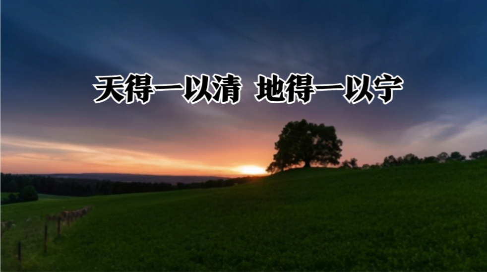
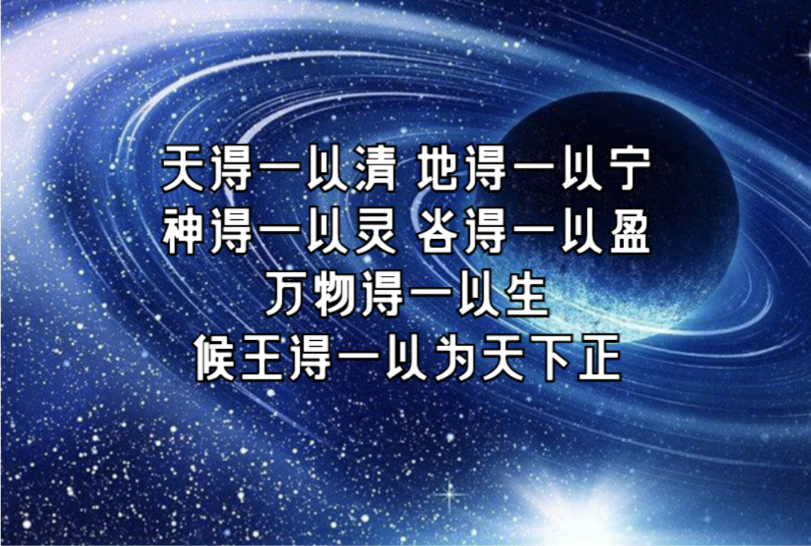
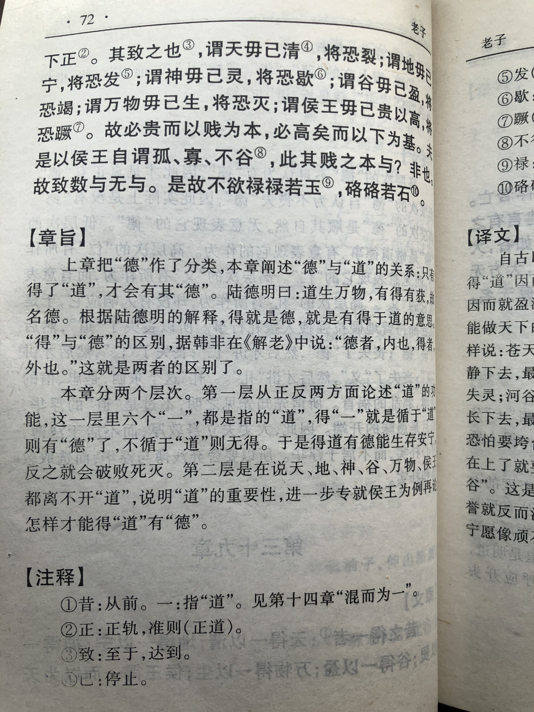
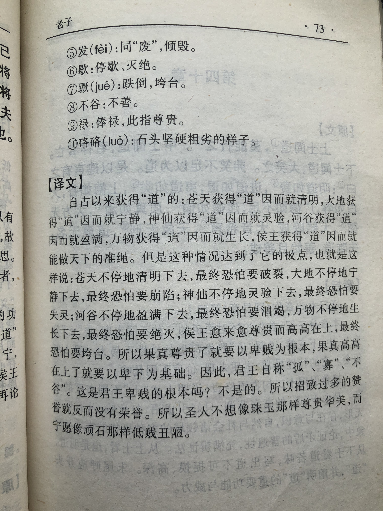

## 《道德经》第三十九章通行本原文：

    昔之得一者：
    
    天得一以清；地得一以宁；
    
    神得一以灵；谷得一以盈；
    
    万物得一以生；候王得一以为天下正。
    
    其致之也：
    
    天无以清，将恐裂；地无以宁，将恐废；
    
    神无以灵，将恐歇；谷无以盈，将恐竭；
    
    万物无以生，将恐灭；候王无以正，将恐蹶。
    
    故贵以贱为本，高以下为基。
    
    是以候王自称孤、寡、不谷。
    
    此非以贱为本邪？非乎？
    
    故至数誉，无誉。
    
    是故不欲琭琭如玉，珞珞如石。
    
## 译文：
 
    往昔得到过道的例子：
    
    天得道而清明；地得道而宁静；
    
    神得道而有灵；河谷得道而充盈；
    
    万物得道而生长；王侯得道而天下大治。
    
    推而言之：
    
    天不得清明，恐怕要崩裂；地不得安宁，恐怕要震溃；
    
    神不得灵性，恐怕要灭绝；河谷不能保持充盈，恐怕要干涸；
    
    万物不能保持生长，恐怕要消灭；侯王不能保持正道，恐怕要倾覆。
    
    所以贵以贱为根本，高以下为基础。
    
    因此侯王们自称为“孤”、“寡”、“不谷”。
    
    这不就是以贱为根本吗？不是吗？
    
    所以最高的荣誉无须赞美和称誉。
    
    不要求尊贵华丽像宝玉，而宁愿坚实朴素如磐石。

## 逐句解释：

### 昔之得一者。
得一：即得道。
曾经有过得道的例子。道生一，一生二。道是无，一是有，两者虽不等同。但这里的“一”可看成是“道”。

### 天得一以清；地得一以宁；
天得“道”而变得清明；地得“道”变得宁静。所谓朗朗乾坤，天清地宁。

### 神得一以灵；谷得一以盈；
神得一以灵：神或指人。灵：灵性或灵妙。谷：也作榖(gǔ)，山谷，河谷。
神(人)得“道”而有灵性；河谷得道而充盈。所谓人有灵性，谷物充盈。

### 万物得一以生；候王得一以为天下正。
正：一本作“贞”，正统、准绳。也可指首领、领袖。
万物得“道”而生长；王侯得“道”而成为正统，让天下大治。

### 其致之也。
推而言之，由此可知。

### 天无以清，将恐裂；地无以宁，将恐废；
裂：崩裂。废：荒废。
天没有“道”，不得清明，恐怕要崩裂；地没有“道”，不得安宁，恐怕要震溃；

### 神无以灵，将恐歇；谷无以盈，将恐竭；
歇：消失、绝灭、停止。竭：干涸、枯竭。
神没有“道”，失去灵性，恐怕要灭绝；河谷没有“道”，就不能保持充盈，恐怕要干涸；

### 万物无以生，将恐灭；候王无以正，将恐蹶。
蹶(jué)：跌倒、失败、挫折。
万物没有“道”，就不能保持生长，恐怕要消灭；侯王没有“道”，就不能保持正道，恐怕要倾覆。

### 故贵以贱为本，高以下为基。
所以贵以贱为根本，高以下为基础。老子强调的是以弱胜强，以无胜有。

### 是以候王自称孤、寡、不谷。
所以君王们自称为“孤”、“寡”、“不谷”。古代帝王自称为“孤”、“寡人”、“不谷”。不谷即不善的意思。

### 此非以贱为本邪？非乎？
这不就是以贱为根本吗？不是吗？

### 故至数誉，无誉。
所以最高的荣誉是无须称誉和赞美的。

### 是故不欲琭琭如玉，珞珞如石。
琭琭：形容玉美的样子。珞珞(luò)：形容石坚的样子。
所以，我们应该不要求尊贵华丽得像宝玉，而应该宁愿坚实朴素如磐石。

## 心得总结：

本章老子连续七次使用“一”字来表述，这个“一”在这里代表“道”。“一”是“道”最先衍生出来的客观存在，由此再衍生万物，因此“一”可以看成是“道”。老子很多章节都提到“一”，如“圣人抱一为天下式”、“道生一，一生二”等。而本章中，对“一”的运用可谓发挥极致，这里就是”道“的意思。

这里老子认为无论天、地、人(神)，还是侯王将相，以及天下万物都应该遵循“道”。如果与“道”在一起，也就是顺其自然，则诸事顺畅，否则就会麻烦多多，灾难深重。在现实社会中，如何来做到“一”，那就是要保持“清、宁、盈、生、正”。当我们把这些观念合而为一，深入实践才能有所体悟。

老子喜欢从事物的反面考虑问题，强调以弱胜强，以小博大。他指出贵以贱为根本，高以下为基础。这是一种非常深刻的思想，你若仔细想想，的确不无道理。没有低贱，哪里有高贵？没有低下，哪里来的高上？所以，我们应该摒弃华丽与浮躁，而保持朴素与宁静。

老子的语言颇有魅力，排比气势如虹，再加上言语深刻，就能使人振聋发聩。在这个喧嚣的世界里，浮华的东西太多了，朴素的东西太少。因此，我们应该心神合一，回到正道。学习《老子》的目的不是求道成仙，也不是升官发财，而是保持内心的淡泊，洞悉客观世界的运行规律，让自己的人生变得更加充实。

## 附帛书版：

[返回目录](../README.md) &nbsp; [上一章](./38.md)&nbsp; [下一章](./40.md)

