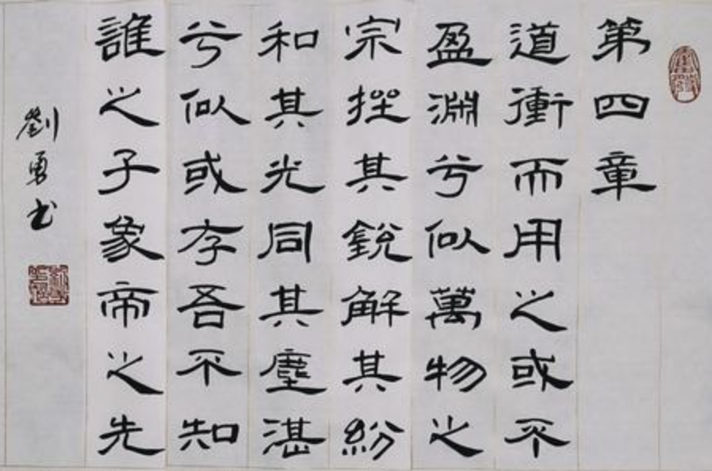
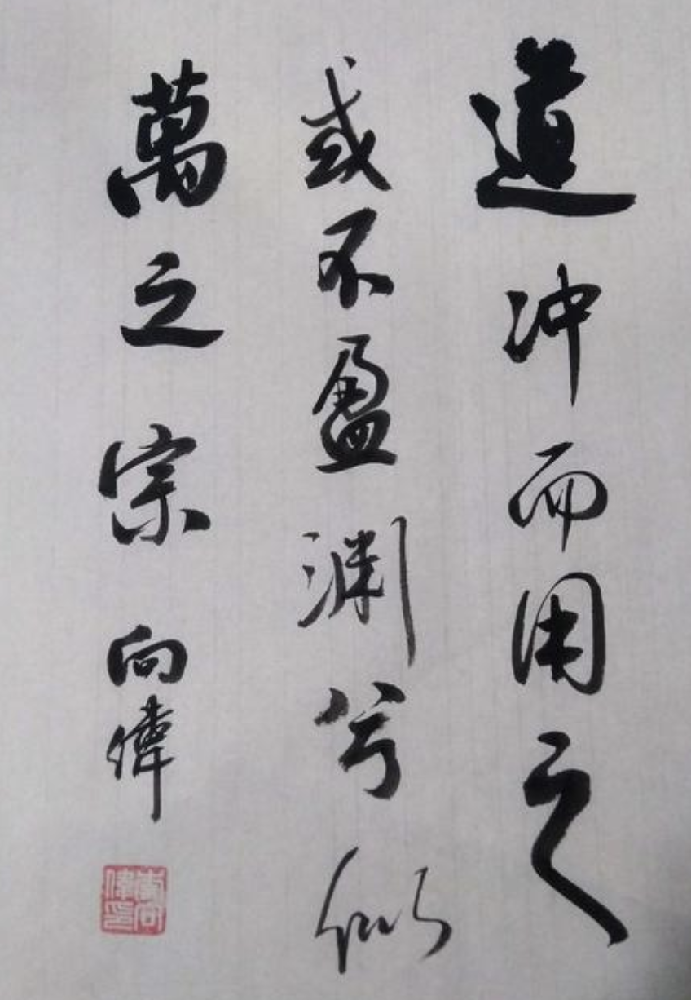
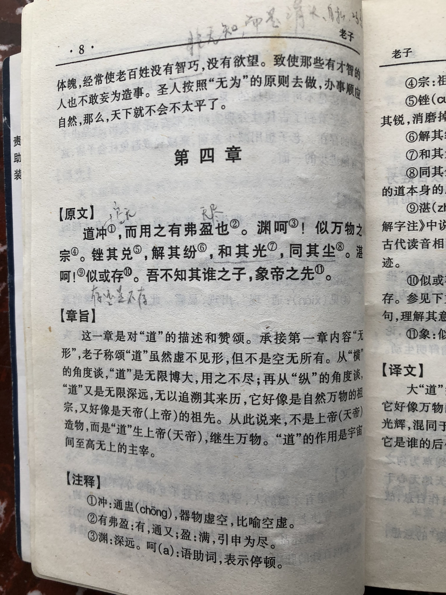
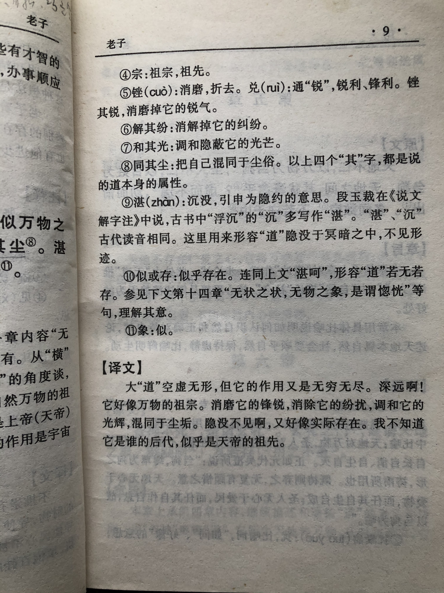

## 《道德经》第四章通行本原文：

    道冲而用之或不盈，渊兮似万物之宗。
    
    挫其锐，解其纷，和其光，同其尘。
    
    湛兮似或存。
    
    吾不知谁之子，象帝之先。

## 译文：
 
    大“道”虚空无形，它运用起来无穷无尽，它深远的好像是万物的祖宗。
    
    消磨它的锐利，消解它的纷扰，调和它的光芒，混同于尘埃之中。
    
    它似乎隐没不见，但又似乎实际存在。
    
    我不知道它是谁的后代，像是天帝的祖先。

## 逐句解释：

### 道冲而用之或不盈，渊兮似万物之宗。
大道空空如也，看起来啥也没有，但它运用起来却又无穷无尽，无所不包。道真深远啊，就像万物的源泉，深不可测。

### 挫其锐，解其纷，和其光，同其尘。
“道”磨掉了锐气，抛除了纷扰，混合在阳光和尘土里。“道”非常普普通通，就隐没在稀松平常的事物里。

### 湛兮似或存。
人们虽视而不见，但它似乎确实存在。

吾不知谁之子，象帝之先。
我不知道“道”是谁的后代，似乎比天帝还早，是天的祖先。

## 心得总结：
本章主要说的是“道”的特征，空虚无形，深邃高远，是万物之源、天地之祖。因此“道”是能够脱离于普通世界，从更高维度来审视世界的。我们的地球是三维世界，但是我们不知道是否存在四维、五维乃至更多维，以我们人类的视觉是看不到的，而“道”是几维我们更不知道，因为它深远到我们无法猜测。

“道”去除了锐利的光辉，混杂于尘世之中，所谓大隐于市。我们虽看不到，但它的的确确存在着，并且影响着人们的行为和情绪，甚至左右着事物的发展。我们看不到，并不能说不存在。

当然这不是玄学，也不是迷信，更不是宿命论。不是捏造一个出鬼神或上帝，也不是让我们来相信冥冥中的主宰力量，更不是让我们听凭命运安排而无所作为。老子是让我们知道这个世界背后有个不断运动和发展的客观规律，它是万物之源，并支配者万事万物的生长。我们应当遵循“道”的规律，顺其自然，在这个基础上再去有所作为。无为胜有为，有为入无为。

老子并没有体系化论证“道”的产生过程，也没有以逻辑的方式推演出“道”的运行规律，更没有说明为何“道”就是天帝之先。他老人家只是把这个概念和现象指了出来，告诉人们本来的样子。至于“道”本身结构和逻辑体系并没有详细说明。因此，我们没法用严谨的逻辑去求证，我们只能相信老子的言论，这就是悟性，你如果认为有道理，并觉得一切豁然开朗，这便是悟道了，你若不信，那这套理论对你是很难有说服力的。

生在凡尘中，如果我们能够跳出固有思维模式，从更高维度乃至上天视角来俯视整个世界，同时又能够丢掉那些锐利的光环，抛却名利的羁绊，混杂于市井世俗之间，就像光无处不在，也像尘土那般接地气。那么，我们就接近于“道”了。所谓上可以安邦治国，下可以修身齐家。不亦快哉！

## 附帛书版：

[返回目录](../README.md) &nbsp; [上一章](./3.md)&nbsp; [下一章](./5.md)

