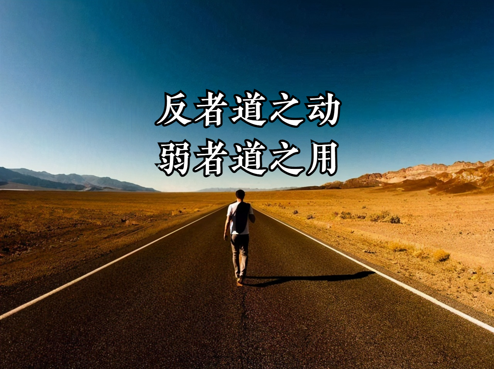
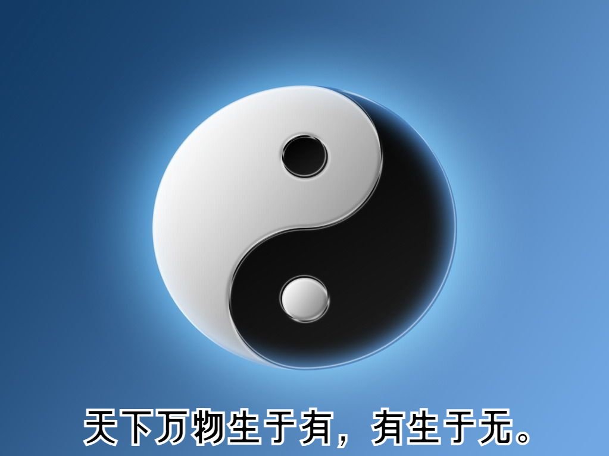
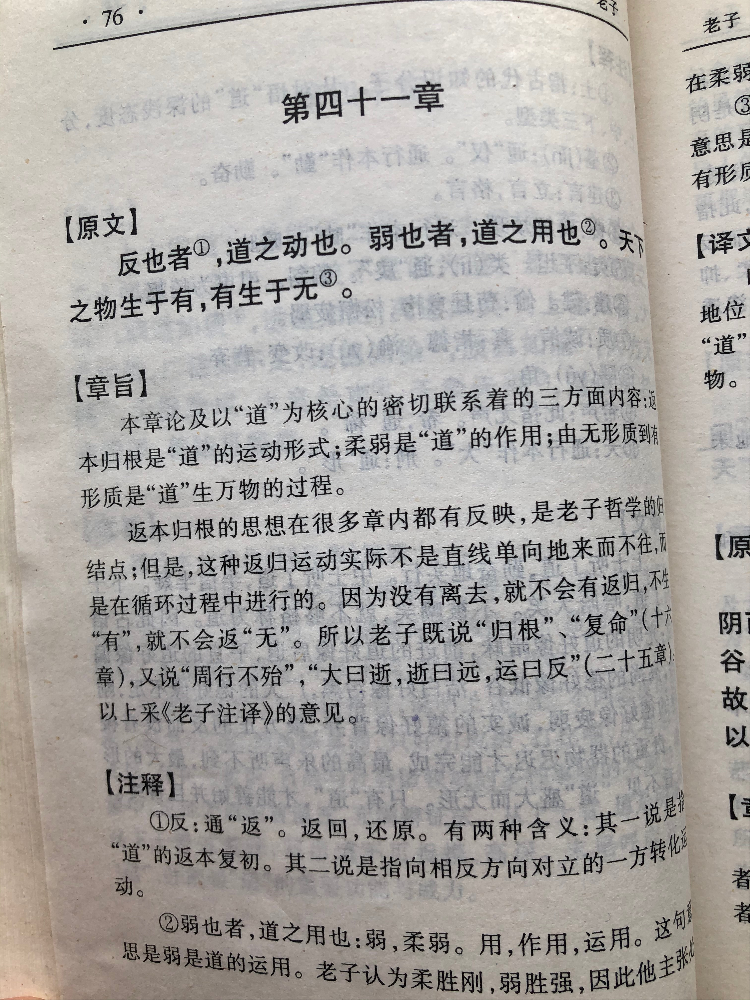
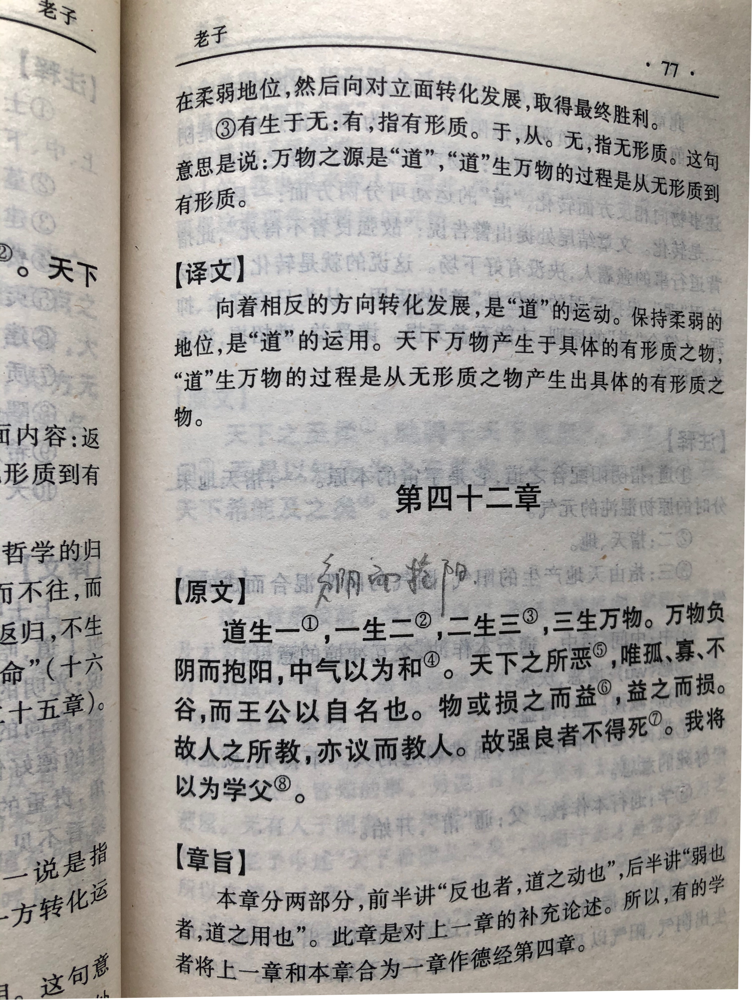

## 《道德经》第四十章通行本原文：

    反者道之动，弱者道之用。
    
    天下万物生于有，有生于无。
    
## 译文：
 
    循环往复、不断走向对立面，是道的运动规律，道的作用柔弱而微妙。
    
    天下的万事万物都产生于看得见的有形之物，有形之物又产生于不可见的无形的道。

## 逐句解释：

### 反者道之动。
反：通返，返回本根，循环往复。也可指相反、对立面。
指道的运动规律是不断循环往复，事物发展不断走向对立面。而一旦到达极限，则物极必反，最后回到事物的本根。

### 弱者道之用。
弱者：柔弱、渺小。
指道的作用非常柔弱微妙，似有或无，你看不到、听不见、摸不着。但它的作用却无穷无尽，万事万物都受到它的制约。

### 天下万物生于有，有生于无。
有：这里指道的物质存在，与第一章中“有名万物之母”的“有”相同，是世界万物的有形根源。
无：与第一章中的“无名天地之始”的“无”相同，也就是无形的“道”。

天下万事万物都来源于有形的“有”，而有形的“有”来源于无形的“无”。有和无构成了有形和无形的一切客观世界。金木水火土，山河湖海、鱼虫鸟兽、风雨雷电等等，所有客观世界形态都产生于“有”，而“有”产生于“无”。因此“无”是“有”的基础。

老子的“道”是一种无形的微弱力量，也是万物之源，它能衍化出“有”，然后再衍化出一切客观存在，包括人、物质和运动等。这里是否包括主观意识，没有说明，但主观意识也是受到“道”的影响。因而“道”无所不能，是世界一切的支配力量。

## 心得总结：
本章老子提出了《道德经》里非常重要的结论：即“道”的运行规律是“反者道之动”，事物的发展运动都是朝着相反的方向，在走到另外一端时又会再回到本根，不断循环往复。这里有两种意思，一是返回本源，二是对立统一转换。每一次转换都是一次升华，而不是单纯的回到最初。这与现代哲学认为事物的发展是“波浪式前进，螺旋式上升”的观点是类似的。两千多年前的老子，早就看出事物运行的本质规律。

“弱者道之用”，也是反其道而行之。人们普遍喜欢强大，老子却认为用弱不用强。根据“弱者道之用”观念，用弱反而能强，用强则反而变弱。这句话还表明“道”在发挥作用的时候，用的是柔弱的方法，即顺其自然，任由一切事物依照自身的规律发展变化。通过这个规律，我们认识到要从事物的柔弱出发，最后转向刚强，而且在这个过程中，还得充分尊重自然，而不强加干涉。

“天下万物生于有，有生于无”。老子重申了“道”与“德”的关系，这里的“无”，可理解为“道”，而“有”可理解为“德”。“道”是无形的，“德”是有形的，人们还不能真正地认识“道”，人们所能认识的，仅仅是“道”的形式“德”而已。“德”是“道”的形态和外在表现，“道”是“德”的本根与主宰。

综上，大道的德行就是循环往复和柔弱顺应。“道”孕育了万物，却不主宰万物，不把它们据为已有，不使它们受制于自己的力量。如果天下的统治者能够顺应大道，效法“道”的做法，以柔弱的手段来治理天下，那么必然能够得到民众的拥护和爱戴，从而天下得到大治。

## 附帛书版：

通行本第四十章对应帛书版第四十一章

[返回目录](../README.md) &nbsp; [上一章](./39.md)&nbsp; [下一章](./41.md)

