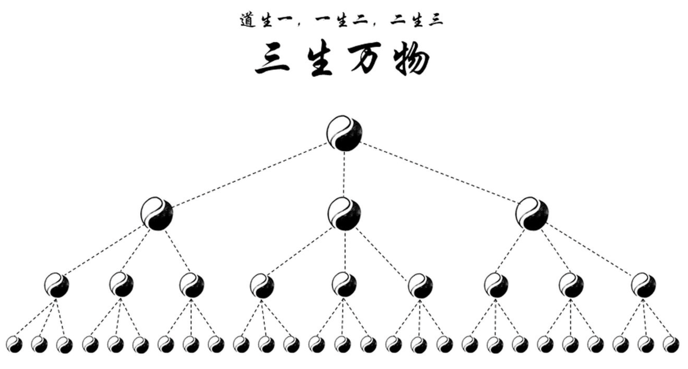
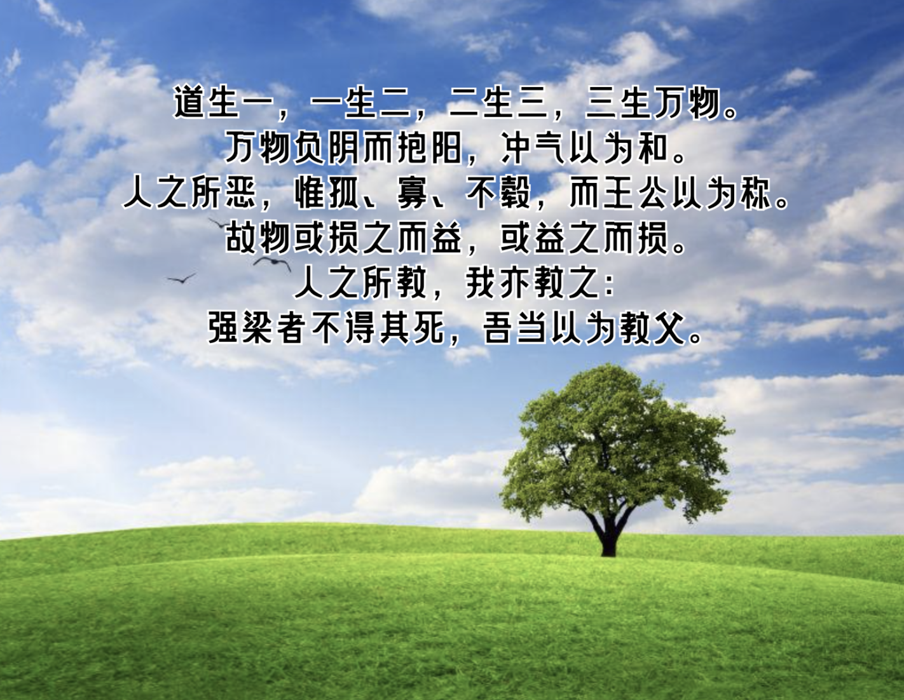
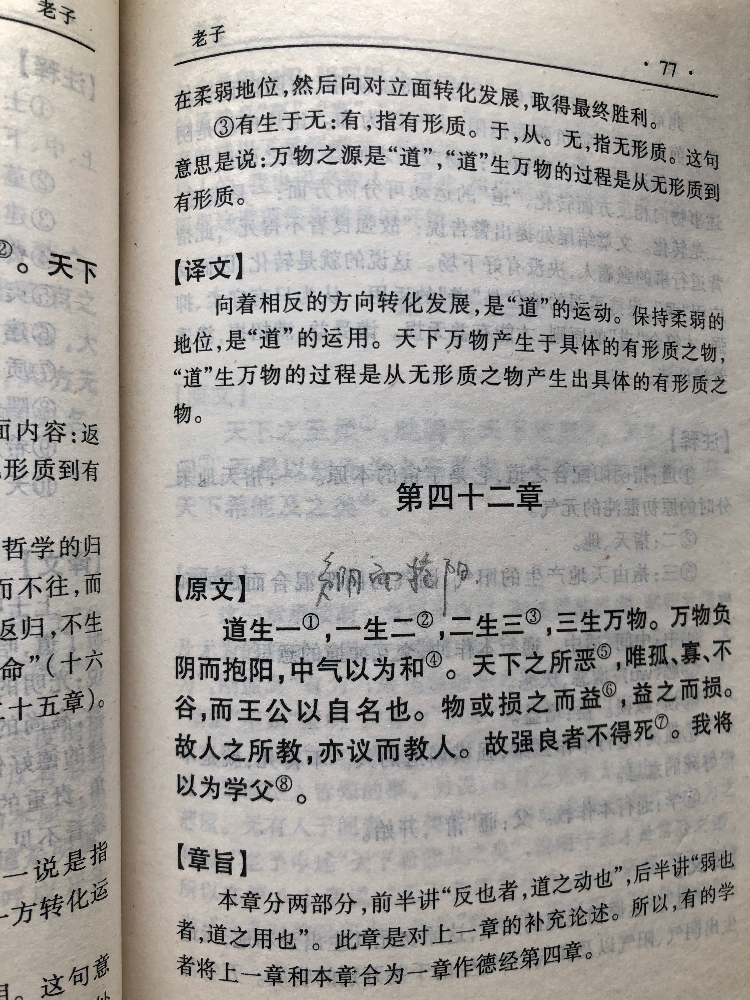

## 《道德经》第四十二章通行本原文：

    道生一，一生二，二生三，三生万物。
    
    万物负阴而抱阳，冲气以为和。
    
    人之所恶，惟孤、寡、不毂，而王公以为称。
    
    故物或损之而益，或益之而损。
    
    人之所教，我亦教之：
    
    强梁者不得其死，吾当以为教父。
    
## 译文：
 
    “道”是天地之始，生出了“一”，浑然一体的天地。
    
    然后“一”生出来“二”，即天和地（或阴和阳）。
    
    后来“二”生出来“三”，就有了这个世界的基本元素（或原始物种）。
    
    再后来“三”生出万物，世界出现了千千万万不同的元素与物种。
    
    万物背阴而向阳，阴阳二气相互交融，最后和谐一体。
    
    人们所厌恶的就是“孤”、“寡”、“不谷”，但君王却用这些字词来称呼自己。
    
    所以一切事物，如果减损它却得到增加；如果增加反而得到减损。
    
    别人这样教导我，我也这样去教导别人：
    
    强行天下的人死无其所，我将把这句话当作施教的宗旨。

## 逐句解释：

### 道生一，一生二，二生三，三生万物。
一：就是一，表示整体。
“道”是无，也是宇宙一切的本根，混沌初开时生出来“一”，天地万物浑然一体。随即“一”分为“二”，即天和地（或阴和阳）。有了“二”，也就有了“三”，即大千世界的基本元素。有了“三”，也就有了世界上的万事万物。

### 万物负阴而抱阳，冲气以为和。
冲：通“盅”，为虚、空。也可理解为冲撞交融。
万物背阴而向阳，阴阳二气互相交融，达到均衡和谐的状态，从而形成新的统一体。

### 人之所恶，惟孤、寡、不毂，而王公以为称。
不毂：不谷，不善，不得养，帝王谦称。
人们所厌恶的就是“孤”、“寡”、“不谷”，但君王却用这些字词来称呼自己。说明君王应该身处低下，保持谦卑。

### 故物或损之而益，或益之而损。
所以对于一切事物，减损它会使其受益；而增益它反而使其减损。这就是“反者道之动”的例子，事物会不断对立转换。

### 人之所教，我亦教之：
别人这样教导我，我也这样去教导别人：

### 强梁者不得其死，吾当以为教父。
强梁：强暴凶横。
教父：宗旨、指导思想。
过于强大，而不能保持柔弱的人，下场会很惨，死无其所，我把这句话当做宗旨。

## 心得总结：

本章是《道德经》非常重要的一章，老子指出了“道”生万物的路径，也再次强调了“道”的规律在于用弱不用强，告诫人们应该保持谦卑和低下。

关于“道生一，一生二，二生三，三生万物”解释众多，版本不一，没有哪一个观点敢说完全正确。其实老子也没有具体说明什么是“一”、“二”、“三”，各种理解也都是后人增添上去的。也可能老子只是列举数字而已，并无他意。因此，我们不要死抠什么是“一”，什么是“二”，过于执拗于字眼。

从“道”到世界万物，老子指出要历经好几个演化步骤。首先“道”也就是无，生出“一”这个整体，表示从“无”到“有”。“一”是一种混沌初分，天地一体的状态。后来“一”分为“二”，“二”就是天地（或阴阳）。“二”衍生出来“三”，“三”代表这个世界构成的基本要素，然后“三”生出来千千万万的物种。

“故物或损之而益，或益之而损”，这句是之前篇章的“反者道之用”的例证，即事物不断朝对立面转换。你不断减弱，它却增强，你不断增强，它却减弱。这跟哲学里面的对立统一、质量互变、否定之否定有相同的思想，都是认为事物在不断发展变化，且会对立统一转换，最后会得到一个升华。老子告诫人们应该看到事物的对立面和矛盾性，这样就不会片面和狭隘。

最后老子告诉我们，“强梁者不得其死，吾当以为教父。”这是说为人尤其为君不要过于强横，而是应该保持谦卑和柔弱，过于强大、过于豪横的人不会得意太久，最后可能死无其所。

## 附帛书版：

[返回目录](../README.md) &nbsp; [上一章](./41.md)&nbsp; [下一章](./43.md)

