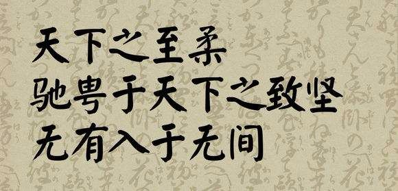
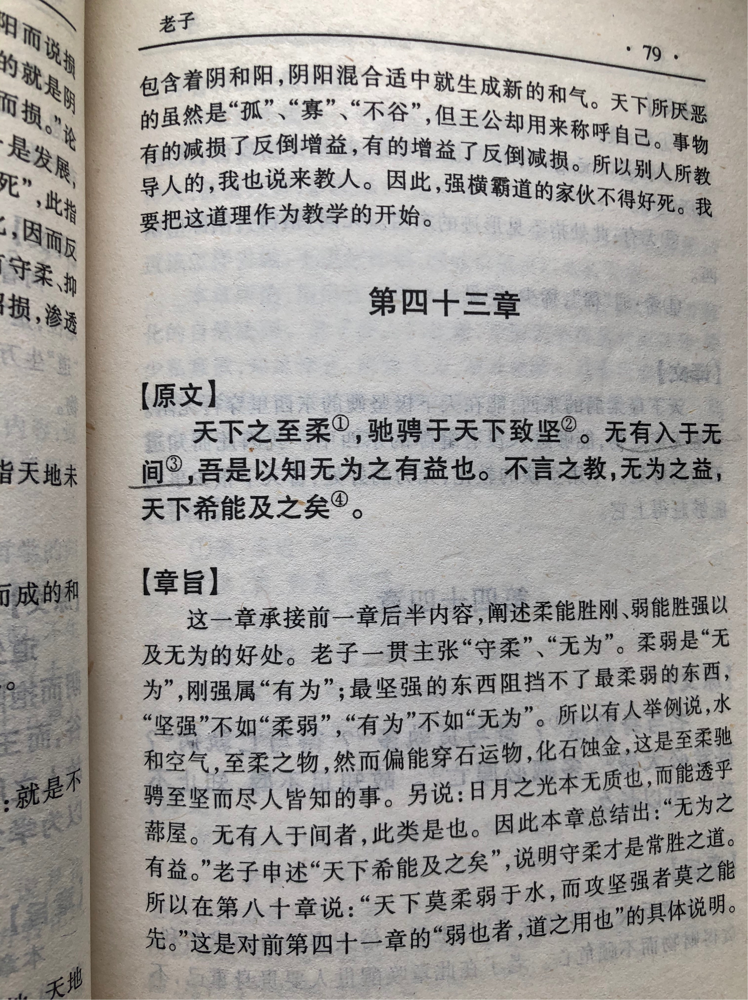

## 《道德经》第四十三章通行本原文：

    天下之至柔，驰骋天下之至坚。
    
    无有入于无间。
    
    吾是以知无为之有益。
    
    不言之教，无为之益，天下希及之。
    
## 译文：
 
    天下最柔弱的东西，能驰骋于天下最坚硬的东西。
    
    无形的道可以渗入到没有间隙的地方。
    
    我因此懂得了无为的益处。
    
    不言的教导，无为的好处，普天下没有什么比得上。

## 逐句解释：

### 天下之至柔，驰骋天下之至坚。
至柔：最柔，指水。
天下最柔的莫过于水，而水滴能穿金石。柔能克刚，弱能胜强。

### 无有入于无间。
无有：没有，指虚空的“道”。
虚空无形的“道”可以渗入到一切地方，甚至没有空隙的地方。“道”无影无形，润物细无声。

### 吾是以知无为之有益。
我因此知道了清净自然、无为而治的益处。

### 不言之教，无为之益，天下希及之。
没有言语的教导，无为而治的好处，天下少有能及得上的。

## 心得总结：
本章依然说的是柔弱胜刚强，以及“道”之无形，影响深远。其中“无有入于无间”是很有名的话，很多人拿来做座右铭。

老子认为柔能克刚，弱能胜强，这是反其道而行之的典型体现。事物表面看起来刚能克柔，强能胜弱，如刀能砍瓜切菜，也能堵住水流，然而再仔细一想就会发现水斩不断、压不扁，任你百般蹂躏，水还是不卑不亢，颜色不改。而水只要坚持不懈，持之以恒，终能穿破金石，击溃堤坝。

“无有入于无间”，这句话初看起来颇不理解。“道”本身无影无形，谈何进入呢？而且既然没有间隙，又如何进入？其实仔细一想，这不是物质上的进入，而是一种思想或者能量的渗入。”道“无声无息，润物无声，无所不在，影响着天地万物，自然会渗入其中，悄然影响着一切。

所以老子希望行不言之教，做无为的事情。清静无为，道法自然是老子的主张，也是世上所稀有的。人们通常都希望大有作为，希望能受人瞩目、荣誉加身，而其实越是这样就越适得其反。而只有保持柔弱、谦卑，行无为之治，反而能取得巨大成绩，最后实现自我。

## 附帛书版：

[返回目录](../README.md) &nbsp; [上一章](./42.md)&nbsp; [下一章](./44.md)

