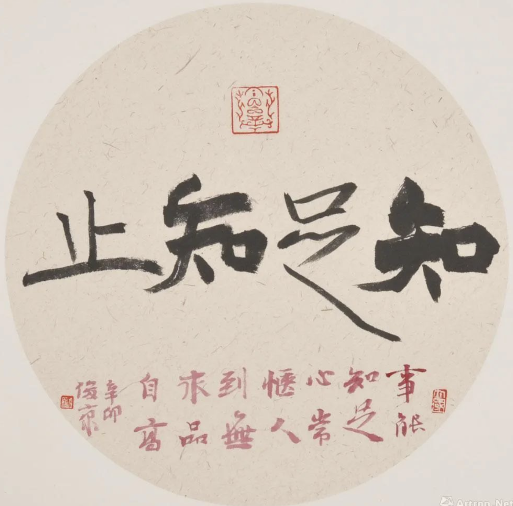
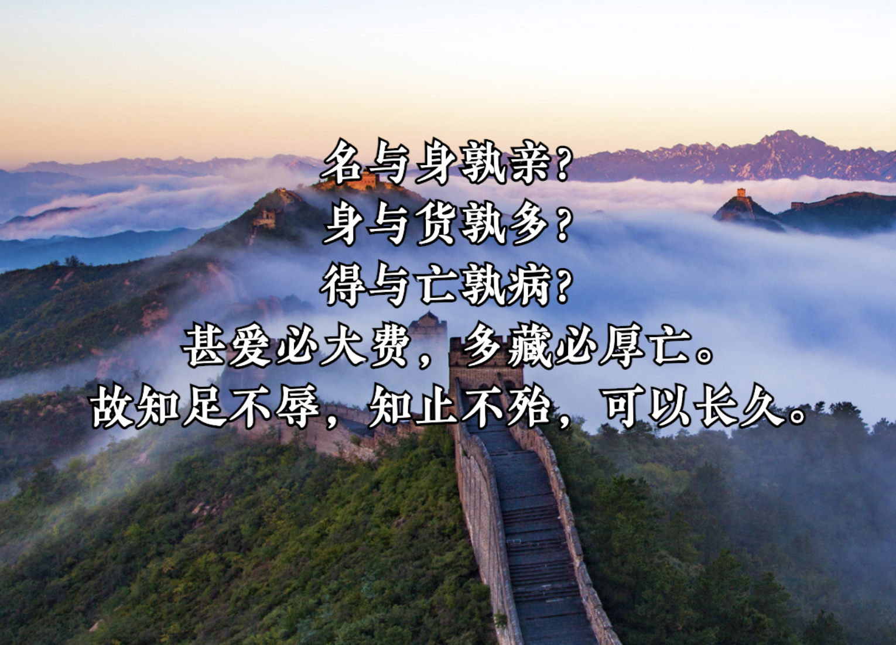
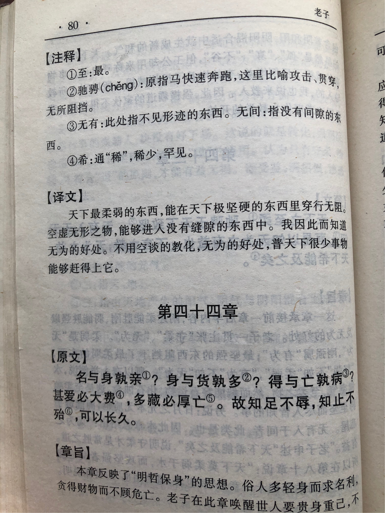
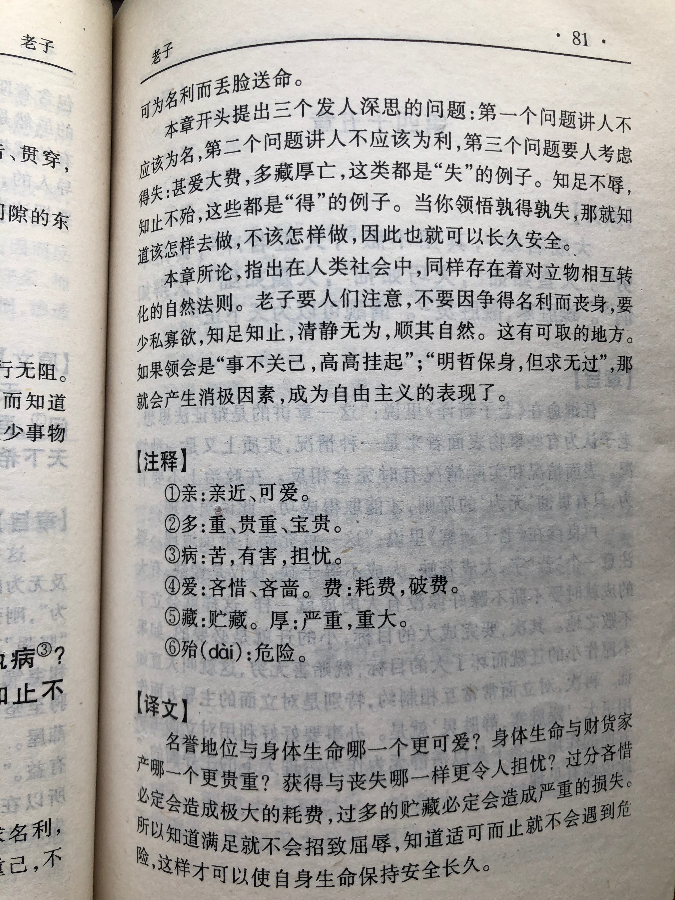

## 《道德经》第四十四章通行本原文：

    名与身孰亲？
    
    身与货孰多？
    
    得与亡孰病？
    
    甚爱必大费，多藏必厚亡。
    
    故知足不辱，知止不殆，可以长久。
    
## 译文：
 
    名声与生命哪个更为紧要？
    
    生命与财富哪个更为珍贵？
    
    在名利与生命的得失之间哪个更有害？
    
    热衷名利必然付出巨大代价，贪图财富必定招致惨重损失。
    
    所以，懂得知足就不会有屈辱，懂得适可而止就不会有危害，那样就可以长久。

## 逐句解释：

### 名与身孰亲？
名是名声或名誉，身则代表身体、生命，哪个更为紧要呢？一般人都会说：当然是身体和生命重要。可是在现实选择时，人们往往为了名利而不择手段，不惜以身体和生命为代价。

### 身与货孰多？
货指那些金银财宝。那么身体与财货比起来，哪个更重要？人们可能会心口不一，表面都说身体重要，或者说两个都要。而实际行为当中，人们往往爱财如命，并美其名曰创造价值，其实就是不断满足自己的贪婪。

### 得与亡孰病？
亡：失去、丢失。
在得到名利与失去生命之间，哪一样更有害呢？如果可以得到名声和财富，但代价是失去健康甚至生命，人们会作何选择？人们往往会为了财富或名望而奋斗，而不重视已经拥有的健康。

### 甚爱必大费，多藏必厚亡。
甚爱：过于喜爱。必大费：一定会付出大的代价。多藏：贪得无厌，希望越来越多。
过于追逐名利，必定会付出巨大代价。贪得无厌，不断积聚财富最后会遭致惨重损失。

### 故知足不辱，知止不殆，可以长久。
如果能懂得知足，就不会遭受耻辱；如果能够懂得适可而止，就不会迷失自我；如果不迷失自我就可以长久。尤其对于领导者，不迷失在名誉和财富里，社会才可以长治久安。

 

## 心得总结：

本章老子直接指出名利以及生命的轻重，告诫人们不要过于重视名利和财富，而应该重视生命和健康。这是非常浅显的道理，人人也都懂得，可是有多少人能真的做得到呢？

身处红尘中，人们追名逐利，都希望受人瞩目，都希望掌控更多的财富和拥有更多的话语权。人们的欲望无止境，贪婪无度，有时为达目的而不择手段，结果搞得满身疲惫，心力憔悴，最后适得其反，垮了身体，也没有达成既定目的。这真是得不偿失啊！

老子不是叫我们无欲无求，看破红尘，也不是叫我们什么也不做，逆来顺受。他是希望我们能够拥有智慧，分清主次、抓住生命的本质，不要被表面的名利所束缚，成了名利的奴隶，更不要因此迷失了自我。老子很清楚地告诉我们，什么才是真正的重要，什么才是我们应当孜孜不倦追寻和珍惜的。

如果我们不能静下心来，不能清晰地区分生命中的轻重，就会去追寻生命本质之外的东西，就会本末倒置。“甚爱必大费，多藏必厚亡”，如果人片面去追求物质享受，过于在于名利，那就与老子的“道”越来越远，最后就会走向败亡。

“故知足不辱，知止不殆，可以长久。”，面对财富和名利的诱惑，老子的解决方案是知足、知止。如果我们懂得收敛，懂得知足者富，懂得适可而止，那么就不会受困于诱惑而无法自拔，我们就能跳出泥潭，找到生命里本质的东西，比如：清静、自然、低下、谦卑、善良、博爱等等，这些都是让人能够长久的方式。

现代社会里讲三观，也就是世界观、人生观、价值观。世界观就是对于世界的总体看法，也是最根本的观点，人生观是成为什么样的人，价值观是对事物的是非判断，老子这里的世界观是“道”，是一种客观自然（与唯物主义和客观唯心主义的区别和联系以后单独专门谈）。老子的人生观能看出来就是无我利他，与世无争，无为而治。而老子的价值观就是低下谦卑，以弱胜强，抛却名利，珍爱生命。

老子的观点其实非常朴素，非常好懂，也具有实操性。并不是空话、套话、黑话，也没有严格的约束和惩罚措施。他老人家只是温和的建议，告诉你智慧，让你自己去琢磨，自己去感悟，能听进去的自然受益匪浅，听不进去的那就哈哈大笑，一笑了之吧。

## 附帛书版：

[返回目录](../README.md) &nbsp; [上一章](./43.md)&nbsp; [下一章](./45.md)

