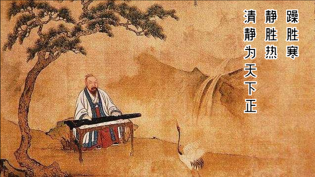
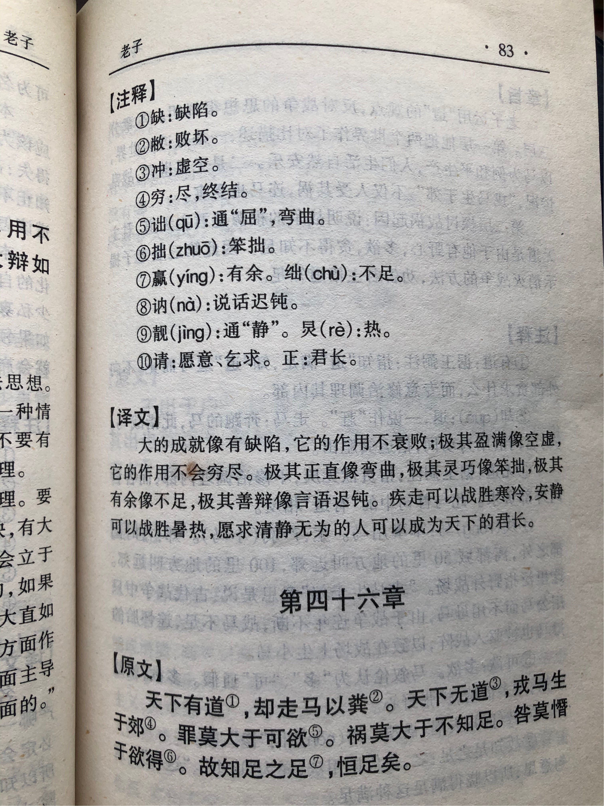

## 《道德经》第四十五章通行本原文：

    大成若缺，其用不弊。
    
    大盈若冲，其用不穷。
    
    大直若屈，大巧若拙，大辩若讷。
    
    躁胜寒，静胜热，清静为天下正。
    
## 译文：
 
    最大的成就若有所缺，而它的作用永不衰竭。
    
    最大的充盈好像空虚，而它的作用无穷无尽。
    
    极致的笔直好像弯曲，最好的灵巧好像笨拙，最厉害的善辩好像木讷。
    
    躁动能抵御寒冷，守静可以抑制燥热，清净无为是天下正道。

## 逐句解释：

### 大成若缺，其用不弊。
成：成功，成就。弊：困顿，匮乏。
秉持大道，取得伟大成就的人，看起来若有所缺，并不会居功自傲，这样的人可以长久发挥作用。最大的完美是有缺憾的，这样的完美才是真完美。

### 大盈若冲，其用不穷。
冲：通盅，中空，空虚。穷：尽。
通晓大道，取得圆满功绩的人，看起来好像虚空，并不骄傲自满，这样的人发挥作用没有尽头。极致的盈满其实虚空，这样才会长久。

### 大直若屈，大巧若拙，大辩若讷。
帛书版：大直若屈，大巧若拙，大辩若讷，大赢若绌
屈：通曲，弯曲。大赢若绌：最大得有余似乎不足。讷：说话迟钝或言语谨慎。
通晓大道的人，刚直得看起来似乎弯曲，灵巧得似乎笨拙，能言善辩得似乎迟钝木讷。最大的笔直反而有点弯曲，最大的灵巧反而有点笨拙，最大的善辩反而有点木讷。

### 躁胜寒，静胜热，清静为天下正。
躁：疾步、跺脚而生热。正：通“政”，或正道、规范。
躁动可以战胜寒冷，清净可以抵御燥热。清静无为可以让天下回归正道。有的版本写成：静胜躁，寒胜热，意在读起来顺畅。但其实老子的话没问题，“躁胜寒”，说得是动可以制住冷，“静胜热”，说得是静可以制住热，所以老子强调的是动静结合，保持守中，这才是清净无为。清净无为并非不动，而是在运动、变化的时候依然能保持内心的宁静和淡泊。

## 心得总结：

本章具有深刻的辩证思维，读起来似乎不是很好理解。老子指出“成、盈、直、巧、辩”五种完善状态，其实与“缺、冲、屈、拙、讷”是对应的。这是告诉我们极致完美的状态，其实含有缺陷的。老子的深刻就在于此，我们通常认为完美无缺，而老子告诉你，完美是有缺的。这是老子“反者道之动”的又一体现，也是上一章”知足不辱，知止不殆“的延续。

老子的话其实与日常俗语也很接近，比如：金无足赤、人无完人、白璧微瑕、月盈则亏、日中则昃等，这些也蕴涵着同样的道理。凡事有度，过犹不及。当一件事物快要达到圆满完美的状态时，就会走向对立面，而这个时候看起来似乎还有些缺憾，而这恰恰是最完美的状态。也就说，完美其实并非完美。

老子的智慧在于给人棒喝，使人清醒。当我们追名逐利，投机取巧，沉迷浮华的时候，老子告诉我们应当抱朴守拙。”大直若屈，大巧若拙，大辩若讷“，这是告诉我们在追求功名和成就时，其实可以来点弯曲和磨炼；在追求智巧和聪明时，其实可以来点笨拙和愚钝；在追求能言善辩和花言巧语时，其实可以迟滞和木讷。

”躁胜寒，静胜热，清静为天下正“，老子这是告诉我们要以动制冷，以静制热，遵道守中，保持内心的宁静和淡泊，以清净无为来治理天下，从而众望所归，成就自我。

本章的”大成若缺、大盈若冲、大直若屈，大巧若拙，大辩若讷“，对于人们的思想和行为有着非常积极的作用，尤其是对于身处浮躁喧嚣的大都市里的人们。远离了乡村和自然，人渐渐背离了初心，变得贪婪痴迷，变得狂妄自傲。无论你是领导者还是管理者，还是普通的上班族、打工者，仔细读读这篇都将收获多多。我们应该谨记教导，保持守中，遵守清净无为，尽心尽力，努力做好每一天。

## 附帛书版：

[返回目录](../README.md) &nbsp; [上一章](./44.md)&nbsp; [下一章](./46.md)

