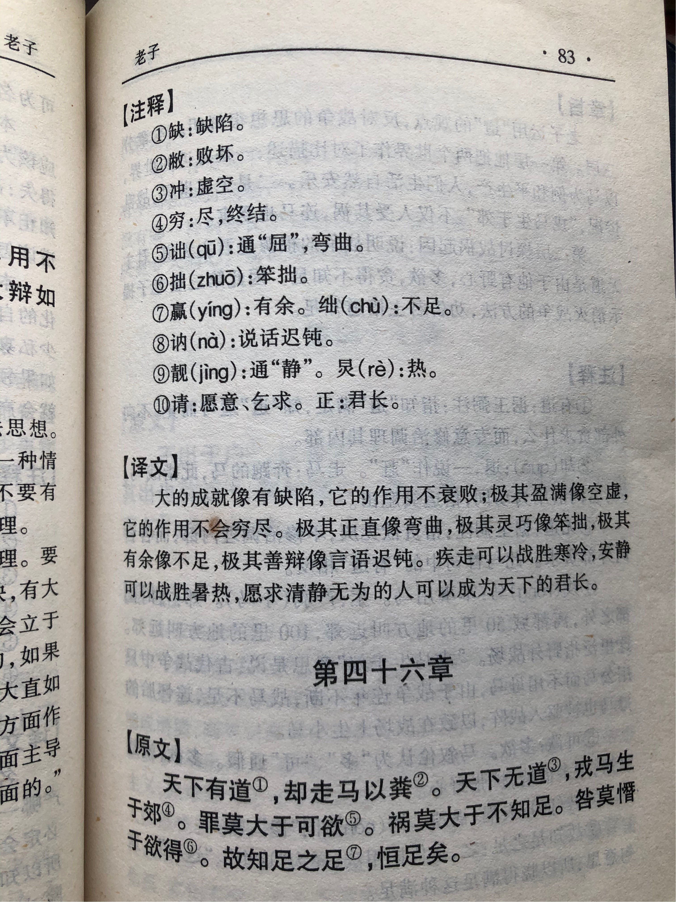
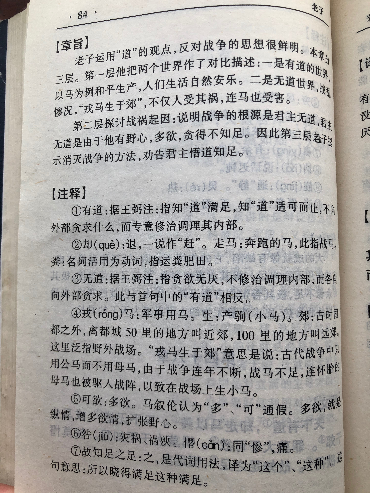

## 《道德经》第四十六章通行本原文：

    天下有道，却走马以粪。
    
    天下无道，戎马生于郊。
    
    罪莫大于可欲，祸莫大于不知足，咎莫大于欲得。
    
    故知足之足，常足矣。
    
## 译文：
 
    治理天下遵循于“道”，让战马回到田地耕种。
    
    治理天下不遵循“道”，小马驹在战场上出生。
    
    最大的罪过莫过于不断满足私欲，最大的灾祸莫过于永不知足，最大的过错莫过于贪得无厌。
    
    所以知道什么时候该满足了，就能得到永久地满足。

## 逐句解释：

### 天下有道，却走马以粪。
走马：善跑的马，意为战马。却：屏去，退回。粪：耕种，播种。
天下有“道”，让战马从战场回到田间耕种。这是说天下安宁，没有战争，百姓安居乐业。

### 天下无道，戎马生于郊。
戎马：战马。郊：野外，指战场。
天下失去“道”，战马从野外战地出生。这是说天下大乱，战祸连年，百姓不得安宁。

### 罪莫大于可欲，祸莫大于不知足，咎莫大于欲得。
罪：罪过。可欲：尽情放纵欲望。祸：灾祸。疚：过错。欲得：想要得到。
最大的罪过在于尽情放纵，不断满足自己的私欲，而最大的灾祸莫过于永不知足，最大的过错莫过于总想得到。要知道欲望无止境，人一旦贪婪成性，最后就会迷失自我，招来灾祸。

### 故知足之足，常足矣。
知足之足：懂得满足的满足。
懂得什么时候该满足的这种满足，才能长治久安，得到永久地满足。否则欲望没有尽头，过度追求欲望，违反自然规律，人就会走向歧途。

## 心得总结：
本章老子主要是告诫人们尤其是领导者应该控制欲望，保持平和心态，遵循无为而治，还百姓以安宁，让人们安居乐业。这是对于“德”的进一步解释，也是“道”的内涵延续。

《道德经》全文都在解释什么是“道”和什么是“德”。老子通过一些实际实例在不断强调和告诫人们，凡事有“度”，要“守于中”。当我们理解了天下万物运行的规律，了解事物之间存在的“尺度”时，我们便知道了该如何做，也便知道了处理事物的分寸。

“罪莫大于可欲，祸莫大于不知足，咎莫大于欲得。”老子是在告诫我们应该遵循自然，保持朴素，对于欲望要适可而止，这样就不会犯下过错，引来灾祸。当然这里要注意的是并非人们不能有欲望，老子不是让人们无欲无求，得过且过，而是让人们去除多余的欲念，尤其是领导者，应该天下为公，为了公共的利益而奋斗。

老子认为，统治者不瞎折腾，遵循自然法则，人们就能过上好日子。历史证明也是如此，历朝历代开朝通常都政治清明、社会安宁，而后期统治阶级渐渐变得贪婪无度，与客观自然渐渐背离。统治者通过各种方式使阶级利益固化，巧立名目剥削百姓，使人们生活于水生火热之中，最后导致天怒人怨，百姓被迫走上了反抗的道路。

“知足之足，常足矣”，对于一切事情都掌握有度，知道什么时候该满足，什么时候该停止，哪里还会“不知足”呢？当人能做到胸中有数，凡事适度，那就是遵循自然，初闻其道了。这样的人，心中通透，诸事顺遂，自然能快乐满足，长治久安了

注意老子的“知足常足”与我们通常说的“知足常乐”是有区别的。首先老子的文章针对的是领导者和管理者，即有话语权的人，告诫他们应该放下自我，去除私欲，把百姓的利益放在个人之前。“为了人民美好的生活”这个愿望是可以无止境的，只要符合了“道”的规律，遵循自然法则即可。其次，老子说的“知足而足”是一种“无为而治”的体现，并非个人俗事上的随遇而安。老子这里说的是对于家国大事要知道什么时候该满足，什么时候该放下，要遵循客观规律，与自然和谐发展。

老子的观念既是一种崇高的德行，也是一种自然和谐的发展观。这与我们提倡的“人民的公仆”、“科学发展观”、“和谐社会”是类似的，只不过老子的话更有实操性也更具有深意，更能让人顿悟和发人深省。“知足之足”内涵丰富，值得我们不断思考。

## 附帛书版：

[返回目录](../README.md) &nbsp; [上一章](./45.md)&nbsp; [下一章](./47.md)

