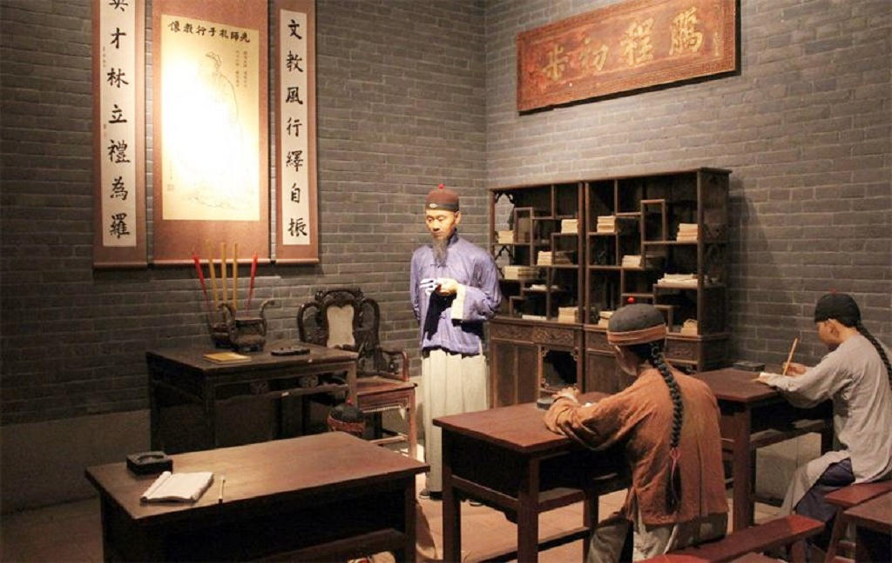
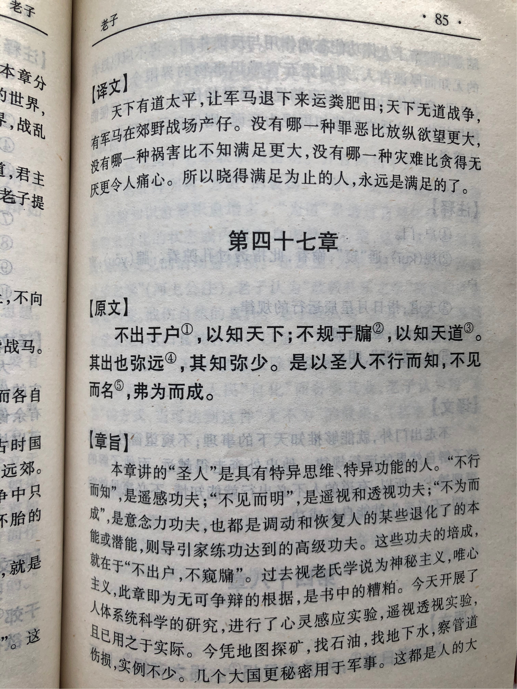
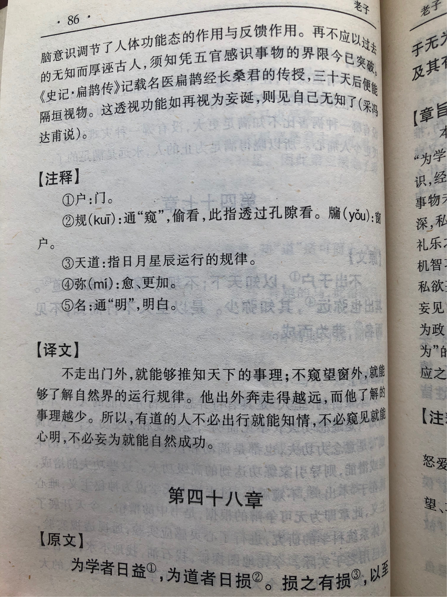

## 《道德经》第四十七章通行本原文：

    不出户，以知天下；
    
    不窥于牖，以知天道。
    
    其出弥远者，其知弥鲜。
    
    是以圣人不行而知，不见而明，弗为而成。
    
## 译文：
 
    足不出户，便能知晓天下的大事；
    
    眼不望窗，就能推理世界的规律。
    
    如果背离了心中的“道”，即使远途奔忙，所知道的道理却很少。
    
    所以，有“道”的圣人即使不远行也能知悉天下，不窥见也能明晓事理，不妄为而能有所成就。

## 逐句解释：

### 不出户，以知天下；
足不出户，便能知道天下事情。这是说心中明了，内心清净。通过外界消息和蛛丝马迹，稍加分析，便能够掌握天下大事了。

### 不窥于牖，以知天道。
窥牖：窥，从小孔隙里看；牖，音yǒu，窗户。 
不透过窗户瞭望，也能掌握天下的规律。这是做到了明心见性，不再受困于内心的狭隘，从而洞悉了万物的运行规律。

### 其出弥远者，其知弥鲜。
弥：更加、极甚。
出行得越远，对于“道”的理解就越少。这是因为背离了失去了“道”，失去了正确的方向，就会南辕北辙。

### 是以圣人不行而知，不见而明，弗为而成。
不见而明：也有写不见而名，意为不窥而明天道。 弗为：不为，无为、不妄为。
所以圣人（或统治者）即使不出门，也知道天下的大事，不亲眼所见也能够心中明白，不任意妄为而能够取得成就。

## 心得总结：
本章老子讲的是面对纷繁复杂的世界，笃守内心的宁静，反而可以知晓天下大事，洞悉万物的运行规律，最后终有所成。这与前面章节提到的“致虚极，守静笃”是一脉相承的。

俗话说，“秀才不出门，便知天下事”。这不是因为秀才聪明或有特异功能。而是“书中自有黄金屋”、“书中自有颜如玉”，通过不断吸取前人的经验和思想，后来的读书人结合自己的分析和总结，就可以掌握事物的运行规律。再有掌握了天下事物的运行规律，就可以推理出当前的形势。世界的发展万变不离其宗，过去的历史事件就是当前形势的一面镜子，足以让我们看得清楚。

万事万物是都有一定的运行规律，这个规律就是“道”。当我们的行为合乎于“道”，保持质朴、摒弃私欲杂念，顺天应人，便可不出户而知天下。“不窥牖，见天道。”不需要你打开窗户向外看，也不需要你涉足远行，只需做到内观其心，致虚极、守静笃。这时候对于世间万千事物，就都能了然于胸，不再有困顿迷惑了。

当然“足不出户、不窥于牖”这只是比喻，并非真的两耳不闻窗外事，而是通过书本的知识和对外部消息的观察，把两者结合，即使身处象牙塔中，也可以理清事物的发展脉络。秀才不出门是在学习，在用功，也在倾听，不是真的漠不关心。“风声雨声读书声声声入耳，家事国事天下事事事关心 。”读书人虽然一心只读圣贤书，然而对于家国天下，依然时刻牵挂在心。

“其出弥远，其知弥少。是以圣人不行而知，不见而明，不为而成。”如果背离了“道”，那么人走出去越远，知道得就越少，这就好比贪婪之辈走再多的路，过再多的桥，也只是看看风景而已，最后“乱花渐欲迷人眼”，反而变得昏聩迷糊。而有“道”之人，以开明的智慧、虚静的心境，即使眼无所见，耳无所闻，也能了解事物的来龙去脉。

如果人的心智活动向外奔逐，就会使思绪纷杂、精神散乱，就好像镜子上面蒙上灰尘。老子认为，人应该加强对自身的修养，摒弃私欲杂念，清除心灵的污垢，保持内心的清净，这样对于一切事物就能清晰明了。“身为心之宅，心为神之舍”，只有心不外驰，神守于舍，不忘初心，不为外物所惑，保持清静无为，才能终有所成。

## 附帛书版：

[返回目录](../README.md) &nbsp; [上一章](./46.md)&nbsp; [下一章](./48.md)

