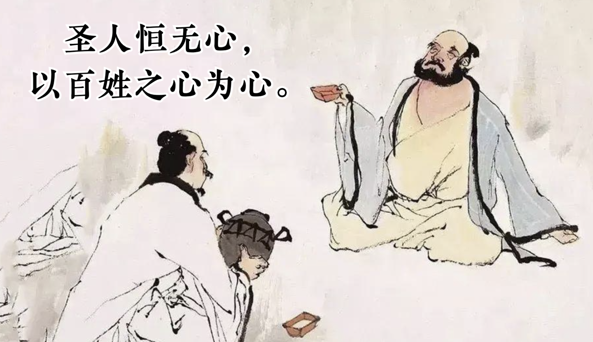

## 《道德经》第四十九章通行本原文：

    圣人恒无心，以百姓之心为心。
    
    善者善之；不善者亦善之；德善也。
    
    信者信之，不信者亦信之，德信也。
    
    圣人之在天下，歙歙焉，为天下浑其心，百姓皆注其耳目焉，圣人皆咳之。
    
## 译文：
 
    有道的人是没有私心的，以百姓的心当作自己的心。
    
    善良的人，善待他们；不善良的人，也善待他们，这样就人人向善了。
    
    守信的人，信任他们；无信的人，也信任他们，这样就人人有信了。
    
    有道的人治理天下，会收敛个人的私欲和偏见，使天下人们的心思归于纯朴，
    百姓们都很重视耳闻目睹，有道的人善待百姓如婴孩一般，让大家回归到质朴自然。

## 逐句解释：

### 圣人恒无心，以百姓之心为心。
恒：长久。
圣人也就是有道的统治者，他们往往没有自己的私心，也没有主观偏见，以百姓的心当作自己的心，也就是一心为民，天下为公。

### 善者善之；不善者亦善之；德善也。
德：通“得”，也可以当成道之形式理解。
善良的人，我们要善待，不善良的人，我们也依然善待，这就是得到善之真谛了。这是说无差别对待众生，只要领导者用心，那么一定可以感化民众。

### 信者信之，不信者亦信之，德信也。
有信用的人，信任他们；无信用的人，也信任他们，这样就会建立起信任来。这里也可以说这就是一种有德的信任。

### 圣人之在天下，歙歙焉，为天下浑其心，百姓皆注其耳目焉，圣人皆咳之。
歙（xī）：吸气，指收敛。浑其心：使心淳朴，不用智巧。咳：通孩，使老百姓回复到婴儿般的状态。
有道的统治者治理天下，会收起个人的欲望，让天下百姓回归质朴，百姓是善于观察和聆听的，有道圣君像对待孩子一般善待百姓，即爱民如子，那样百姓就会回归初心了。也有解说咳乃阂（外闭也），即领导者可以使老百姓收敛闭合欲望，回归纯朴，这个说法我觉得不是太好，而应该是视百姓如自己孩子一般，无论良善与否，无论诚信与否，都会言传身教，珍爱无比。

## 心得总结：
本章老子主要告诫领导者去掉私心，不失偏颇，善待他人，爱民如子，通过种种德行感化民众，最后得到百姓认可，从而天下大治。

这章的内容在之前章节也被反复提及过，总结起来就是“收敛欲望，无我利他”。人类痛苦的根源在于个人欲望的无限膨胀，只有放下才能获得解脱，当内心质朴纯真，做事情才能得心应手，但真正能做到这点的人少之又少，所以老子才不断强调这个。为人最难的是去除个人欲望与杂念，笃守内心的宁静与淡泊，这是一种非常高的智慧和修养，普通人不好做到这点，领导者更难做到，然而领导人必须做到，只有做到了这点才能堪称合格领导人或管理者。

这一章讲的治国安邦之道，主要是面向统治者来说。作为领导者，首要的任务就是为人民谋福祉，为了人民的利益而奋斗，这不是空话，也只有这样，才能得到人民的爱戴和拥护。无论是古代君王还是现代政府，也无论是东方农业大国还是西方商业社会，这个使命始终未改。现代政治把“为人民服务”具体化了，有的甚至变成了具体的条规章程，而老子在那个年代是从辩证的角度提出了自己的理念：唯有善待一切民众，爱民如子，才能治理好天下。

老子的论证从什么是“道”和“德”，再到如何治国安邦，如何对待民众，如何修身养性都说得很多了。虽然没有详细的逻辑推演和反复论证过程，但老子的话足够简明扼要，该表达的意思已经足够我们去理解和意会了。这是老子《道德经》好的地方，当然也是某些人认为不严谨的地方。但我觉得既然是经书，就不应该繁文缛节，也不要旁征博引，而是简明扼要，字字珠玑，把道理描绘出来即可，没必要揉碎了分析。老子的话是一种智慧，是点悟人生，而不是具体的实施手册和操作指南。懂得人自然会通过理解加以运用，不懂的人说破了也没用。

从本章来看，老子已经说得很明白了。就是告诫统治者要收敛欲望，返璞归真，善待百姓，爱民如子，以无为而胜有为。道理浅显，但实施起来并非易事。如何做，如何面对，还是要看个人的决心。对于领导者来讲需要从领悟到实践，对于个人来讲，其实也是一样的，如果能够做到善待他人，真诚以待，将心比心，那么一定可以换取他人的真心，最后收获相应的福报。

## 附帛书版：

[返回目录](../README.md) &nbsp; [上一章](./48.md)&nbsp; [下一章](./50.md)

