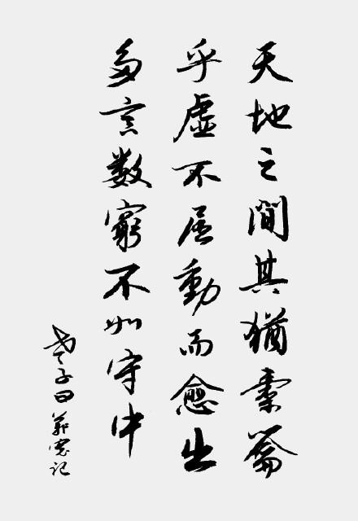
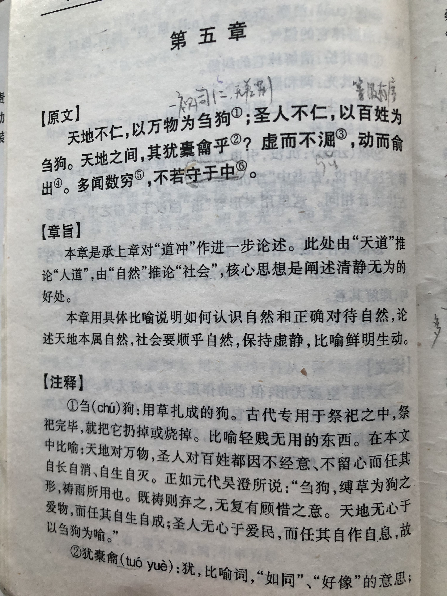
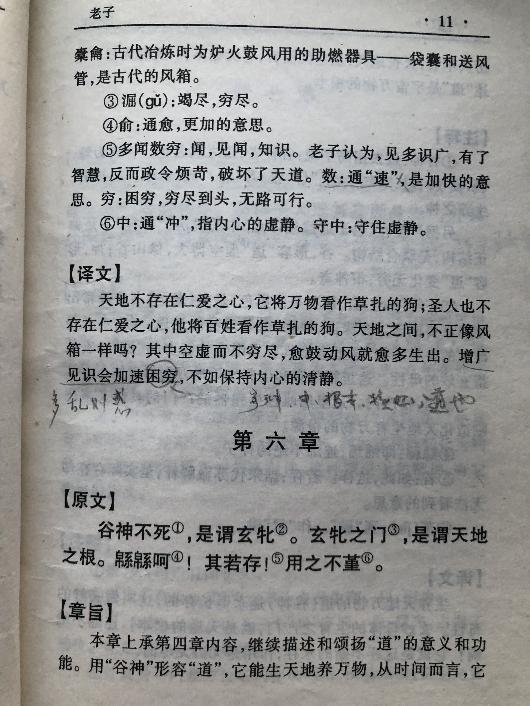

## 《道德经》第五章通行本原文：

    天地不仁，以万物为刍狗；
    
    圣人不仁，以百姓为刍狗。
    
    天地之间，其犹橐龠乎？
    
    虚而不屈，动而愈出。
    
    多言数穷，不若守于中。

## 译文：
 
    天地并没有所谓的仁义慈悲，万物都像是草扎的祭品，在天地眼里并无特别。
    
    圣人也是无所谓仁慈偏爱的，他对待百姓也像对待草扎的祭品一样，让百姓自作自息，顺其自然。
    
    天地之间，不正像一个大风箱吗？静止的时候，它只是一个空空如也的箱子，一旦运行起来，就会运转不息，永不穷尽。
    
    大道恒久客观，言行干预反而导致势穷力屈，不如保持中立，守住内心的虚静。

## 逐句解释：

### 天地不仁，以万物为刍狗；圣人不仁，以百姓为刍狗。
刍狗：刍（chú），草扎的狗。
其实这就是一个很简单的意思，天地并没有人间的仁义慈悲，不一定要延伸太多。想想世间万物本身就是平等的，都是自然界的物件，是因为人把一些物品或人分为三六九等，而对于天地来讲，万物并无差别，你存在抑或不存在，地球依然那么旋转。人类自诩高级物种，其实与祭祀的草狗无异，本来无所谓尊贵卑贱，人也一样。人类所推崇的仁慈正义，这不过是人类的法则，而不是上天的。天地自己独立运行，周而复始，并不会因为世间万物而生怜悯或者施加干预。你喜，天地是那样，你悲，天地也还是那样，无悲无喜才是天地的性格，无仁无义才是上天的特征。那么高尚的统治者呢，最好的做法是效法天地，道法自然，抛却仁慈与尊卑贵贱，对待百姓也有如草扎的祭品一样，不去干涉，让百姓自作自息、安居乐业。那些认为等级有序，言必称仁义的儒学之辈要注意了，不要读了四书五经就可以褒贬他人，设置尊卑贵贱了。真正的圣人是不分贵贱，无差别对待老百姓的。

### 天地之间，其犹橐龠乎？虚而不屈，动而愈出。
天下大道不是很像一只巨大的风箱吗？(橐龠tuó yuè，古代鼓风吹火用的器具，是一个大风箱)
它里面空空如也，然而鼓动起来却绵绵不绝，永无穷尽。

### 多言数穷，不若守于中。
多言数（shuò）穷，也有多闻数穷，意为言多必失。
即大道恒久客观、不偏不倚，言行干预都是对平衡的破坏，只会导致势穷力屈，不如保持中立，天道无常，世界终究是平的。

## 心得总结：
朋友们，圣人早已把一切看的清清楚楚。他早就洞悉了宇宙天地的运行规律，也分析了统治者与老百姓长治久安的关系。我们往往看一时，而没有看到一世；我们往往只看到一面而没有看到多面；我们以为万物有别、尊卑有序，我们以为通过教化来产生差异，岂不知人人平等，万物同源，一切的根本乃是虚无。老子的思想确实非常深刻，在2000年前居然看的如此通透。已经比我们现在的人人平等理念先进多了。

天道无亲，常与善人。天之道，损有余而补不足。人之道则不然，损不足而以奉有余。我们常以为要拼爹、拼学历，爬高高、赚多多，以为赢者通吃，殊不知天道非人道，世界终究是平的，你以为你得到了，你以为你赢了，你以为你睥睨天下，傲视群雄，然而呢？世界是平的。

这章，老子是告诉我们一个非常朴素的道理，就是万物平等，我们应该抛弃仁慈外衣，减少人为的设置和干预，还世界以自由和清宁，这样人们才能自由畅快地呼吸。这还不值得我们学习么？

这章历来理解分歧很大，不同的人以及不同时期的人理解都不甚相同。其实这也没什么，文字记录都有差别，何况对于意境的理解。《道德经》本来就晦涩难懂，措辞也比较深邃，有那么多不同理解是对的，统一解释才可惜了。

## 附帛书版：

[返回目录](../README.md) &nbsp; [上一章](./4.md)&nbsp; [下一章](./6.md)

