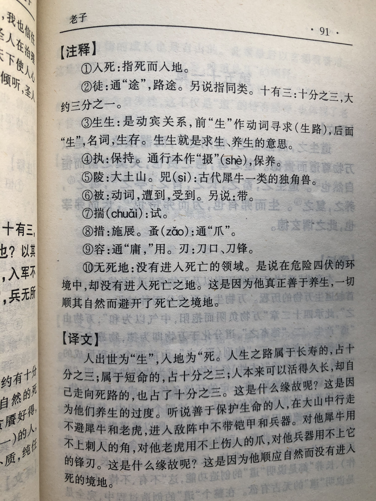

## 《道德经》第五十章通行本原文：

    出生入死。
    
    生之徒，十有三；
    
    死之徒，十有三；
    
    人之生，动之死地，亦十有三。
    
    夫何故﹖以其生生之厚。
    
    盖闻善摄生者，陆行不遇兕（sì）虎，
    
    入军不被甲兵；
    
    兕无所投其角，
    
    虎无所措其爪，
    
    兵无所容其刃。
    
    夫何故﹖以其无死地。
    
## 译文：
 
    人始于出世，而终于死亡。
    
    正常生长的十分之三，
    
    半途夭亡的十分之三，
    
    正常生长，妄为而死的也占十分之三。
    
    这是为什么呢？这是因为他们生养优厚，过度贪婪了。
    
    据说善于护持生命的人，
    
    在山地行走不会遇到犀牛和老虎，
    
    在战争中也不会被武器所伤。
    
    犀牛对这样的人无处用角，
    
    老虎对这样的人无从用爪，
    
    兵器对这样的人也没法亮出锋刃。
    
    这是什么原因？这是因为这样的人懂得顺应自然，而不会进入死亡之地。

## 逐句解释：

### 出生入死。
出世为生，入地为死。人之旅程就是从出生到死亡的过程。

### 生之徒，十有三；
徒：类，或通“途”。
能自然生长，寿终正寝的人，十占其三。

### 死之徒，十有三；
半途夭亡的，十有其三。

### 人之生，动之死地，亦十有三。
本来可以高寿，却妄动作死的人，也占十分之三。

### 夫何故﹖以其生生之厚。
生生之后：生长奉养过厚。
这是什么原因呢？是因为这类人生养过于优厚，适得其反，反而早亡。

### 盖闻善摄生者，陆行不遇兕（sì）虎，
摄生：养生，护持生命。兕：犀牛类动物。
听说真正懂得护持生命的人，在山地里遇不到犀牛和老虎。

### 入军不被甲兵；
被：遭受，招致。也有说被（pī）通披，表示身披，穿戴。
行军打仗，也不被武器伤害。懂得护持的人，也懂得躲避危险。

### 兕无所投其角，
犀牛也没法向这类人用角顶撞。

### 虎无所措其爪，
老虎也没法向这类人施以利爪。因为这类人懂得自然规律，动物们也伤害不了。

### 兵无所容其刃。
兵器也没法对这类人亮出锋刃。对于高手来讲，敌人的刀剑砍不到。

### 夫何故﹖以其无死地。
这是什么原因呢？因为这类人依循自然，就不会有死亡危险的境地。

## 心得总结：

本章老子通过人之生死来告诉人们，人生无常，生死有常。本质上仍然是在告诫人们应遵循自然，适可而止。

人之生死，早就注定了。出生之后，终极目标就是奔赴死亡，这是注定了的。人三分之一能寿终正寝，三分之一意外夭亡，还有三分之一是自己作死。虽然注定了要死，但生命的过程是因人而异的，你可以过得顺其自然，也可以浑浑噩噩，还可以任意妄为，这取决于你的态度和行为。

首先老子尊重生命，希望人们按照生命的自然规律成长和死亡，一切顺其自然。对那些“动之死地”的人，老子认为是“生生之厚”，也就是生养过于优厚了，超出了自然规律。对于不按规律发展，逾越自然法则的，那就会引祸上身，甚至自取灭亡。这是给人们的一个警钟。古时候贵族尤其是君王很崇尚养生，希望自己能长生不老，因此热衷烧丹炼药，有的甚至到了病态的地方，各种秘方不断尝试。但实际情况我们知道，人没有不死亡的，这是客观规律。如果你过于追求养生，过于在意死亡，最后可能适得其反，死无其所。

其次老子认为“善摄生者”，也就是懂得护持生命的人，毒虫猛兽不敢伤害他，敌人的武器也无法伤害他。而什么是“善摄生者”，如何做才是““善摄生”呢？老子没有明说。但通过上句的“生生之厚”以及之前的章节来推断，老子的意思应该是懂得舍弃欲望，懂得顺应自然的人就是“善摄生者”，这样的人纯真质朴，如初生的婴孩，做事情都是顺势而为，因而可以化解灾祸。

不被猛兽所袭击，不被刀兵所伤害，这样的人可谓通晓天地，洞悉了一切规律，是修“道”的高人。老子并没有说这样的人是怎样练成的，也没有说达到这样容不容易，他老人家只是一再强调这个规律，告诫人们应该怎样和不应该怎样。其中的道理，需要自己去感悟和琢磨，当然每个人的理解和看法都不尽相同。人人心中都有一个老子，这个也没有必要统一。只要能保持开放和谦卑的心态，从老子的言语中获得智慧，感悟到人生的真谛，这便是善莫大焉。

## 附帛书版：

[返回目录](../README.md) &nbsp; [上一章](./49.md)&nbsp; [下一章](./51.md)

