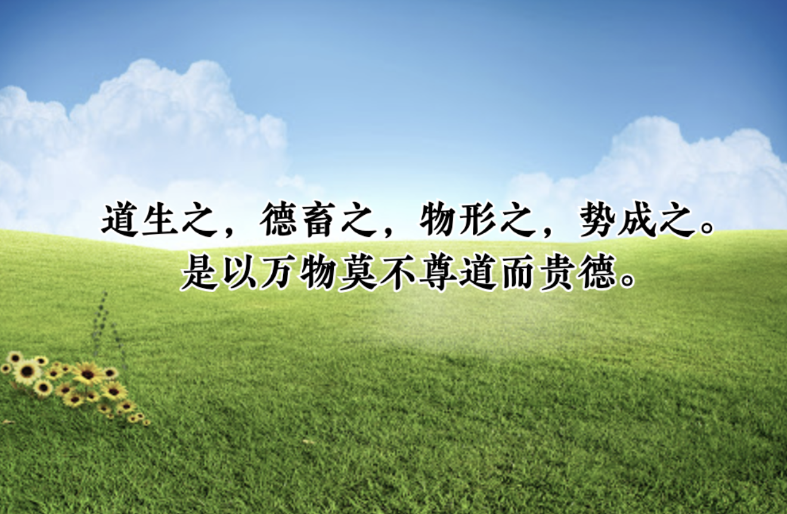
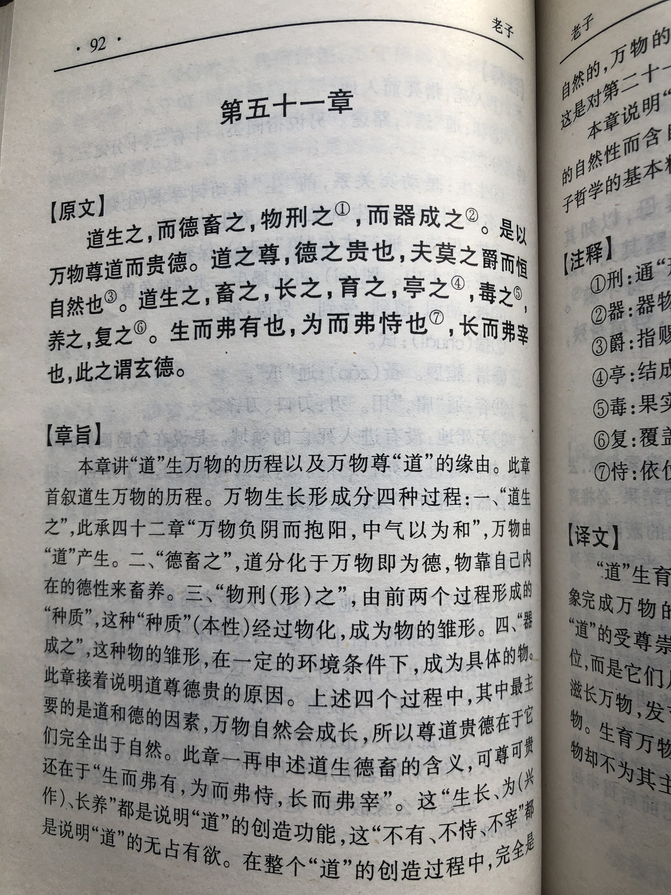
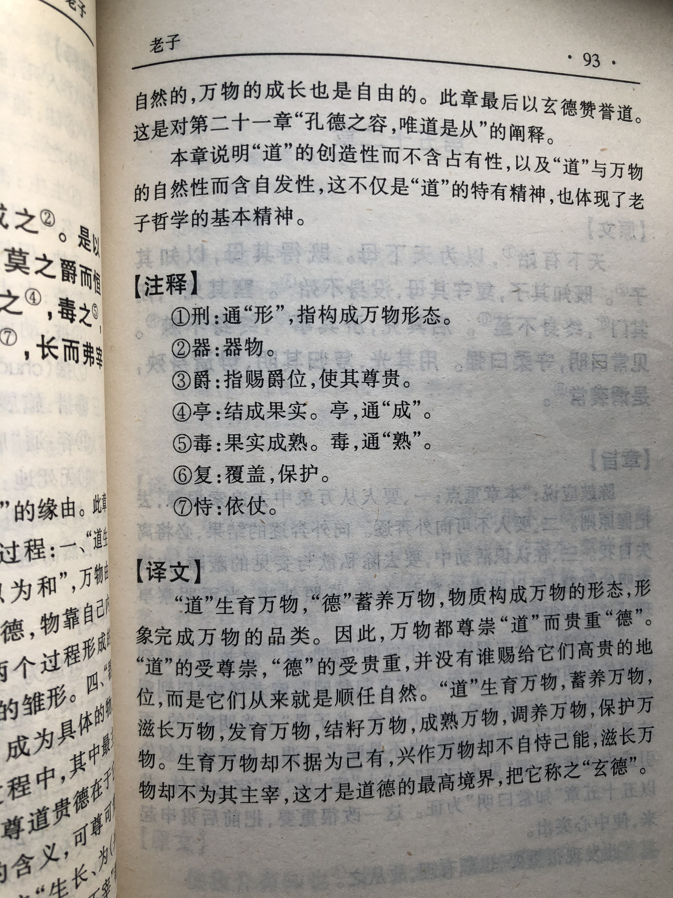

## 《道德经》第五十一章通行本原文：

    道生之，德畜之，物形之，势成之。
    
    是以万物莫不尊道而贵德。
    
    道之尊，德之贵，夫莫之命而常自然。
    
    故道生之，德畜之，长之育之，成之孰之，养之覆之。
    
    生而不有，为而不恃，长而不宰，是谓玄德。
        
## 译文：
 
    道生育万物，德养育万物，万物形态各异，是环境形势形成如此。
    
    因此，万物无不尊重道而珍贵德。
    
    道之所以受尊重，德之所以受珍贵，是因为它们不强加干涉，而让万物自然生长。
    
    所以，道生育万物，德养育万物，它们使万物自然生长发育，使万物成熟结果，让万物得到滋养与庇护。
    
    生育万物而不占有，成就万物而不自恃有功，让万物成长而不主宰，这就是玄妙深奥的德。

## 逐句解释：

### 道生之，德畜之，物形之，势成之。
之：代表万事万物。畜：畜养。势：自然环境与情势。
“道”生育万物，“德”畜养万物，万物形态各异，精彩纷呈，这都是自然环境所形成的。

### 是以万物莫不尊道而贵德。
莫：无，没有。
因此，万物都心怀感恩，尊重“道”而贵重“德”。

### 道之尊，德之贵，夫莫之命而常自然。
莫：不。命：干涉、强制。常：帛书版为恒，恒久，永久。
“道”的尊贵，“德”的贵重，在于不去强制干涉万物，而让万物恒久自然生长。

### 故道生之，德畜之，长之育之，成之孰之，养之覆之。
覆：覆盖，保护。这里帛书版字词很多不一样，但意思无差别。
所以“道”生养万物，“德”畜养万物，它们生养和抚育万物，促使万物成熟，并使万物得到养护和保护。

### 生而不有，为而不恃，长而不宰，是谓玄德。
恃：依仗。玄德：至高的德，深微而玄妙。
生养万物而不占为己有，成就万物而不自恃有功，让万物成长而不主宰其命运，这就是至高玄妙的“德”。

## 心得总结：
本章老子主要讲的是道法自然，以及“道”、“德”与万物的关系。

前面章节，老子论述过“道”与“德”的关系，“道”是无，是一切的母体，乃根本规律，“德”是有，来源于“道”，是“道”的形式与外在表现。“道”与“德”相辅相成，“道”通过“德”来表达作用，“德”依赖“道”而存在。

本章把“道”和“德”与万物关系做了说明，“道”生育万物，而“德”养育万物，“道”为尊而“德”为贵。它们之所以尊贵，因为它们生养万物而不加干涉，依循自然法则给予滋养和爱护。核心的点还是顺其自然，也就是“为而无为“，对万物产生深远影响，但却好像什么也没有做。

“道”和”德“对于万物的影响，像无私的母爱，也是一种大爱，是无我利他的最好体现。最好的“德”，也就是“生而不有，为而不恃，长而不宰”。母爱也是这样，为了孩子付出所有，但从不要求回报。而“玄德”非但不求回报，还不去干预万物的运行和生长，只在背后默默滋养与守护，有了成就也不自认有功，这真是种至高无上的境界。

    “玄德”与“上善若水”有点类似，都是至高无上的境界，比较能诠释“上善若水”有如下句子：
    你高，我便退去， 决不淹没你的优点；
    你低，我便涌来， 决不暴露你的缺陷；
    你动，我便随行， 决不撇下你的孤单；
    你静，我便长守， 决不打扰你的安宁；
    你热，我便沸腾， 决不妨碍你的热情；
    你冷，我便凝固， 决不漠视你的寒冷。

而“玄德”与之相比，虽然不是无微不至的理解和包容，但本质是相同的，也就是毫无保留地关爱，默默地守护与奉献，不求索取与回报。这种大爱，人间少有，而天道一直如此。

学习《老子》，或者说学习国学，是为了提升品性修养，达到“道”和“德”的境界，以使人生不再困顿和迷惘。当然要想追求有“道”和做到有“德”的境界是非常困难的，现实生活中的利益纠纷和尔虞我诈使得人顾虑重重、举步维艰。但我们还是应该听取老子的智慧，不管他人怎么做，我们应该笃守内心的清静，不断修持，保持初心，追求无我利他，努力提升自己的“德”行，提升自己对于“道”的认识。这便是好的开始。

## 附帛书版：

[返回目录](../README.md) &nbsp; [上一章](./50.md)&nbsp; [下一章](./52.md)

