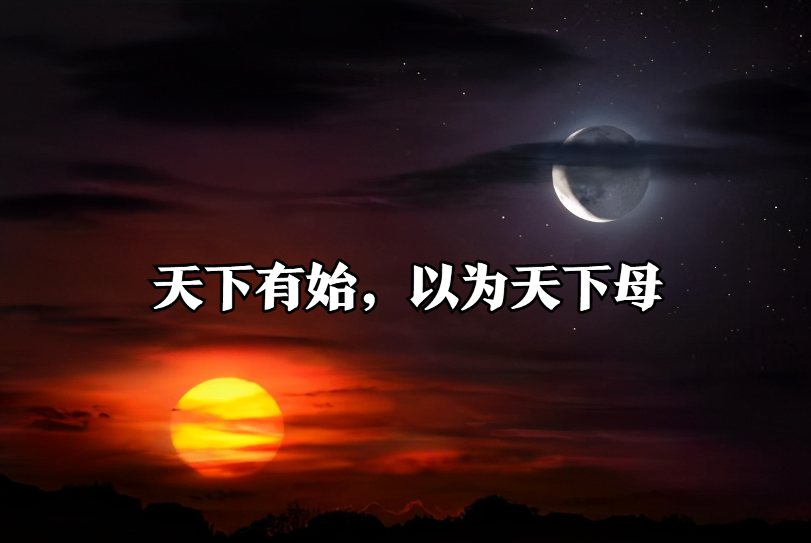
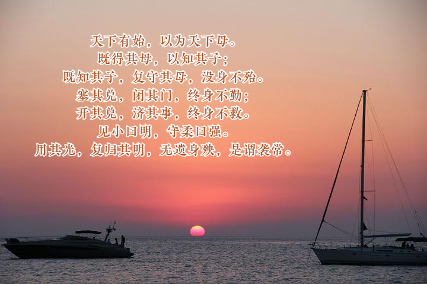
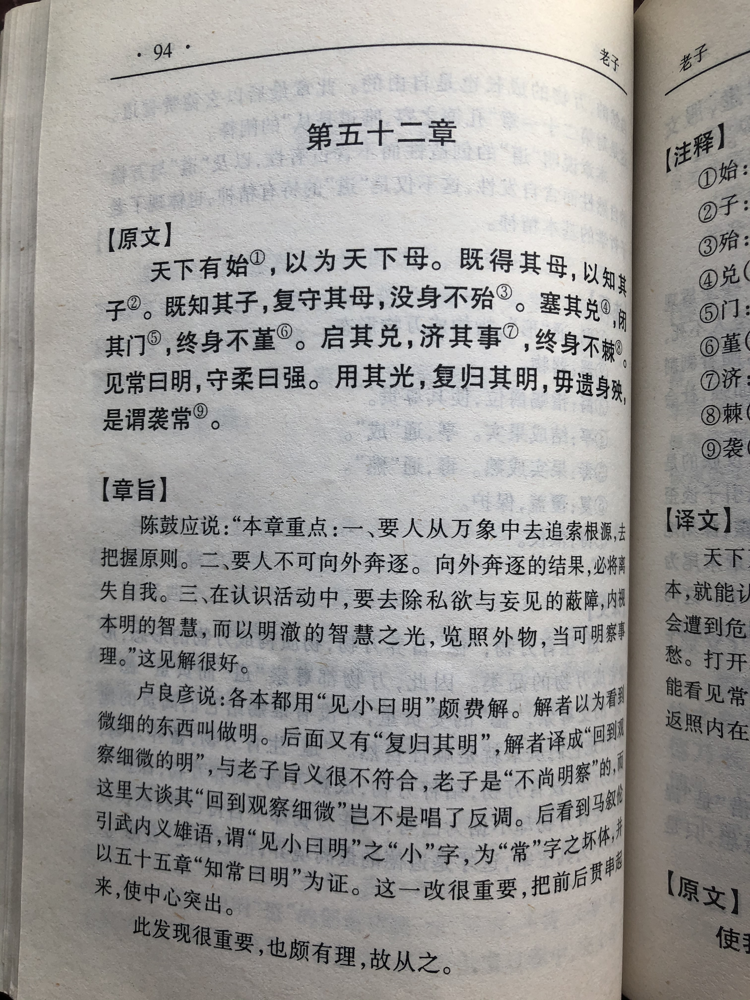
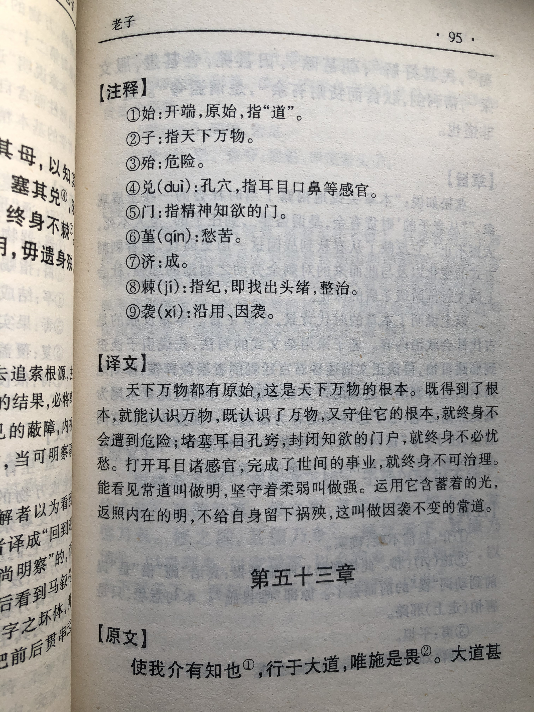

## 《道德经》第五十二章通行本原文：

    天下有始，以为天下母。
    
    既得其母，以知其子；
    
    既知其子，复守其母，没身不殆。
    
    塞其兑，闭其门，终身不勤；
    
    开其兑，济其事，终身不救。
    
    见小曰明，守柔曰强。
    
    用其光，复归其明，无遗身殃，是谓袭常。
        
## 译文：
 
    天下万物有个起始，这个起始是万物的母体(本源)。
    
    通过这个本源就可以认识其衍生出来的万事万物；
    
    认识了万事万物，还能遵守万物的本源，就终身不会有危险。
    
    堵塞耳目孔窍，禁闭欲望之门，就终身不会愁苦；
    
    打开耳目孔窍，增添纷扰之事，就终身不可救赎。
    
    能够观察到细微的叫做“明”；能够坚守柔弱的叫做“强”。
    
    运用其外部光芒，回归内心的光明，不给自己带来灾祸，这就是所谓“承袭常道”。

## 逐句解释：

### 天下有始，以为天下母。
始：起始，根源。母：本源、根源，此处指“道”。
天下万物都起始于本源，也就是“道”，“道”是一切的母体。

### 既得其母，以知其子；
子：派生物，指由“母”所衍生的万物。
通过认识本源，就能知道其他一切万物；

### 既知其子，复守其母，没身不殆。
复守：回归、遵守。殆：危险。
知道了一切万物，还遵守万物的本源，那就终身不会有危险。

### 塞其兑，闭其门，终身不勤；
兑：口，孔穴，引申为耳鼻口舌。勤：劳累、辛苦，引申为愁苦。
堵塞耳目等欲望的孔窍，关闭贪婪的门径，就可以终身不用愁苦。人的欲望通过耳目口舌来表达，如果能够收起过多的欲望，就不用那么勤苦劳作，也没有那么多愁苦烦闷。

### 开其兑，济其事，终身不救。
济：增添。救：救治、救赎。
打开耳目等欲望的孔窍，再增添杂事纷扰，就会终身得不到救赎。开启欲望之门，还增添杂七杂八的纷扰，人内心就无法安静下来。

### 见小曰明，守柔曰强。
能够观察到微小是内心明亮，能够守住柔弱是内心坚强。以小见大、见微知著、坚守柔弱，这些是“道”的要求。

### 用其光，复归其明，无遗身殃，是谓袭常。
光：发光，光向外照射；明：明亮，明向内透亮。发光体本身为“明”，照向外物为“光”。无遗：不留下或不带来。袭常：承袭常道。
运用其外放的光芒，使得内心澄澈光明，不给自己带来灾祸，这就是依循永恒的“道”。

## 心得总结：

本章主要讲的是修道之人应该返璞归真，回归自然。内容与之前章节反复强调过的意思相差无几。总之，老子告诫我们，无论什么时候，人都应该克制欲望，保持清静无为。只有这样，才是符合“道”的运行规律，才会“没身不殆”。

“天下有始，以为天下母。”天下万物都有本源，这个就是天下万物之母，也就是万物之前就存在的客观本体--“无”。本体启动运行就是“有始”，这个生命的根源，也叫做“天下母”，也就是“道”，万物都是它所生出来的，所以先要把这个根源找到。“道”深奥玄妙，无影无形，无法琢磨，但从复杂纷繁的万物中可以追根朔源，最终找到“道”的本质和运行规律。
 
“既知其子，复守其母，没身不殆。”认识了万物，又守住其本源，那就终身不会遇到危险。万物在运行过程中遵循本源的运行规律，就是守“道”，也就是要返璞归真。物体可以有很多，但是本源只有一个，这也叫“守一”。守住了这个本源，那就可以“没身不殆”。

老子在前面说“知常曰明”、“自知者明”、“不自见故明”、“不见而明”，这里又说“见小曰明”。“不自见”是不自我表现，“不见”是不亲见、不用眼睛去见，这里的“见小”也不是用眼睛去观察，而是要用心去观察，去感受，是一种内见或内观。内心明亮清澈了，才叫“明”。

“守柔”就是要守住柔弱的一面，“柔能克刚，弱能胜强”，老子一再强调守“道”就得守住“柔弱”，也就是保持谦卑、低下，去掉贪婪和显耀。“天下至柔莫过于水”、“水利万物而不争”，人要能做到这点，然后生命才能坚强，人生才能光明久远。

## 附帛书版：

[返回目录](../README.md) &nbsp; [上一章](./51.md)&nbsp; [下一章](./53.md)

