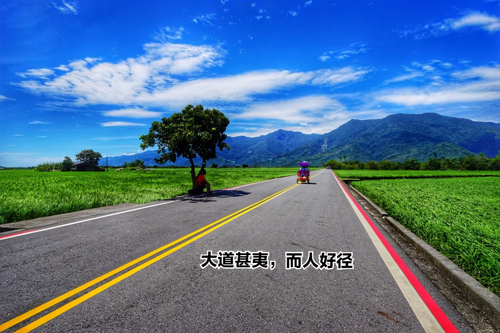
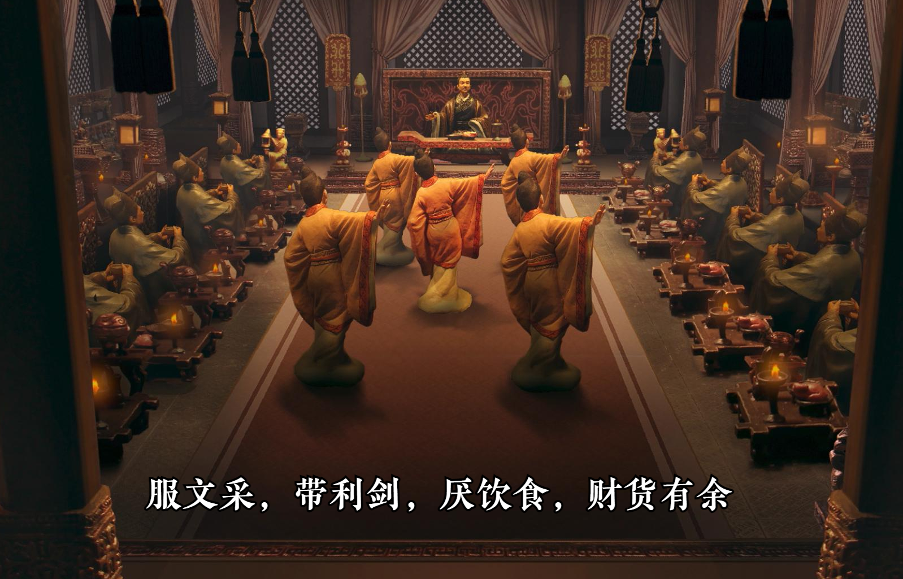
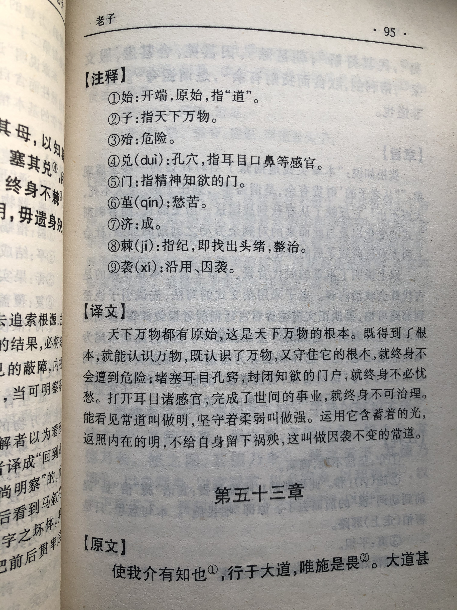
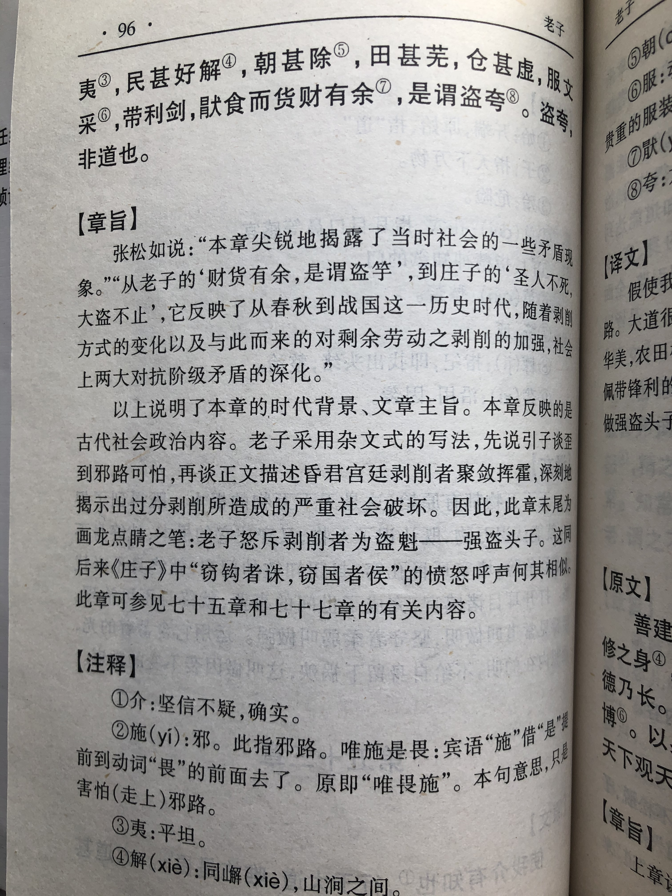

## 《道德经》第五十三章通行本原文：

    使我介然有知，行于大道，唯施是畏。
    
    大道甚夷，而人好径。
    
    朝甚除，田甚芜，仓甚虚；
    
    服文采，带利剑，厌饮食，财货有余。
    
    是谓盗竽，非道也哉！
        
## 译文：
 
    假使我稍有所知，就走光明大道，远离邪门歪道。
    
    大道非常平坦，但人们却喜欢走小道捷径。
    
    朝廷腐败，田园荒芜，仓廪空虚。
    
    穿着华丽服饰，佩带锋利宝剑，饱餐精美饮食，积聚大量财富。
    
    这是大盗的行径，而不是正道也！

## 逐句解释：

### 使我介然有知，行于大道，唯施是畏。
我：我，指有道的圣人。这里用“我”来代称。
介：微小，稍微。
施：通迤（yǐ），弯曲斜径，表示邪道。
畏：怕，敬畏而远之。
假使统治者稍微有所知，就应该行于大道，而远离邪门歪道。

### 大道甚夷，而人好径。
夷：平坦。
大道非常平坦，但常人却喜好走弯曲小道，总希望抄近路，走捷径。这与老子的观念不符，老子一直在强调人们应该抱朴守拙，返璞归真，少搞那些花里胡哨和投机取巧的东西。

### 朝甚除，田甚芜，仓甚虚；
朝甚除：朝政败坏，一说宫殿很整洁。两者都可以说得过去，不影响对整体的理解。
朝纲败坏，宫殿整洁，田地荒芜，仓库空虚。

### 服文采，带利剑，厌饮食，财货有余。
文采：有花纹的纺织品，服饰华丽。
厌饮食：厌，饱足。饱得不愿再吃。
领导者穿戴着华丽的服饰，佩带着锋利宝剑，精美大餐吃得不想再吃，集聚的财富堆积如山。这样的统治者奢靡浪费，却让老百姓忍饥挨饿，这是天下无道的表现。这样的领导者即使威风凛凛，也只是道貌岸然，自私贪婪之辈。

### 是谓盗竽，非道也哉！
盗芋：芋也有写夸，即大，意为大盗、盗魁。
这是那种强盗头子的行径，而不是有道的统治者的行为。

## 心得总结：

本章老子主要是讲有道的领导者与无道的领导者的区别，通过大道、邪道来区分他们的行径，目的是告诫统治阶级应该以民为本，秉持“行于大道”的理念来治理天下。

老子的《道德经》主要是面向“圣人”也就是统治阶级而言，是领导者的行为规范和治国指南。当然对于普通民众也具有很好的借鉴意义无论是走正道、畏邪道还是去掉多余欲望、抱朴守拙等，这些对于普通人也很有价值。

“大道”光明正大，需要人孜孜不倦，持之以恒去追寻，也需要人们有所付出，然而一般人难以有这份坚持，也难以有这份付出。因此，人们就会寻找捷径，企图通过歪门邪道来快速达成目标。改革开放几十年以来，经济高速发展，社会物质繁荣，人们思想渐渐偏离了最初，求快、求捷径、走邪道的事情开始多起来了，人们甚至不惜以伤害生命为代价来抄近道。老子对这种行径是持否定态度的，他告诫人们别去搞投机取巧，而是保持朴素自然，踏踏实实地走光明大道。

有些领导者好大喜功，喜欢浮夸炫耀，这些人“带利剑，服文彩，厌饮食，财货有余”，搞得很是繁华气派，然而老百姓却“田甚芜，仓甚虚”。不明真相者看到领导者的生活以为这个社会一派繁荣，而实际上老百姓的生活才是真实世界。老子在此抨击了这种虚伪的统治者。

大道与大盗也就一字之差。虚伪的修道之人打着“修道”的幌子，为了一己私利劳民伤财，做的是强盗之事，这样的人堪比大盗。而真正的修道者是去除个人私欲，保持内心极致的虚空和清净的人。老子希望领导者是真正的修道者，能够克制欲望，秉持朴素，在光明大道上一步一个脚印，踏踏实实地前行，最后让天下大治，让老百姓生活安宁。

## 附帛书版：

[返回目录](../README.md) &nbsp; [上一章](./52.md)&nbsp; [下一章](./54.md)

