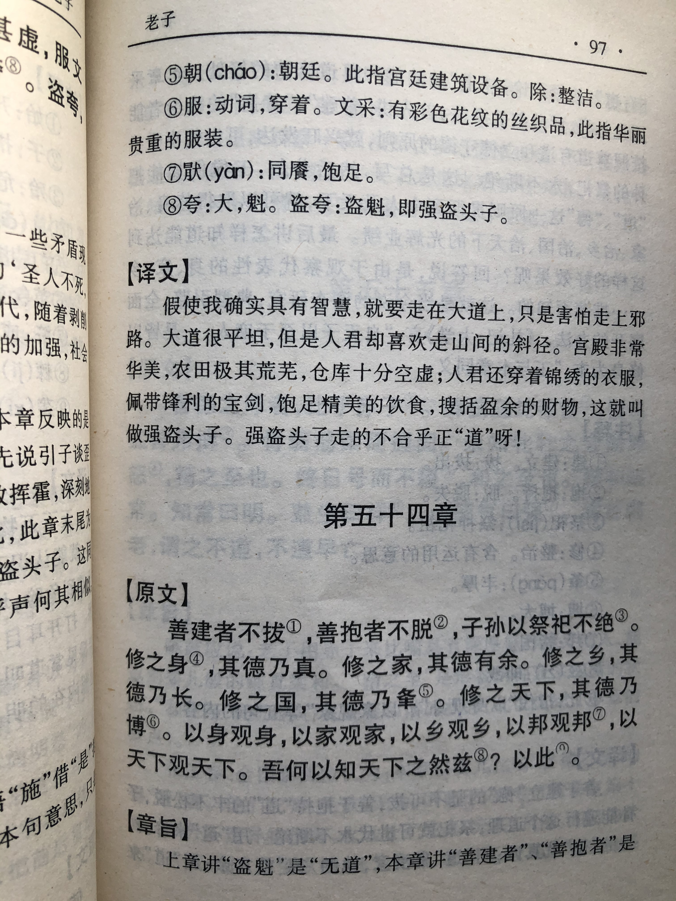

## 《道德经》第五十四章通行本原文：

    善建者不拔，善抱者不脱，子孙以祭祀不辍。
    
    修之于身，其德乃真；
    
    修之于家，其德乃余；
    
    修之于乡，其德乃长；
    
    修之于邦，其德乃丰；
    
    修之于天下，其德乃普。
    
    故以身观身，以家观家，以乡观乡，以邦观邦，以天下观天下。
    
    吾何以知天下然哉？以此。
        
## 译文：
 
    善于建立“德”的不会拔除，善于抱持“道”的不会松脱，若子孙遵循这个道理，那么祭祀就不会断绝。
    
    以“道”修身，他的德行是真实的；
    
    以“道”齐家，他的德行是富余的；
    
    以“道”治乡，他的德行能够长久；
    
    以“道”治国，他的德行丰富昌盛；
    
    以“道”治天下，他的德行广泛博大。
    
    以修身之道来观察个人，以齐家之道来观察家庭，
    以治乡之道来观察乡村，以治国之道来观察国家，以治理天下之道来观察天下。
    
    我是怎么知道天下的情况的呢？依据的就是这个原理。

## 逐句解释：

### 善建者不拔，善抱者不脱，子孙以祭祀不辍。
拔：拔除。抱：抱住、固定。辍：停止、断绝。
善于建设的人，他建的东西很牢固，没法拔出。这里比喻为立“德”，懂得建立“德”的，会非常牢固。善于抱持“道”的人，他所拥有的“道”不会松脱。子孙若能够遵守“善建”、“善抱”的道理，那么就祭祀不绝，“道”和“德”能长久。

### 修之于身，其德乃真；
以这个道理来修身，这个“德”才真实。遵道修身，从自我开始。

### 修之于家，其德乃余；
以这个道理来齐家，这个“德”有富余。修身之后再齐家、睦邻、治国、平天下。

### 修之于乡，其德乃长；
以这个道理来治理乡村，这个“德”可以发挥长久作用，使得乡村和睦，民风淳朴。

### 修之于邦，其德乃丰；
邦：城邦，国。丰：丰厚、丰富。
以这个道理来治理城邦，这个“德”会丰盈。也就是施以无为之治，城邦会丰富昌盛，长治久安。

### 修之于天下，其德乃普。
以这个道理来治理天下，这个“德”会广泛博大。也就是施以无为之治，天下将四海升平，万象更新。

### 故以身观身，以家观家，以乡观乡，以邦观邦，以天下观天下。
所以要以修身之道来观察个人，以齐家之道来观察家庭，以治乡之道来观察乡村，以治国之道来观察国家，以治理天下之道来观察天下。观察事物要遵循一定的方法，这个方法就是“善建”和“善抱”。

### 吾何以知天下然哉？以此。
我是怎么知道天下各种情况的呢？依据的就是这个原理，即通过“道”来观察天下。万物都有其客观规律，通过对事物规律的了解，从而知晓了天下万物。

## 心得总结：

本章主要讲对于修道和修德，如何“善建”和“善抱”。善于建设“德”和善于抱持“道”，是从个人开始，历经乡村、城邦、天下几个步骤，由小到大，最后让天下大治。

这章还是针对统治阶级而言，老子希望领导者能够遵照和拥抱“道”而建立起一套法律机制和“德行”规范体系，然后通过“无为”的方式，让老百姓在这个规则下自由生活，而不是给予过多的禁锢和限制。

领导者要要以身作则，从修身开始，再到家庭、邻里、城邦，最后到全天下。这个过程都要遵循“道”的规律，不要偏离。并且在不断修炼过程中，要懂得观察借鉴，由己推人，不断进步。

“吾何以知天下然哉？以此。”，我怎么知道天下所以然的呢？就是因为我推己及人，了解了万事万物的运行规律。以修身来检验自身德行，以修家来检验家庭齐整，以修乡来检验邻里和睦，以修邦来检验城邦之富饶，以修天下来检验天下太平。由此，我们知道天下是什么情况了。

本章老子的智慧在于由小到大，推己及人，不断增强，由细微处发现端倪。老子给了统治者明确的修德路径，希望统治者能够遵循于“道”，不断建功立德，最后天下大治，国富民强。

从我们个人来讲，其实也很有借鉴意义，虽不至于去治国安邦，但是不断修身养性，不断推己及人，不断在品性、学业、工作当中进步，这也是非常有意义的一件事情。

    修身养性，君子务本，在于不失其根本。
    积善之家，必有余庆，在于留给后世以精神。
    反求诸己，推己及人，在于不断反思与内省。

## 附帛书版：

[返回目录](../README.md) &nbsp; [上一章](./53.md)&nbsp; [下一章](./55.md)

