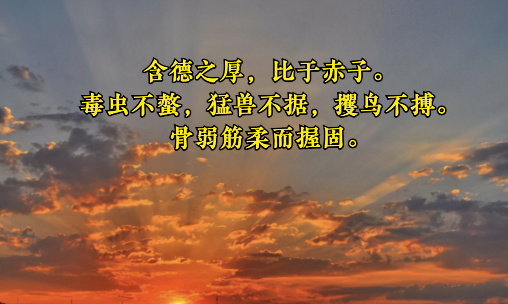
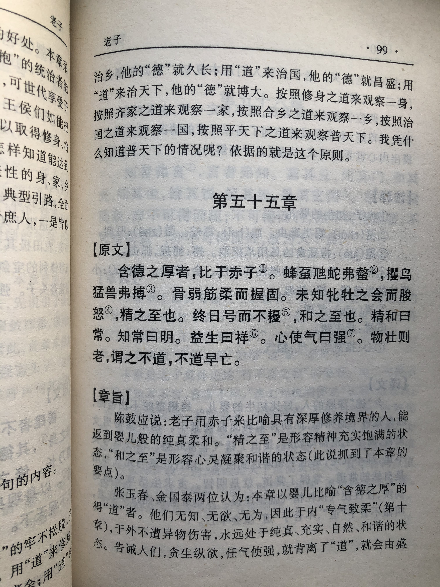
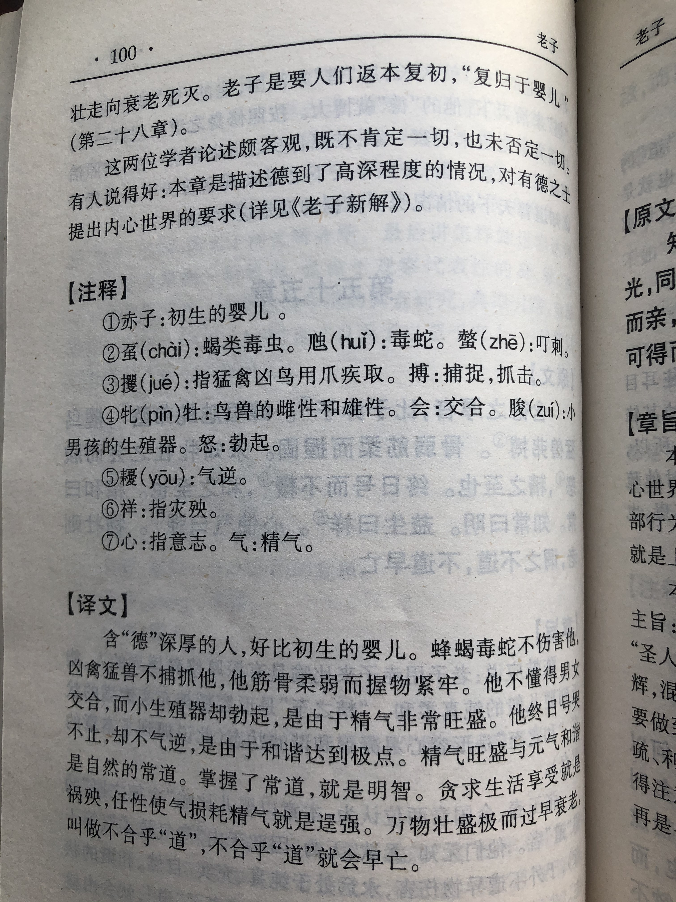

## 《道德经》第五十五章通行本原文：

    含德之厚，比于赤子。
    
    毒虫不螫，猛兽不据，攫鸟不搏。
    
    骨弱筋柔而握固。
    
    未知牝牡之合而朘作，精之至也。
    
    终日号而不嗄，和之至也。
    
    知和曰常，知常曰明，益生曰祥，心使气曰强。
    
    物壮则老，谓之不道，不道早已。
        
## 译文：
 
    道德修养深厚的人，就好像初生的婴孩。
    
    毒虫不咬他，猛兽不伤他，凶鸟不抓他。
    
    他的筋骨柔弱，但抓握却很牢固。
    
    他虽然不知道男女之事，但他的生殖器却能勃起，这是因为精气充沛的缘故。
    
    他整天啼哭，但嗓子却不会沙哑，这是因为和气纯厚的缘故。
    
    知道阴阳和合的道理叫做“常”，知道“常”的叫做“明”。
    
    有益生命的就是吉祥（或贪生纵欲就会遭殃），以欲念主使精气叫做逞强。
    
    事物过于壮盛就会变衰老，这就叫不合于“道”，不守常道很快就会灭亡。

## 逐句解释：

### 含德之厚，比于赤子。
含：含有。赤子：纯净的初生婴儿。
拥有深厚道德修养的人，好比刚出生的婴儿。婴儿纯真而质朴，天真而无邪，没有一丝杂质。

### 毒虫不螫，猛兽不据，攫鸟不搏。
毒虫：指蛇、蝎、蜂之类的有毒虫子。螫(shì)：蜇人或咬人。据：兽类用爪子抓取。攫(jué)鸟：用鸟爪抓取食物的鸟，例如鹰隼。博：用爪搏击。
这样的人毒虫不会去咬他，猛兽不会去伤害他，凶鸟也不会去攻击他。因为纯洁如婴儿，对动物也没有威胁，因此兽类都不忍去伤害。人类也是这样，对于构不成威胁的一般都会有天生的怜悯，而不会痛下狠手。

### 骨弱筋柔而握固。
握固：抓握的牢固。
这样的人胫骨柔弱，然而抓握力却很牢固。这就是表面柔弱，内地实则刚强无比。好比道骨仙风的老人，看起来弱不经风，然而实际上力量刚强无比。

### 未知牝牡之合而朘作，精之至也。
牝(pìn)牡(mǔ)：母牛和公牛，雌性和雄性。朘(zuī)作：朘为男孩的生殖器，作为勃起。 
婴儿虽然不知道男女之事，但他的生殖器却能勃起，这是因为他精力充沛，阳气旺盛的缘故。

### 终日号而不嗄，和之至也。
嗄(á)：噪音嘶哑。 和：和气，阴阳和合之气。
婴儿整天啼哭，但嗓子却不会沙哑，这是因为和气纯厚的缘故。

### 知和曰常，知常曰明，益生曰祥，心使气曰强。
知和曰常：常，指事物常态和规律。和，指阴阳二气合和的状态。 明：明了，洞悉事物本质和规律。益：增益，增添。祥：妖祥、不祥，也有说祥瑞。强：强壮、逞强。
知道阴阳和合的道理叫做“常”，知道“常”的叫做“明”。有益生命的就是吉祥（或贪生纵欲就会不祥），以欲念主使精气叫做逞强。

### 物壮则老，谓之不道，不道早已。
事物过于壮盛就会变衰老，这就叫不合于“道”，不守常道很快就会灭亡。物盛则衰，物极必反，这就是客观规律。

## 心得总结：

本章主要是讲修道之人当返璞归真，如初生婴儿，这样的人才不会受鸟兽攻击，不被毒虫撕咬。人的一生经历颇多，世事沧桑，物欲横流，如果能在历经千帆后回归初心，保持纯真则是难能可贵的。老子把得道之人比喻成了赤子，这是因为赤子无欲、无为，不会给外界带去威胁，因此也不会招致来自外来的伤害。

“骨弱筋柔而握固”，婴儿虽然无欲无求，但他不是软弱的，不会任人欺凌。我们仔细观察婴儿的行为，他的小手虽然很柔软，但是非常有劲，攥东西的时候手握得十分牢固，很难将其分开。初生婴儿虽然外表柔弱，然而精力旺盛，阳具自然勃起，终日号哭而不哑。如果修道之人能重回到赤子境界，那就是达到了无欲、无为、无我的至高境界。这样的人能洞悉事物的规律，明察秋毫，做事情能得心易手，从心所欲，不会受到世俗的羁绊，也不会逞强称能、自以为是。

“物壮则老，谓之不道，不道早已。”这是告诉我们在合适的时机做合适的事情，凡事过犹不及，保持合适的状态是最为重要的。老子始终告诫人们是柔能克刚、弱能胜强、静能胜躁。因此，我们应该保持谦卑和虔诚的心态，虚心请教，不断进步，而不要高傲狂妄。

老子的话有的时候容易被误解，认为是消极避世，认为是循规蹈矩，认为是不敢创新。“物壮则老”也会被认为是不思进取，不敢发展壮大，其实这都是误解。老子的本意并非如此，他不是叫人不作为，也不是一味谦让退避，老子是告诫人们不要妄为，而是去做正确的事情，把正确的事情做到极致了就好了，不要再继续逞强，否则就会物极必反，与“道”背离。与“道”背离很快就会灭亡。因此，我们应该积极面对挑战，敢于创新，敢于为天下做表率，但是一定要牢记老子的话，过犹不及，物壮则老。

## 附帛书版：

[返回目录](../README.md) &nbsp; [上一章](./54.md)&nbsp; [下一章](./56.md)

