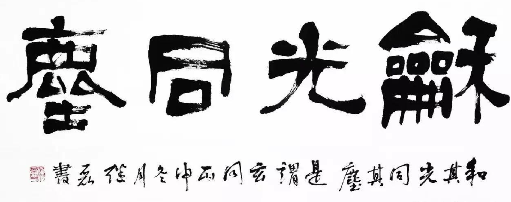
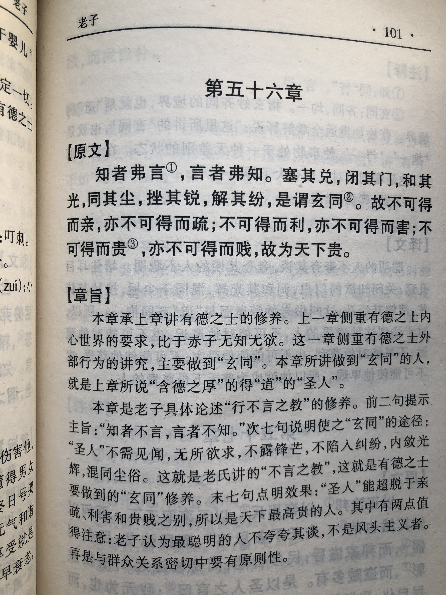
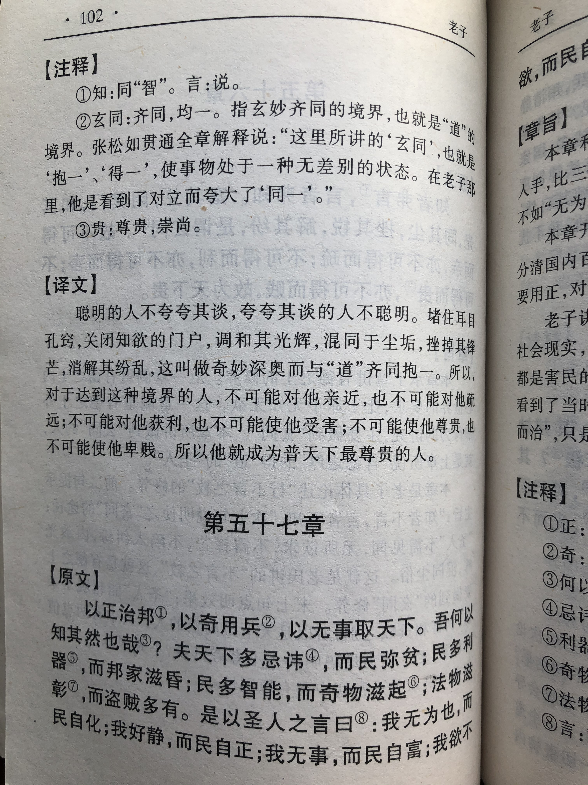

## 《道德经》第五十六章通行本原文：

    知者不言，言者不知。
    
    塞其兑，闭其门；
    
    挫其锐，解其纷；
    
    和其光，同其尘，是谓玄同。
    
    故不可得而亲，不可得而疏；
    
    不可得而利，不可得而害；
    
    不可得而贵，不可得而贱；
    
    故为天下贵。
        
## 译文：
 
    知道的并不多言，能言会道的并不知道。
    
    塞堵住嗜欲的孔窍，关闭住嗜欲的门径。
    
    挫去锐气，解除纷争；
    
    调和光芒，混同于尘世，这就是玄妙的融和。
    
    所以，不因得到而亲近，也不因得不到而疏远；
    
    不为得到而有利，也不为得不到而伤害；
    
    不因得到而显贵，也不因得不到而卑贱；
    
    当超越了亲疏、利害、贵贱时，才是天下最尊贵的。

## 逐句解释：

### 知者不言，言者不知。
这里解释有好几种，都说得过去。第一种是，知道的人并不多言，多言的人并不知道。第二种是，智慧者不多说话，能言会道的并非智者。另外一种是，得“道”的君王不干预民生，一切顺乎自然；干预民生的君王没有得“道”。老子认为应该行不言之教和无为之事。

### 塞其兑，闭其门；
塞：堵塞。兑：孔窍。门：欲望之门。
即堵塞欲望的孔窍，关闭欲望的门径。这是让人们去除多余的欲望，保持清净自然。前面章节提到了这一句，此处是重复提及。

### 挫其锐，解其纷；
此意为挫去其锐气，解除其纷扰。锐气会令人自负夸耀，从而看不清自己，纷扰会干扰人心，从而无法宁静。

### 和其光，同其尘，是谓玄同。
即混合光芒，混同于尘世。也就是阴阳之气相互融合，达到一种玄妙的境界。抛却高高在上的身份，收敛起万丈光芒，与卑微的尘埃交织在一起，这样人接地气，不会飘飘然。

### 故不可得而亲，不可得而疏；不可得而利，不可得而害；不可得而贵，不可得而贱；
所以，不因得到而亲近，也不因得不到而疏远；不为得到而有利，也不为得不到而伤害；不因得到而显贵，也不因得不到而卑贱。这几句是说“玄同”的境界已经超出了亲疏、利害、贵贱等世俗的范畴，达到一种忘我、无我的境界。

### 故为天下贵。
达到这种状态的人，才是最珍贵的，也能受到天下人的尊重。

## 心得总结：

本章的核心意思依然是讲道法自然、清静无为。其中有的句子非常有名，经常作为不少领导和企业家的座右铭。比如：“知者不言、言者不知”、“挫其锐，解其纷”、“和其光、同其尘”等。

“知者不言”或者说“行不言之教”，不是说知道了而不告诉人们，而是知道了也不去强行灌输给人们，而是通过自己的言行做出表率，通过潜移默化和因材施教，去感化众人，达到润物细无声的作用，最后让人们真的理解和搞明白，这样才是真正的智者。

“塞其兑，闭其门；挫其锐，解其纷”这就是让人们保持清静无为，去除多余的欲望。这是老子的核心思想，前面章节也反复提及过。做任何事情都需要首先让自己安静下来，保持内心的宁静，不受外界的干扰。同时要去除私心杂念，当只是为了自己的利益去考虑问题时，事情困难重重，但是如果是为了众人利益去考虑时，你会发现豁然开朗，事事顺遂。

“和其光，同其尘，是谓玄同。”这是非常高深的道理，不只是放低姿态，混合于尘世之中。我们姑且按这个意思来理解“玄同”，但实际上还包括阴阳调和，天人合一，世界大同等。领导者身处高位，光芒万丈，人人仰视，但如果始终高高在上，不接地气，就会与群众渐行渐远，从而作出不明智的决策。而要想保持思想先进性和正确性很重要的一点就是放下自己，与人民大众紧密结合。毛泽东思想活的灵魂之一是群众路线，就是坚持实事求是，一切为了群众，一切依靠群众，从群众中来，到群众中去，跟这里的“和光同尘”道理有异曲同工之妙。

“玄同”还是一种无我的至高境界，超越了世俗的亲疏、利害、贵贱等范畴，如果能够抛却这些，那么人就是超凡脱俗的圣人，达到这种状态的人可能不多，如果真的能达成那就是千古圣人，当被人们永远所铭记。我们普通人要想达到至高无上的境界可能很难，但是如果能够少点名利渴望，少点私欲，努力勤奋，顺天应人，顺势而为，那也是能够做出一番事业来的。因此，从老子的智慧当中，领导者可以悟到管理和治国的策略，而我们普通人也可以学到为人处世、修身养性的方法。

## 附帛书版：

[返回目录](../README.md) &nbsp; [上一章](./55.md)&nbsp; [下一章](./57.md)

